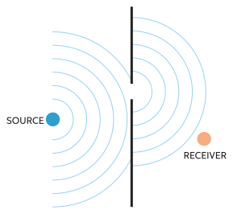
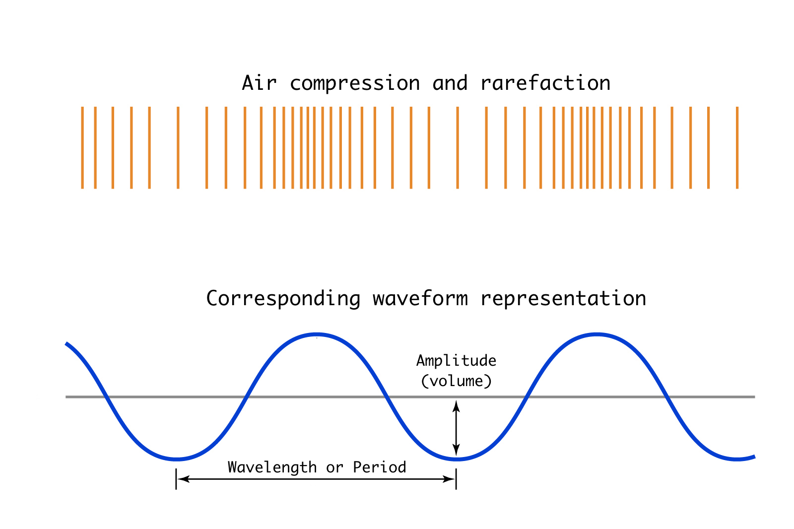

# Acoustics

Acoustics is sound via the language of science. As artists working with sound, all of its material aspects are in play, whether or not we choose to work with them through scientific language. But the concepts outlined here intersect with digital audio, both in terms of recording and synthesis, so having a basic familiarity with the terminology is important (we'll get into a bit of that next week).

### Movement

Last time we gave a definition of sound: _Sound is movement that we can hear_

So when we're talking about sound, we're talking about something that is moving.

That this _something_ is variable makes sound different from other kinds of phenomena. Light, for example, is composed of photons, it has its own materiality. Photons travel in a wave through space from the sun to reach us. Radio waves are actually another form of the same electromagnetic radiation. They are a _something_ in and of themselves. But sound is not. Sound is something _else_ that is moving (without that something else—like in space, which is a vacuum—there is no sound).

When we say that something "makes a sound," we're saying that something that moved, somewhere, also made the the air move, and that moving air made our inner ears move. Or at least, we're typically talking about air (a gas), but sound also propagates through water (a liquid), or even a solid material.

### Sound Waves

Sound propagates through air (or other mediums) as a wave. When we say wave, we often think ocean wave, but that's a misleading image, because ocean waves are "transverse waves"—sound waves are "longitudinal" waves, which look like this:

Video: [Longitudinal wave](media/01_01_longitudinal_wave.mp4)

In this video, imagine that the slinky is air. So the air is compressing and expanding, ie, changing pressure, as the wave travels from one place or another. Here's another view:

As you can see, an individual particle of air doesn't itself move very far, but the pattern of _compression_ and _rarefaction_ (expansion) does. This view is slightly misleading, however, because sound waves aren't linear. They're more like this:

(Monopole just means single source).

Of course, we also have to imagine these waves propagating in three dimensions, like a sphere.

How fast do sound waves propagate? Well, it depends on the density and temperature of the medium they are traveling through. For air at 68 degrees, it is 767 mph (for air at less pressure at high altitudes, it's also less spatially dense, which cancel each other out so the speed is the same for the same temperature). An approximate rule of thumb that's easier to remember is that sound travels about 1000 feet per second.

What happens when these waves run into things? We get:
- _reflection_
- _absorbtion_
- _diffusion_
- _diffraction_

What happens when the waves encounter a change in underlying medium, like air that is warmer, or moving? It can actually bend, which is called _refraction_:

What happens when the waves encounter other waves? Similar to like waves in a puddle, you get _interference_. Interference is fascinating and complicated, so we're going to come back to that when we talk about synthesis. But in short, it can result in amplifying certain frequencies while dampening others.

Taken together, reflection, absorbtion, diffusion, diffraction, and interference mean that sound can radically change as it moves through space, and that the sound we hear is dependent on the environment as well as the sound source.

### Waveform Representation

When we work with sound, we often depict it as a waveform of _amplitude_ over time. Waveforms _look_ like transverse / ocean waves, so they are a little misleading, because we know it's actually about compression and expansion. But they are useful.

The _amplitude_ is the strength of the wave, quite literally the "_volume_" of air that is being moved. Amplitude is typically measured in _decibels_ (dB), which is a units of "sound pressure" (ie, the change in air pressure due to sound).

The _wavelength_ is the size of the sound wave, the distance between each compression. Since sound waves move at a constant rate, wavelength has a direct relationship with the _period_, which the time between each compression passes a fixed location.

We hear sounds as being higher if the wavelength is shorter; lower if it is longer. We typically talk about high and low in terms of _frequency_, which is the number of compressions that pass per second.

The _frequency_ of a sound is just the inverse of the period, and we express it in _Hertz_ (Hz), which is "oscillations per second." So if a sound has a frequency of 100 Hz, the air is compressing and expanding 100 times in one second.

An 100 Hz sound has a period of 1/100, or 0.01 seconds long. Since we know that the wavelength in feet is (very approximately) 1000 times the period in seconds, that means the wavelength is about 10 feet. I personally think it's surprising how big sound waves actually are, and that low sounds can engulf our bodies.

### Ears

So what happens when a sound wave reaches our ears? Let's watch a vintage video.

Video: [The Inner Ear](media/01_08_inner_ear.mp4)

The biological means of human hearing are highly specialized, and to some degree inseparable from the concept of sound. "Normally," human ears respond to frequencies between 20 Hz and 20,000 Hz (20 kHz), but individuals can have all sorts of different sensitivities. Sound lower than 20 Hz we call _infrasound_ (which we can sometimes perceive with our sense of touch), higher than 20 kHz is _ultrasound_. But these are all anthropocentric terms—"sound" means something different depending on your biology.

We talked about amplitude being the volume of air being moved. However, humans are more sensitive to some frequencies than to others—two sounds of the same volume might not be equally loud if they are of different frequencies. _Loudness_ is the technical term for that. The following graph shows the amount of sound pressure needed to create the same loudness at different frequencies. Note that humans are most sensitive at the bottom of the curve, which roughly corresponds to the frequencies of the human voice.

What happens after the sound gets to the brain?

### Timbre

Now, I want to make one important clarification with all this. So far we've been looking at these diagrams and charts as if all sounds propagated as evenly spaced waves and consisted of just a single frequency. That's not at all the case, obviously. In our previous exercise, we came up with all kinds of qualities of sounds—some of them had to do with amplitude and pitch, but there's also things like texture, which, to borrow the musical term, is often called _timbre_ (spelled with an 'i', pronounced with an 'a'). Timbres are produced via "complex waveforms" which means that there are waves of many different frequencies happening at once.

We're going to learn a lot about timbre, but for now, here's a silly example that shows what the different waveforms look like from multiple musical sources:

These waveforms reflect the fact that sound sources, even ones from instruments that are designed to have a particular pitch, include a rich mixture of vibrations. This affects the shape of the sound waves in the air as well as the way our inner ear moves.

This also demonstrates the limits of this kind of representation for dealing with sounds. There's nothing in these shapes that would really give us an aesthetic sense of what's happening.

And that's where our first project comes in.
