# Systems and synthesis

So far, we've been working with a two-step process: recording sounds, and then manipulating them in an audio editor to produce a static piece. However, with a different set of tools, we can approach things completely differently. Real-time systems generate sound on the fly, so instead of manipulating audio data directly, we design systems that automatically create the sounds we want. This reorients our approach to sound art away from soundscapes and field recording and towards experimental electronic music.

The most basic building blocks for audio systems are synthesis (the creation of sounds from scratch), sample manipulation (the generation of new audio from small pre-recorded segments), and real-time sequencing (ordering sound in time, but via algorithms instead of arranging audio on a timeline). We'll work with synthesis first.

## Pure Data (Pd)

There are many ways that artists and musicians have produced electronic sound, from hardware synthesizers like those produced by Moog and Buchla to software platforms like Ableton or MainStage. We're going to be using a visual control-flow programming language. Unlike most programming languages, this type of programming doesn't use code, but a graphical layout of functions and operators. It's a common approach for working with multimedia, including languages like vvvv, Isadora, and Quartz Composer. Max/MSP is the first and most influential of these, which was originally developed by the researcher Miller Puckette and now powers the effects in Abelton Live. After Max became a commercial product, Puckette created a free and open-source version called Pure Data, or Pd, which is what we will use to build our sounds from scratch.

## Installation

Download Pd here: [https://puredata.info/downloads/pure-data](https://puredata.info/downloads/pure-data)

Most of you will want the first option for either Mac or Windows (not the very first option, which is the source code). Unzip the download and move the Pd application into your Applications folder.

If you get a notification like this:
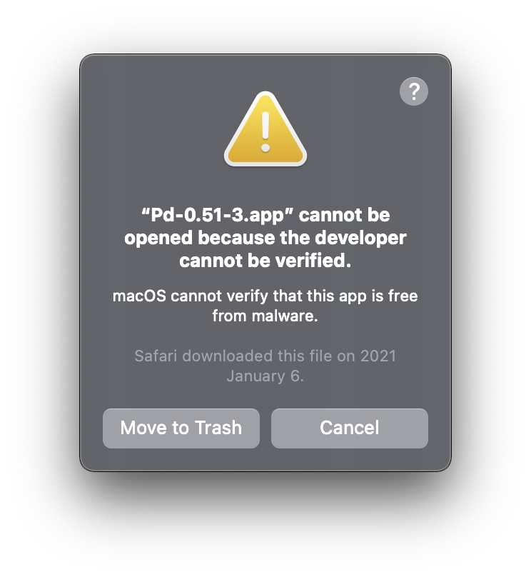

Click cancel and then go to your System Preferences and choose the "Security" panel. You should have the option to "Open Anyway". Once you do this once, you won't have to do it again.

Once you have launched the application, but before we do anything with it, we need to do one more thing, which is to add a couple "externals" to the system. Download those here: [link](link). Navigate to your "Documents" folder, which should now contain a "Pd" folder. Inside "Pd", there should be another folder called "externals". Open the zip file, and drag the objects inside into this folder.

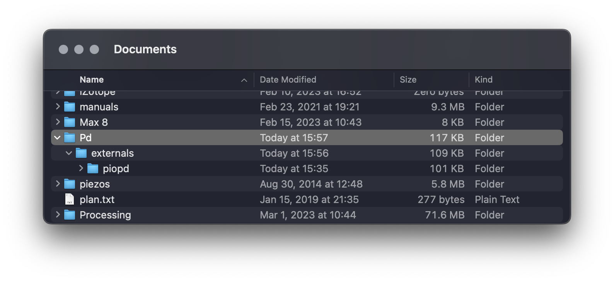

### Setup

The first window we see is simply a log window. Sometimes helpful messages will appear here if something has gone wrong, but we can ignore it for now.
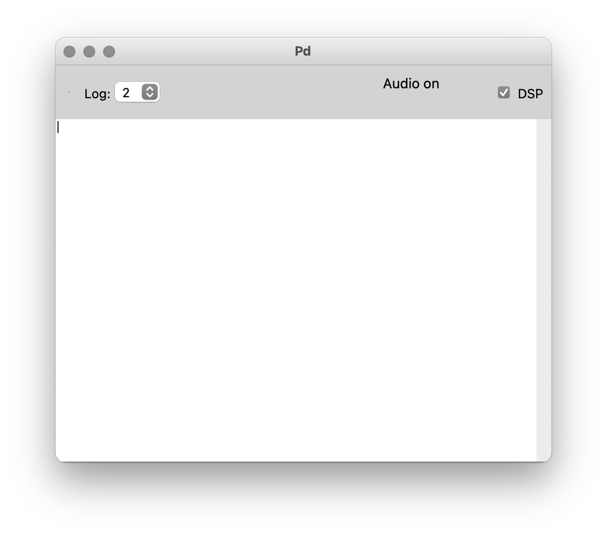

To make sure our audio is up and running, go to the "Media" menu and select "Audio Settings..."

Make sure that under "Output Devices" you have the output set to use whatever device you want to use. I suggest that you use your laptop speakers to start off—we may make some gnarly sounds by accident, so it's best not to have those in headphones in order to protect your ears.

Next, go back to the "Media" menu and select "Test Audio and MIDI...". You should see a panel like this:

Under "TEST TONES", click the box labeled 80—you should hear a test tone. If not, check your audio settings and hardware. You can close this window once it is working.

Finally, go to the "File" menu and select "New". A blank "patcher" window will appear. This is what we'll use to make our Pd "patches", aka sonic systems.

### Basic principles of Pd

#### Placement

A blank white canvas is both intimidating and filled with possibility. Under the "Put" menu we see the different types of things that we can add to our patch. Rather than select one, note that there are keyboard shortcuts for each option: for example, you can create an "Object" by typing Command-1 (Control-1 on Windows and Linux).

Leave the menu, and type Command-1. When you move your cursor over the patch, you'll see a dashed blue rectangle follow it. Click somewhere to place the Object, and you'll see a flashing cursor.

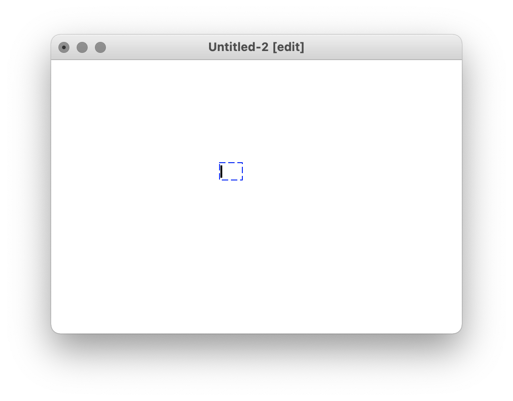

Objects are the "vocabulary" of Pd. The more names of objects you know, the more complicated things you can do with Pd. If you type the word "print" inside this Object and click again outside the box, you will create the [print] Object.

Next, let's create a Number using Command/Control-3. Put it above `print`, and click to the side so that it's no longer blue.

Note that a Number box, which holds a number, is distinguished from an Object box by the bevel on its corner.

#### Connections

Also note the tabs on the boxes, one on the top of `print` and one each on the top and bottom of number. These are connection points. If you put your cursor over the bottom "outlet" of the Number box, it will turn into a circle. Click and drag it to the "inlet" on the top of `print` to make a connection.

Once you have a connection, you can remove it by moving the cursor over the line until it turns into an "X". If you click, it will turn the line blue—you can now type "Delete" to remove it. Make a connection, delete it, and make it again to get familiar with how it works.

#### Switching between Edit and Playback mode

Notice that at the top of the patcher window, there is the indicator "[edit]". This means that we are in editing mode, and our mouse clicks are interpreted as intending to alter the patch. To change to playback mode, go to the "Edit" menu and unselect Edit Mode, or simply type Command/Control-E. "[edit]" will disappear and you can no longer make connections between boxes (if you add an Object, the patcher will automatically revert back to edit mode).

Once you're in playback mode, click on the Number box and drag your mouse up and down.

This simple setup demonstrates the fundamental way that Pd and all control flow programs work. The number produced by the number box as it is moved up and down is sent through the connection to `print`, which displays it in the log.

Now, make a Message using Command/Control-2. Once again, Messages are distinguished from other types of boxes by a different shape. Attach it to print, switch from edit mode to playback mode, click it, and look at the log.

Beyond these basic types, the "Put" menu also includes some interface elements. Foremost among these is the "bang" -- select it from the menu, and then move it around on the screen. Connect it to the inlets on both the Number box and the Message box:

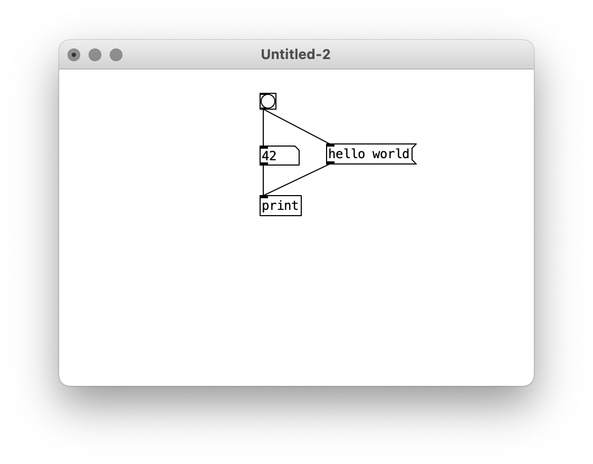

In playback mode, clicking on the "bang" will send both the number and the "hello world" message to `print`, and hence to the log.

You can think of bangs, numbers, and messages as  discrete pieces of data that travel once along the connections only when they are triggered. These are all understood as "control messages" in Pd parlance.

Change into edit mode, drag a rectangle around all your objects so that they all turn blue, and hit delete—now we once again have a blank patch. Make a `bang` connected to two Number boxes, connect each of those to a `+` box, and finally connect that to another Number:

In playback mode, enter some numbers into the top two Number boxes, and hit the bang, you'll see the result. This demonstrates how data flows downward and can be operated upon along the way.

Note that if you change the number in the left Number box, the result updates, but not if you change the number in the right Number box. In Pd, only a change or a bang in the left inlet triggers the operation.

Instead of always using both inlets, you can add a default value as a parameter of many Objects. This works differently depending on the object, but for add it's like this:

#### Audio signals

Audio signals flow a little differently than messages, because they are continuous—if there is a connection between two audio objects, data is always flowing.

What is an audio object? We know that an Object handles audio if its name ends in a tilde ("~").

Add an Object box to a new patch, and type `osc~`. This is a sine-wave oscillator.

Next, connect a number box upstream, and a `dac~` object downstream. Connect the outlet of `osc~` to both inlets on `dac~`, which is a "digital-analog converter" that interfaces with your sound card (the two inlets are for the right and left channels). Note that you can distinguish audio connections from data connections by their thicker lines.

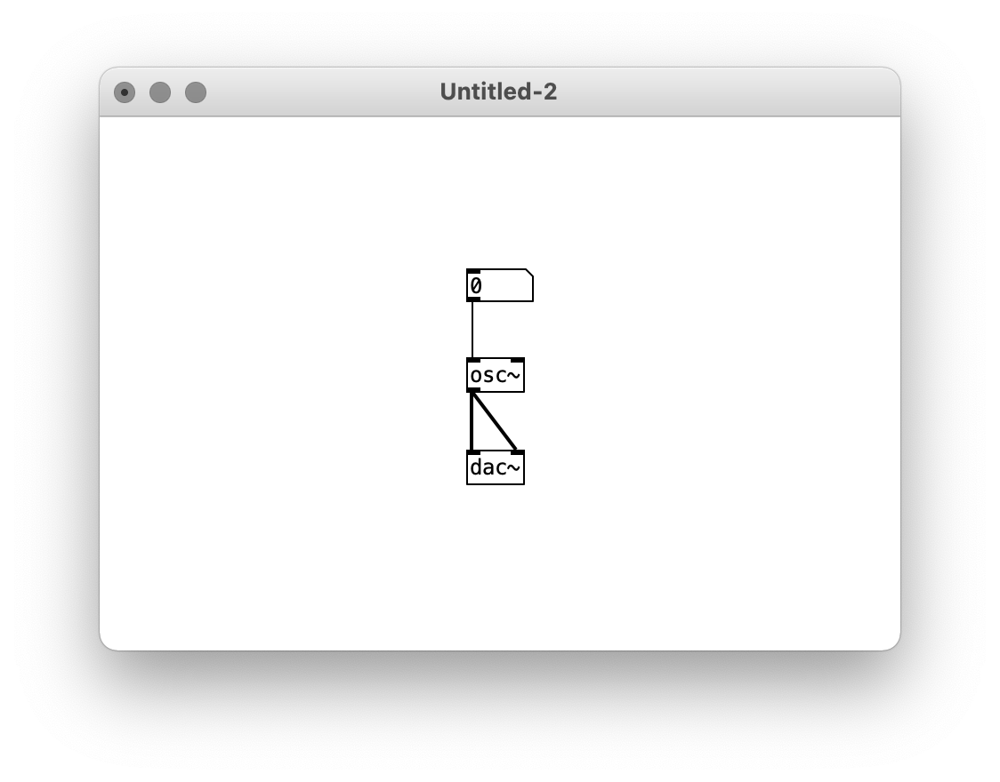

Now, in playback mode, increase the value of the number box to 300 or so, and you should hear a "pure" synthesized tone.

Note that you can turn the audio (aka the DSP, or Digital Sound Processing) on and off with options under the "Media" menu, their keyboard shortcuts, or a toggle on the log window.

Let's get a better sense of what's going on here by making a visual output as well. Create a `scope~` object (which is one of the externals we added at the beginning).

You may have to arrange things a bit to get everything to fit. Switch into playback mode and make sure audio/DSP is on, and you should see the waveform graphed on the screen.

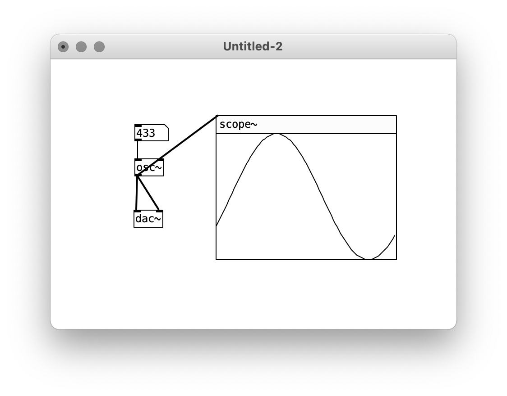

One final addition, add an HSlider leading into the Number box to make it easier to control:

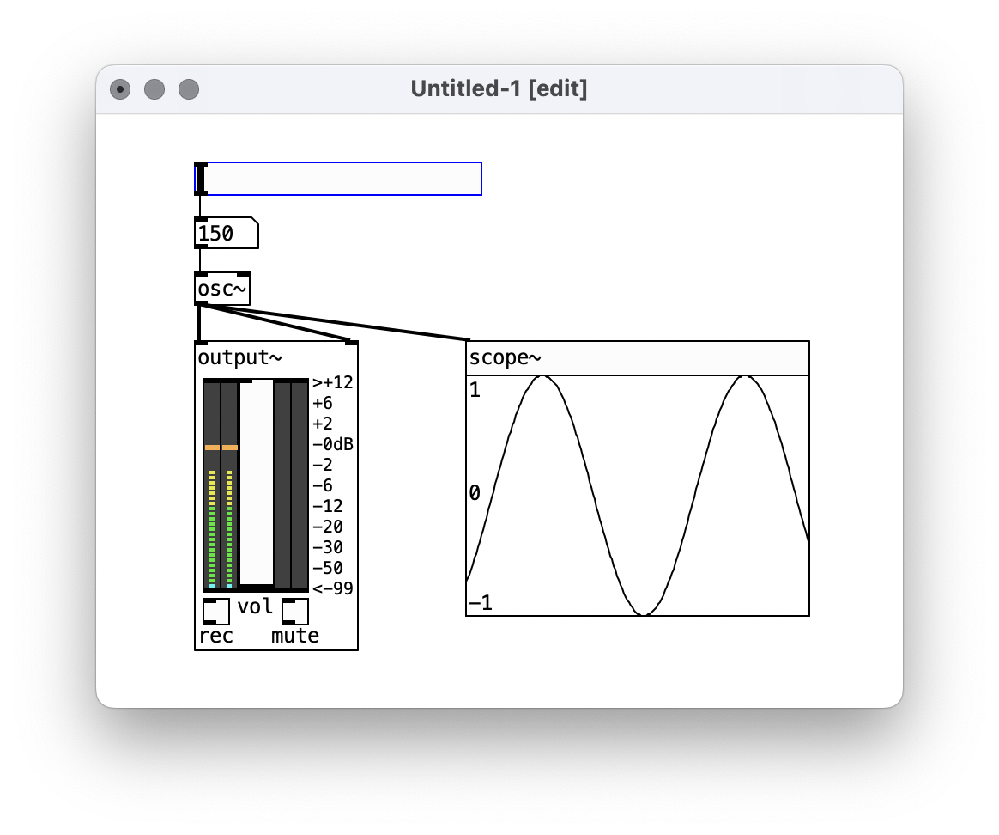

Right-click or control-click the slider and you will get a small dialog box, which includes the option "Properties". Choose this to open the properties panel. Set the range to 50–1000, which is a reasonable range for the fundamental frequencies that we might want to hear. Change the "lin" parameter to "log" -- frequency works logarithmically, and we want the slider to reflect that.

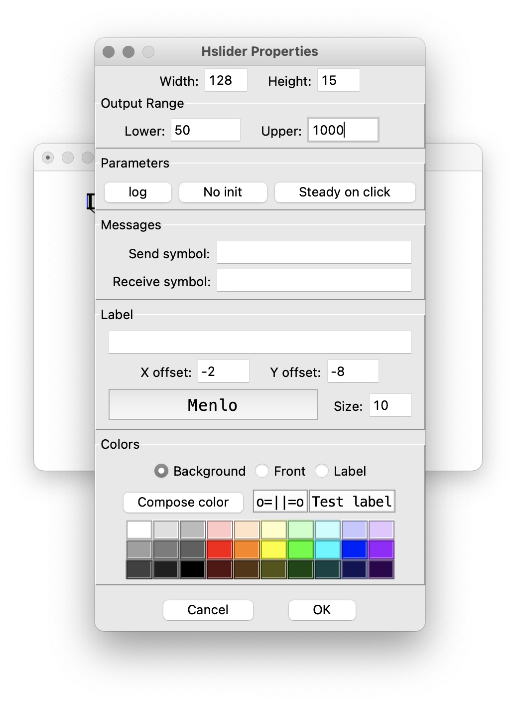

Congratulations, you've made your first synthesizer! (Make sure to save it).

## Oscillators

All synthesis starts with oscillators. `osc~` is a perfect sine wave. However, there are other shapes that we can use. For example, replace `osc~` with `saw~`, `sqr~`, or `tri~` in your patch and play with the results (these are also externals we installed—look inside those files to see how they are made).

## Additive Synthesis

Simple oscillators can be added together, thus becoming the building blocks of much more complex waveforms.

Using the `+~` Object (notice the tilde, which indicates that we are adding audio signals, not numbers), multiple oscillators can be combined. Because this also increases the amplitude of the waveform, we need to divide by the number of signals we are adding.

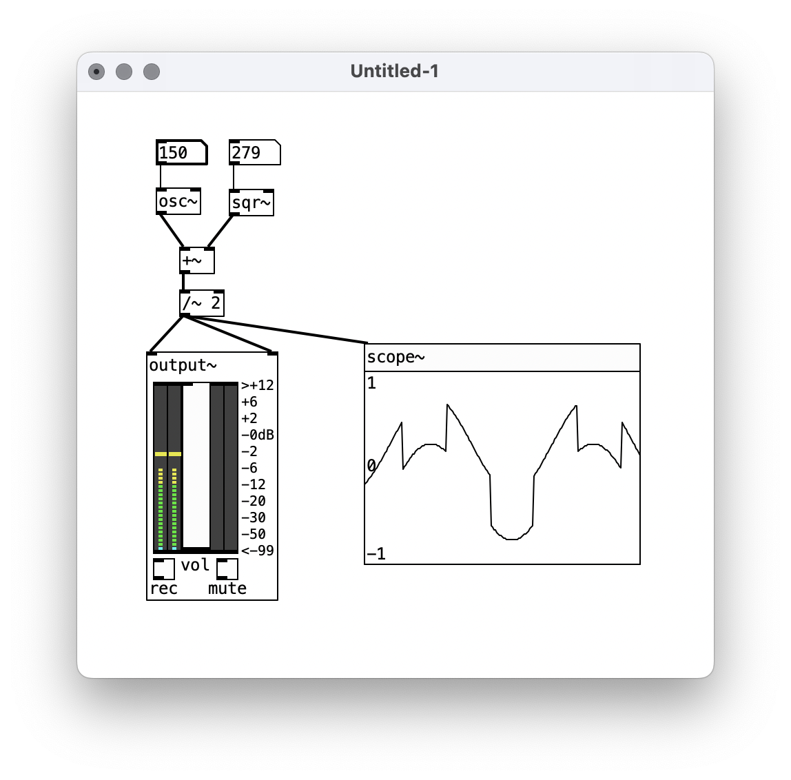

Try making two oscillators with very close frequencies—you'll hear "beating", which is another implicit oscillation at a frequency that is the difference between the two initial frequencies. Note that dragging on the number boxes in playback mode will increase or decrease by an integer value, but holding shift down will move the decimals.

## AM Synthesis and LFOs

Similarly, multiplication creates even wilder waveforms by combining two or more simple oscillators—essentially, one oscillator modulates the amplitude (volume) of the other. Traditionally, `phasor~` is used as a modulator. It is similar to `saw~`, but instead moving between the full signal range of -1 to 1, it oscillates from 0 to 1 (zero volume to full volume).

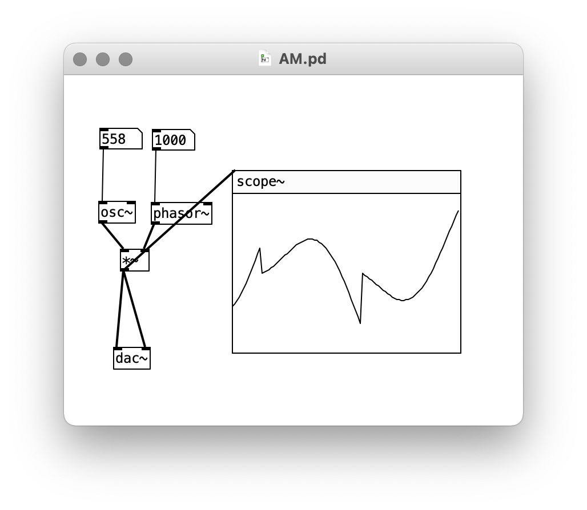

If you set the `phasor~` down close to 20 Hz, you'll notice you get a pulsation effect. To smooth it out and make it into a "tremolo" instead, we can use an `osc~` as a modulator instead of `phasor~`. However, since `osc~` moves between -1 and 1, we'll add 1 and divide by 2 to get it to work like

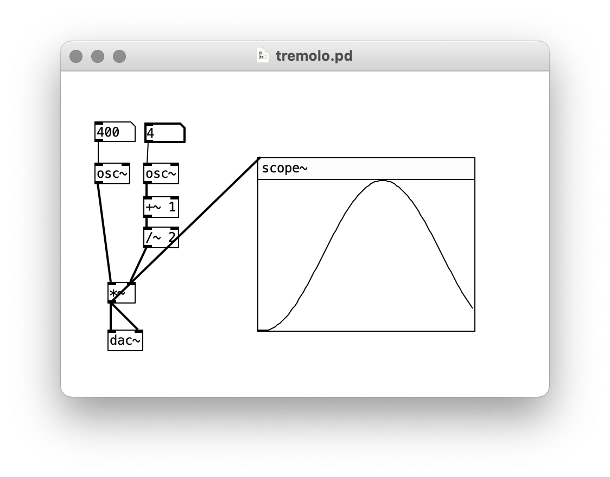

Using `osc~` in this way is known as a Low-Frequency Oscillator, or LFO. Even though it cannot be heard directly, LFOs can change the character of other sounds.

## FM Synthesis

While AM synthesis changes the amplitude of another signal, Frequency Modulation (FM) synthesis changes the frequency instead. Thus far, we have used static values for the frequencies of our oscillators, other than varying them manually with a Number box or slider. However, we can have another oscillator drive this change automatically instead.

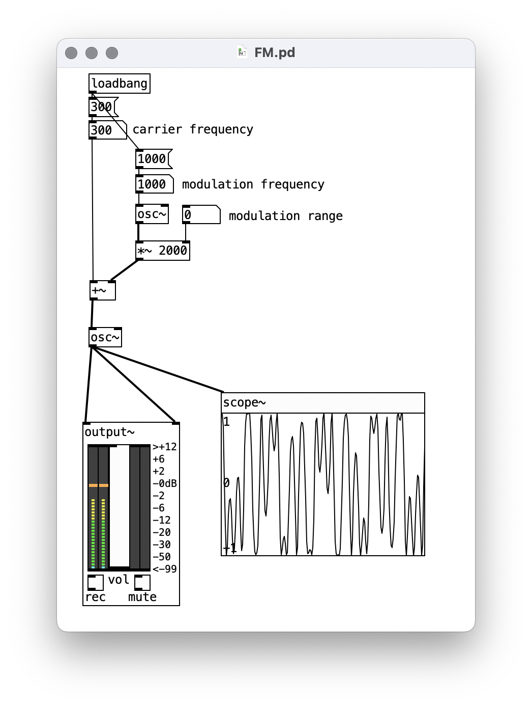

Here, the frequency that we give to `osc~` is determined by another `osc~` which sweeps over a given range. Varying these parameters results in complex waveforms.

## Complex oscillators

Note that this becomes a branching process: any number box can be replaced with another oscillator of some kind, whether it serves as a frequency modulator or an amplitude modulator. Combined, you can produce some dynamic sounds.

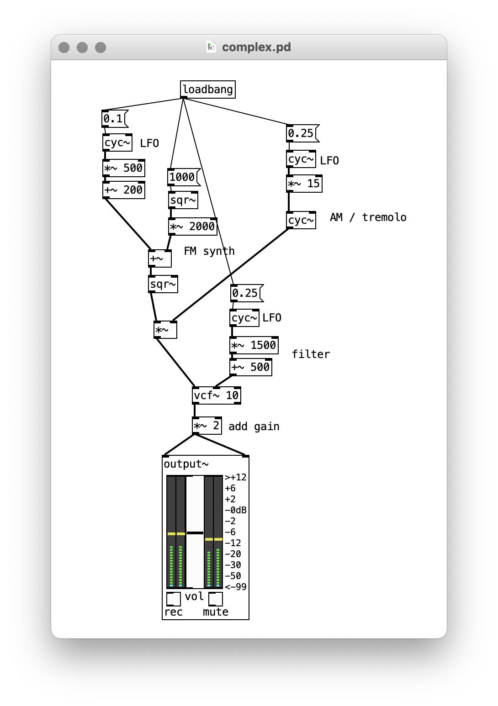

## Subtractive Synthesis

# volume knob
# help menu
# midi notes
