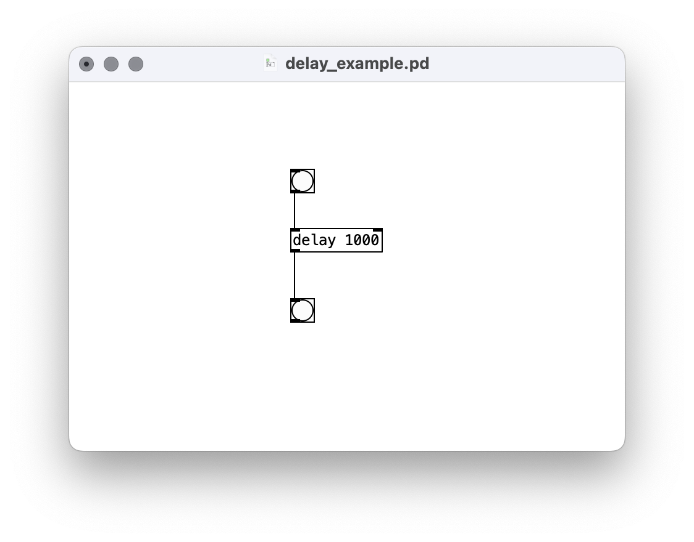
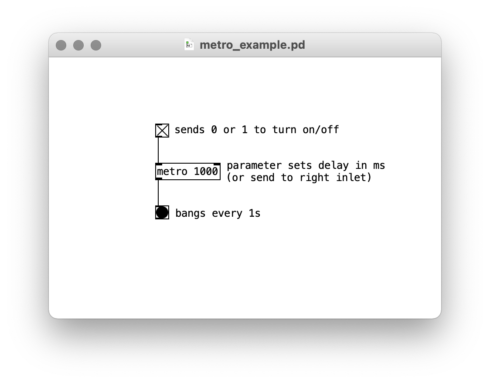
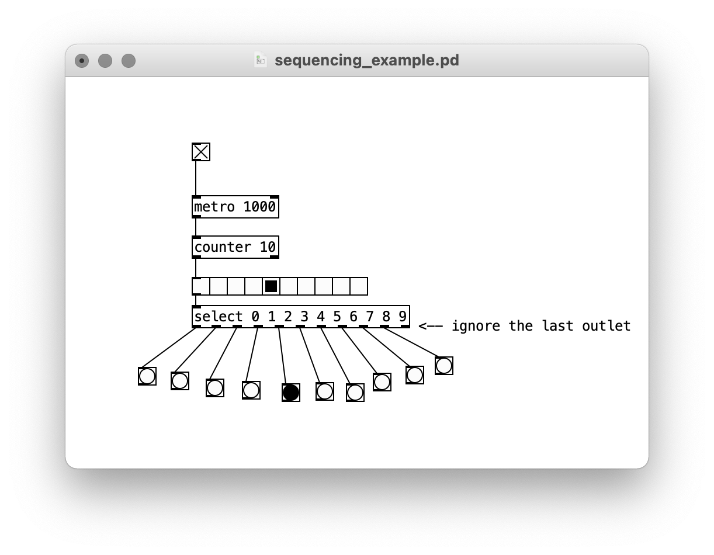
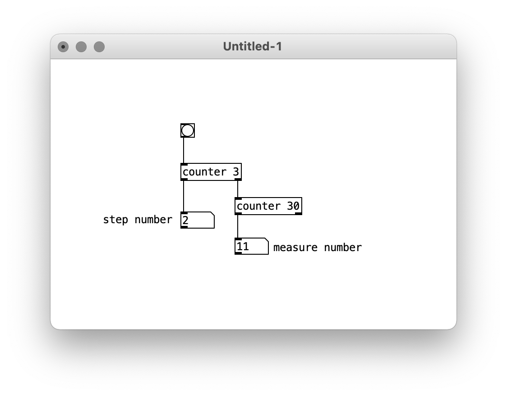
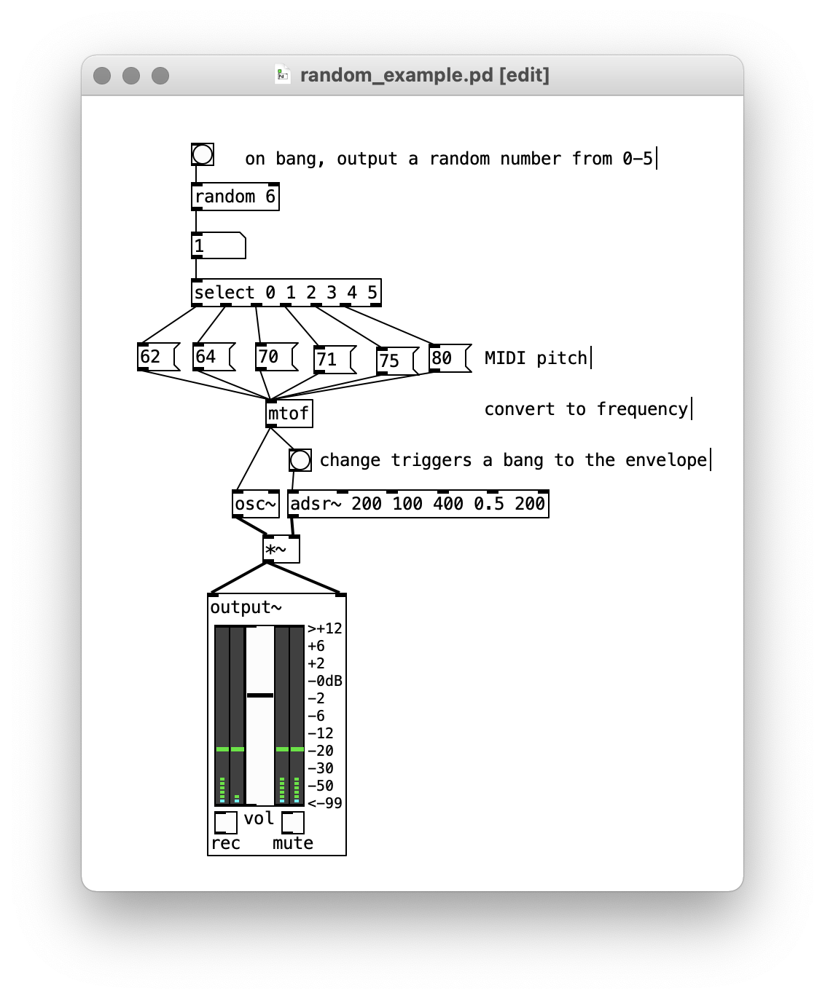
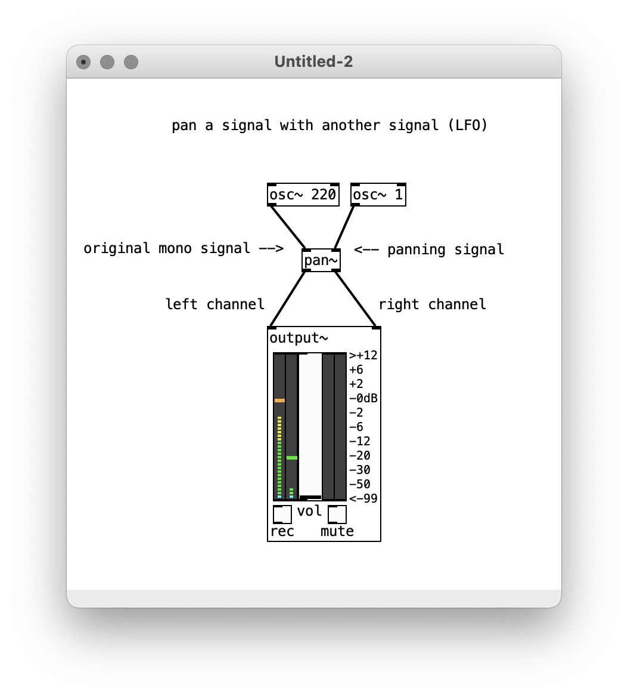
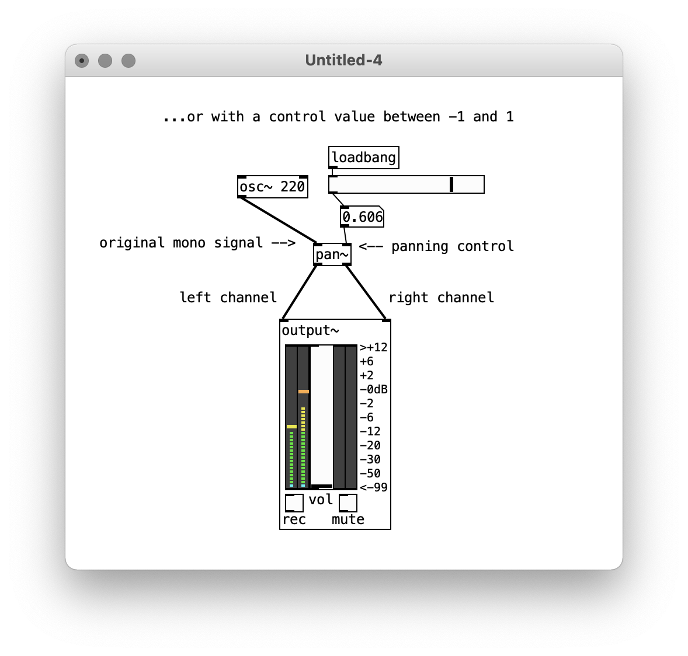

# Sequencing (and Spatialization)

Last time we covered the fundamentals of what we can do with waveforms in Pd. Now we're going to explore how we can organize those sounds in time in ways other than oscillation.

## Envelopes

Sound events in the physical world often have a shape to them. There might be an initial strike, tone, or impact, followed quieter section as a vibrating body comes to rest.

In electronic sound, we shape that characteristic through an **amplitude envelope**. This is simply a description of how the amplitude of a sound changes over time. The most typical configuration for an envelope, which you'll see all over the place on synthesizers and software instruments, is a four-stage function known as an ADSR:

   

- **(A)ttack**: the length of time it takes the sound to reach its loudest point
- **(D)ecay**: the length of time after the attack it takes the sound to reach its sustain amplitude
- **(S)ustain**: the length of time the sound is held (often determined by a piano key), and at what amplitude
- **(R)elease**: the length of time after the sustain it takes the sound to fade to silence

In Pd, we can define an envelopes with the `adsr~` object (one of our pre-built externals):

   

By multiplying any continuous signal with the `adsr~` signal, we can produce discrete sound events with very different characters. Experiment with how each parameter changes the sound.

Note that no sound is produced until the envelope is triggered using a "bang". This has important implications for our next topic.

## Delay

Envelopes give us the notion of an "event" in time that can be triggered. As we've already seen, in Pd, a "bang" is what makes things happen. There's a lot we can do with bangs, but to start off, we can delay them. Like this:

   

The number in the delay object box tells us how long the delay will be. In this case, it's 1000 milliseconds—or one second. 

What's important to realize at this point is there are two types of signals in Pd. So far, we've mainly been working with audio signals—the stuff that comes out of oscillators. But we've sent a few messages and used loadbang too—these aren't audio, they're "control" signals that tell Pd what to do. Audio objects are, of course, concerned with time, in the sense of building up audio waveforms. But `delay` is the first object to demonstrate that control signals have a different notion of time, which functions to cue different things to happen when we want them to. But `delay` is just the beginning.

## Sequencing

With static audio files in Audacity, we sequenced audio segments by splicing them and moving them on the timeline. There is no timeline in Pd, and all the sounds are being generated "real-time". We've already seen how to use LFOs to create change over time, but we can also trigger events using timers, bangs, and envelopes.

Perhaps the most important object for sequencing is `metro` aka "metronome". `metro` outputs a bang every N milliseconds. To start a `metro`, we have to send it a 1, and to stop it, we send a 0. An easy way to do this is with a toggle object (both bangs and toggles are available from the "Put" menu):

   

To take things a step further, we can add a counter. This object will count the number of bangs it receives, up to but not including the parameter given as a default value or sent to its right inlet.

   

A more interesting display than a number box is HRadio, which is available from the Put menu. Since my counter goes to 10, I've had to go into the properties on the HRadio and increase the number of cells from the default 8.

   

Next, we add a `select` object. `select` compares an input to its inlet with the numbers or symbols given to it as parameters. If the input matches one of them, the corresponding outlet gets a bang. (Note that the final outlet on `select` is just the input if the input doesn't match any of the specified options).

Since our counter has 10 steps, it outputs values from 0 to 9. `select` takes that number, and bangs the appropriate step.

   

From here, we could connect those bangs to envelope generators to play sounds, or use them to send messages with frequency values to oscillators, or both.

Here's a more developed example to show how that might look:

   

Note that `counter` outputs a bang from its right outlet every time it has finished the count and is starting over. This means you can chain counters together to have different levels of repeating events:

   

### Random and comparison operators

Beyond `metro`, `counter`, and `select`, a very useful object for sequencing is `random`. When `random` receives a bang in its left inlet, it outputs a random number less than the default parameter or a message sent to its right inlet.

Combined with `select`, this is an easy way to choose between several options on a bang. For example, this plays one of six pitches with each bang:

   

`random` can also be used to introduce indeterminacy. For example, maybe a certain sound is only triggered 50% of the time:

   

Note that this example uses another new object, `>` which outputs a 1 if it receives a number greater than its argument. We can then select on the output of `>` to get a bang that only fires half of the time.

Other comparison operator objects are: `<`, `<=`, `>=`, and `==` (note the double).

(Actually, the above example should be >=, shouldn't it?)

## Spatialization

In Audacity, we explored amplitude envelopes, stereo panning, and reverb as the fundamental tools of spatialization. The same applies with Pd. We've already seen how to apply amplitude envelopes as well as "mix" sounds by dividing or multiplying their output by a number to decrease or increase their  amplitude.

Regarding stereo, note that the `dac~` object, as well as the `output~` object that we've been using, has two inlets, one each for the right and left channel. By connecting signals only to one or the other, we can pan them hard left or hard right.

...but for more detailed control, we can use `pan~`. This object takes either a continually varying signal (aka an LFO) or a control value, and routes a mono input to stereo output, adjusting the balance between channels accordingly.

   

   

### Reverb

Pd does not have a reverb object by default. Reverb can be programmed in Pd, but it is not a simple affair. Better to use an object programmed for us in a more low-level language, like C.

Many people and communities have made additional objects and libraries for Pd that can be downloaded—these are called "externals" and can be made in Pd or in C. To install a reverb, go to the "Help" menu, choose "Find externals", and type "freeverb~", which is the name of a very good (and very free) reverb object.

   

You'll see a version of `freeverb~` that is specific to your operating system (unlike objects made in Pd, objects programmed in C cannot simply be copied to another computer, they have to be built specifically for your computer's architecture). Click on the first entry (there may be only one) and Pd will install it. You'll see a new folder inside your "Pd" -> "externals" folder, and you'll also be able to type `freeverb~` in your patch.

Look at `freeverb~`'s help file for details on how to use it. But at it's most basic, you simply hook the left channel to the left inlet, the right channel to the right inlet, stereo output, and away you go:

   

I recommend using only one `freeverb~` object as the very last object before `dac~` or `output~`. More than one will be a burden on your CPU, and with just one you will have a coherent sense of spatialization.
