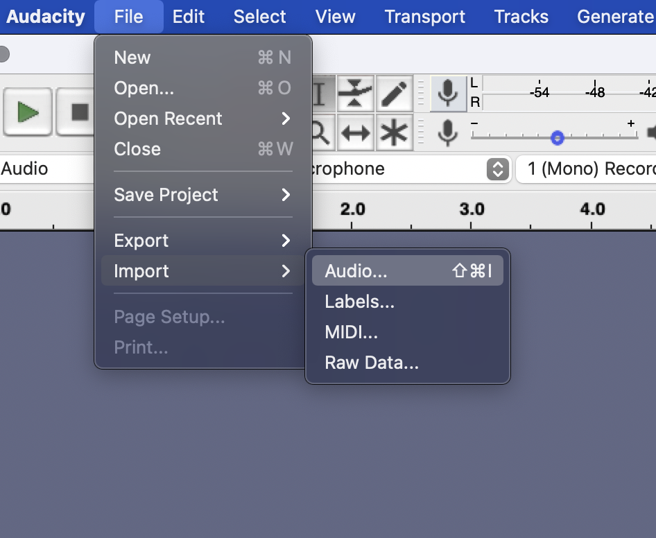
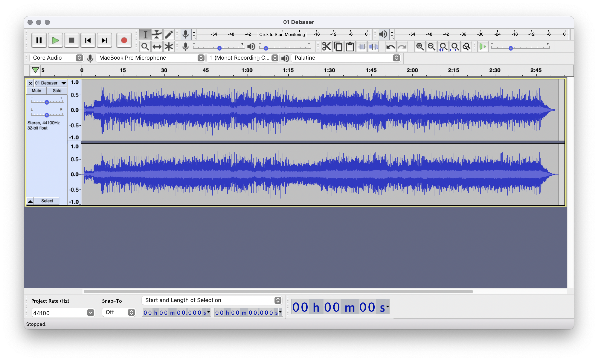
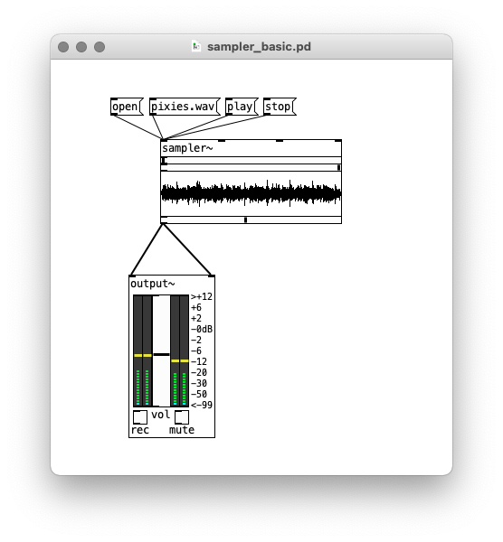
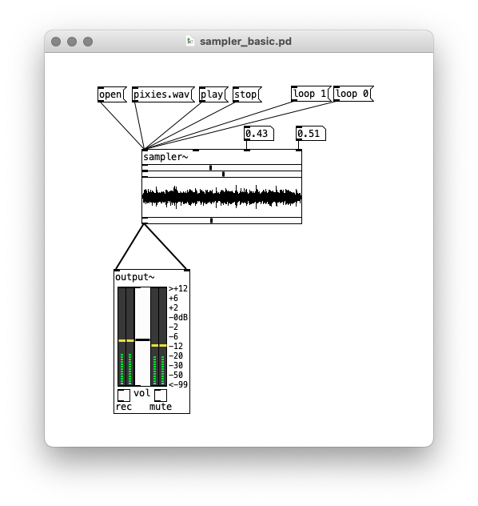
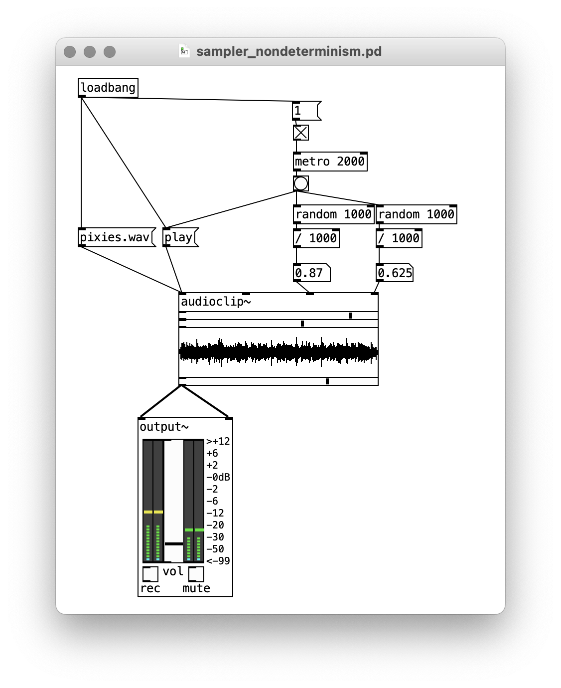
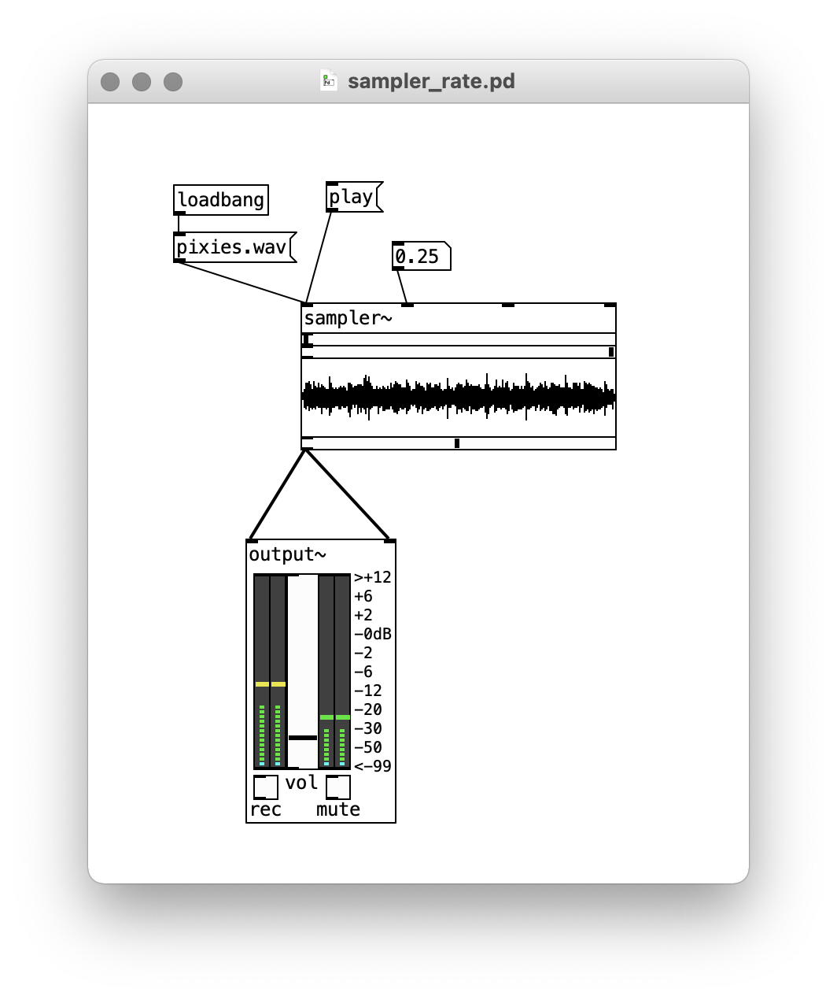
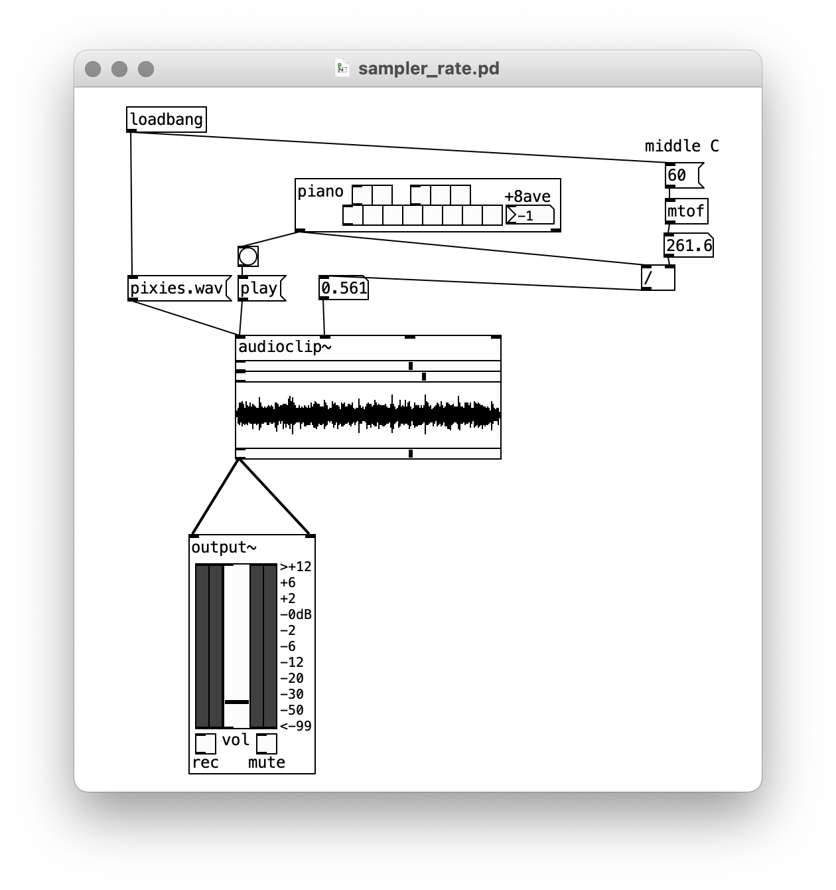
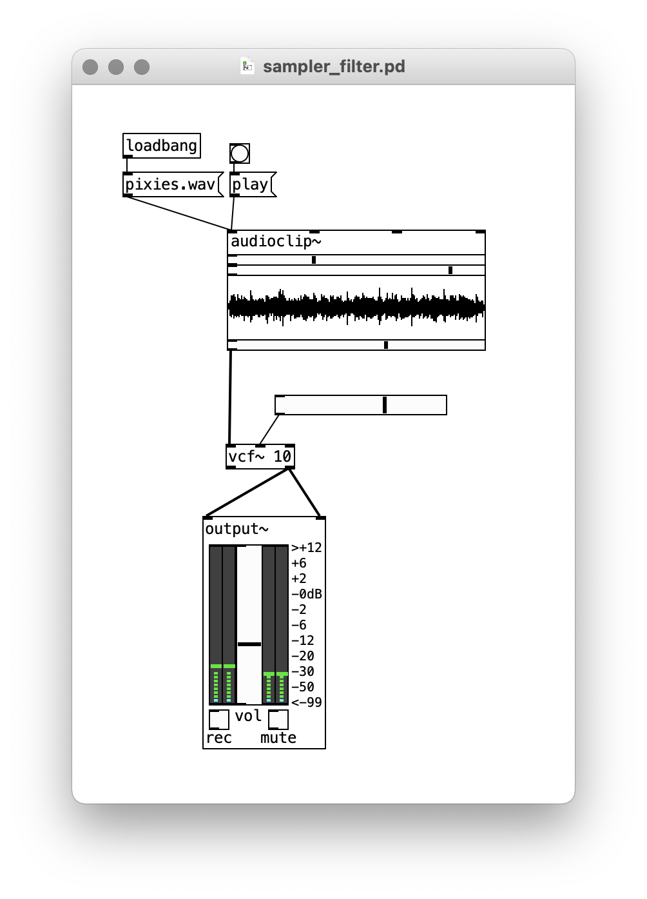
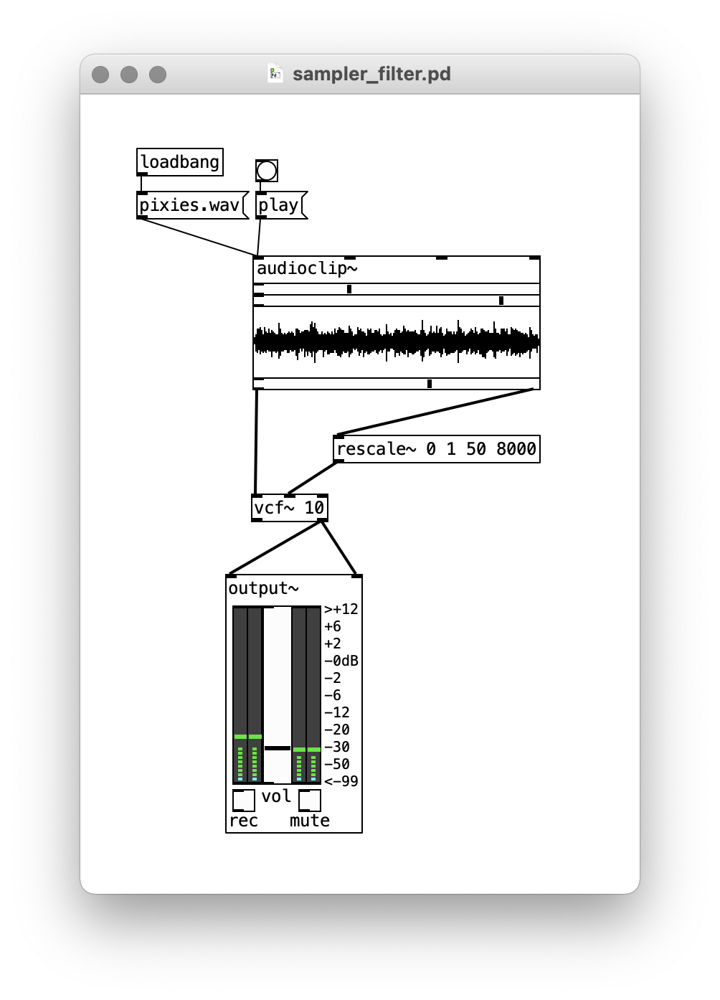
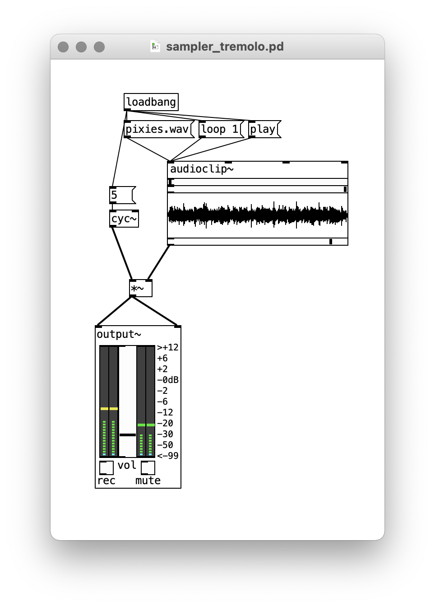

# Sample manipulation

Thus far with Pd, we've used oscillators, filters, envelopes, and timing objects to create synthesized sonic systems that do not depend on any pre-recorded audio data.

However, Pd is also capable of loading audio data and using it like a signal. It can manipulate audio "samples" in both senses of the word: short snippets of audio clipped from recordings, and the individual units of digital data captured from an analog signal.

## Preparing a sample

To begin with, we'll need some audio to work with. We can use Audacity for this. After opening the application, use "File" -> "Import" -> "Audio..." and navigate to the audio you want to use. This could be something you recorded, of course, but I'll use a musical track from my collection. This is an .m4a file, but Audacity should be able to covert it.

   

   

   

This track is stereo, but for our purposes, we need mono. After selecting everything with "Select" -> "All", we can use "Tracks" -> "Mix" -> "Mix Stereo Down to Mono" to create a single channel file.

   

Now we can zoom into the track and select a few seconds that we want to work with. You can use "Edit" -> "Clip Boundaries" -> "Split" to isolate a section, and then delete the clips on the either side and move your clip to the beginning of the track.

   

<!-- The last thing we need to do before exporting is make sure there is a clean beginning and end to the clip, ie, that the waveform starts and ends at 0. We do this by making a very short fade in and fade out, using the option in the "Effects" menu. (Without this, the clip will create "clicks" when we manipulate it in Pd.)

   

 -->

Export the track as a WAV file, and save it in your Pd folder. **rename the track to something short without a space** -- this will make things easier later.

   

## Manipulating samples in Pd

To work with our sample in Pd, we will use the `audioclip~` pre-built object. `audioclip~` has four inlets and two outlets. The leftmost outlet is the audio signal, and for now we'll connect this to the left and right channels on an `output~`.

The leftmost inlet on `audioclip~` takes control messages. We can load our sample in two ways: either by sending the message `open`, and then selecting our file from the dialog box, or by sending a message with the name of the file. While the former method is good for experimenting, the latter allows us to load a sample when the patch loads (by using a `loadbang`).

Once loaded, the message `play` will play the sample from the beginning (and `stop` will interrupt it). ...if it doesn't play, make sure your DSP and Audio are switched on.

   

The audio just plays once. However, by sending a message `loop 1` we can make it loop (and `loop 0` will turn looping off).

Notice that a slider object below the waveform shows the position of playback as the sample plays. There are also two sliders above the waveform that we can use to select just a portion of the sample for playback. Alternately, we can attach number boxes to the last two outlets on `audioclip~` and specify the selection points that way:

   

Note that if we added messages and a `loadbang`, we could therefore save the loop points so that they load with the patch.

Alternatively, we could set the loop points randomly, playing a different section of the audio each time:

   

Finally, `audioclip~`'s second inlet determines the playback rate. This offers some interesting possibilities. To begin with, you might simply experiment with the sample played at a faster or slower rate.

   

However, by adding a little math to the rate calculation, we can create a tuned sampler. The `piano` object will give us the frequencies for each note; if we want middle C to play the sample at the original pitch, we'll have to divide everything by the frequency of middle C (261.63 Hz). This will give us a ratio that we can send to `audioclip~`.

   

You could also make a series of messages with different frequency and/or pitch values and bang those with a sequencer.

## Using samples as audio signals

The left outlet of `audioclip~` is an audio signal, and rather than connect it directly to `output~`, you can use it as an input to any kind of synthesis, whether additive, AM, FM, or subtractive.

For example, here's a low-pass filter (using the right outlet of `vcf~`) with the Q set at 10 and the cutoff frequency controlled with a slider (remember to make it logarithmic and set an appropriate range in the properties):

   

We can, however, also automate a filter change. It turns out `audioclip~` has a second, right outlet, which gives a signal from 0 to 1 corresponding to how far along in the loop playback has progressed. We can use this value to automatically update the cutoff frequency we give to `vcf~`, therefore creating a filter sweep with every loop.

To do this, we're going to use another object we haven't talked about yet: `rescale~`. Rescale takes numbers within a given range and rescales them to another range. So for example, if we are getting a signal between 0 and 1 from `audioclip~`'s right outlet, and we want our filter sweep to go from 50 Hz to 8kHz, we could use the arguments `rescale~ 0 1 50 8000`.

   

(Also, `rescale`, without the tilde, works similarly for numbers instead of audio signals.)

For another example, let's add some tremolo to the output. All this entails is multiplying the output from `audioclip~` by an LFO:

   

While not as flexible as a raw oscillator, samples obviously add a lot more sonic texture and conceptual possibilities to your patches.
