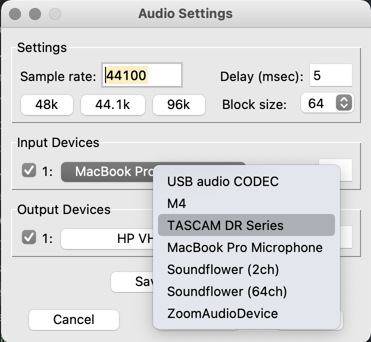
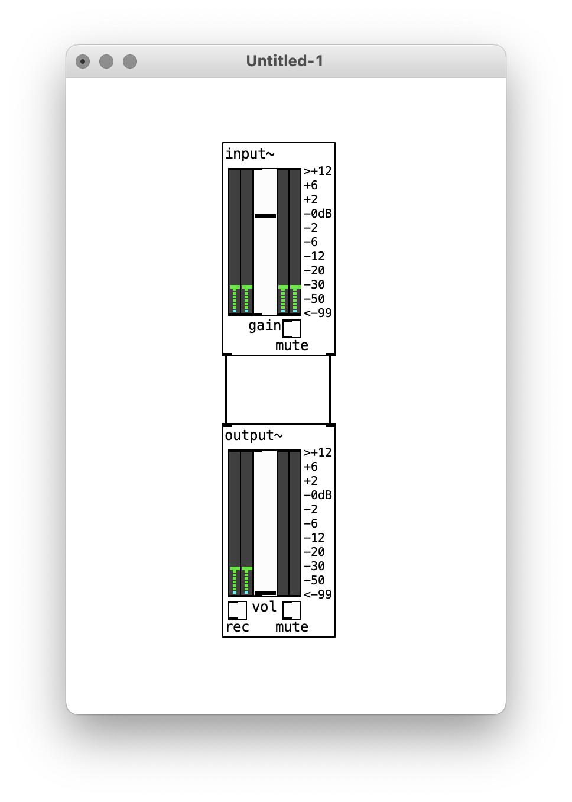
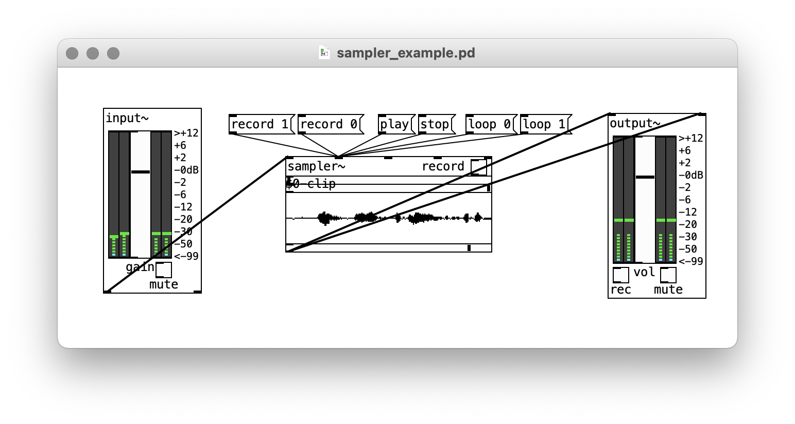

# Live Input

Now that we can use real-time systems to synthesize sounds, manipulate samples, and sequence and spatialize how audio changes through time, our Pd toolkit is almost complete. The last thing we'll cover is using other forms of input, starting with audio.

## Connecting a microphone

Bringing sound in from a microphone offers a lot of possibilities. We have some options here: we can use the built-in microphone on our laptops (although quality and portability is limited), or we can use an external microphone together with an audio interface.

Our DR-05Xs have the handy capability of serving as an audio interface, either for its own built-in mics or for another microphone plugged into its input (including contact mics and electromagnetic pickups). To use it, plug it into the computer using the USB cable. When you turn on the recorder, select the option "AUDIO I/F". You'll have to navigate down through the subsequent submenus to "Exec" to begin (you should also have "Mac/PC" selected by default, and you can leave the sample rate at the default as well as it won't matter for our purposes). You should then see indicator bars for the input level (which you can affect via gain) and the label "USE AUDIO I/F".

If Pd was running before you plugged in your DR-05X, restart it. Subsequently, when you go to the "Media" -> "Audio Settings" menu, under "Input Devices" you should be able to select "TASCAM DR Series".

   

If this doesn't work for you, using the built-in microphone on your laptop is also fine, just make sure "MacBook Pro Microphone" is selected.

## Live audio signal

In Pd, create an `input~` object. This looks strikingly like `output~`, except it goes in the opposite direction: instead of inlets, there are two outlets for the left and right channels. Make sure your DSP and Audio are turned on. If you're using your laptop microphone, you should see audio activity in the leftmost meter of `input~`; with the DR-05X, it should be in both. If you raise the slider, you'll get audio flowing out of the outlets. You can connect it directly to an `output~` to test, although look out for feedback if you aren't using headphones.

   

From here, you can process the audio live through any of the familiar techniques we've used. To keep things simple, you may just want to work with one channel. Adding live tremolo:

   

## Sampling

In the previous exercise, we manipulated audio samples that we had prepared in Audacity using the `audioclip~` object. However, now that we have live input, we can sample from the microphone directly in Pd.

To do this, we'll use `sampler~`. `sampler~` is identical to `audioclip~`, except that it has an additional inlet (the first one). This is a signal input. By clicking the "record" toggle, or sending it "record 1" to start recording and "record 0" to stop recording, you can sample the audio coming in:

   

Sampler can record up to 10 seconds. One thing you might do is trigger recording and stopping automatically. Using a `metro` for example, you could record 1 second every 10 seconds, and have `sampler~` loop in between.

<!-- apologize to Kamala -->
To do this you'll also need an object we haven't talked about yet: `delay`. This object simply takes a number of milliseconds as a creation argument, and will delay a bang by that amount. In this case, we want to record for just 1 second, so we'll use `delay 1000` to delay the bangs from the metro in order to trigger the "stop" message:

   

## Controlling parameters with with audio

Audio input can also be useful not only as a source of audio data, but as a means of triggering events in your patch.

To treat an audio signal in this way, we can use the `peak~` object. `peak~` performs a calculation on the incoming signal to detect whether a "peak" has occurred. If so, it outputs a bang. Depending on the volume of your input, we may have to tweak the sensitivity using a number box or messages in the right outlet (the units are unknown, you'll just have to experiment for the right level).

Hooking `peak~` up to an envelope generator, for example, can make a voice-triggerable synth note play:

   

Similarly, `pitch~` tracks the frequency of the input, if it can find one. You can use this to supply a frequency directly to an oscillator ( although a more interesting approach might be to control the width of an LFO or some other parameter):

   

`peak~` and `pitch~` can be used together to create a kind of instrument that follows the notes that it hears:

   

Finally, `level~` tracks the amplitude of an audio signal. Unlike `peak~` and `pitch~`, `level~` outputs a signal between 0 and 1, corresponding to -99 dB and 0 dB on your input meter. This way, you can hook `level~` up wherever you might use an LFO or envelope, multiplying it with an audio signal to create an amplitude envelope:

   

Level takes a threshold in its right inlet, which can be used to filter out changes in amplitude below a certain dB level. Look on `input~` to figure out how loud the ambient level is, and give `level~` a number slightly higher than that to avoid unwanted output.

