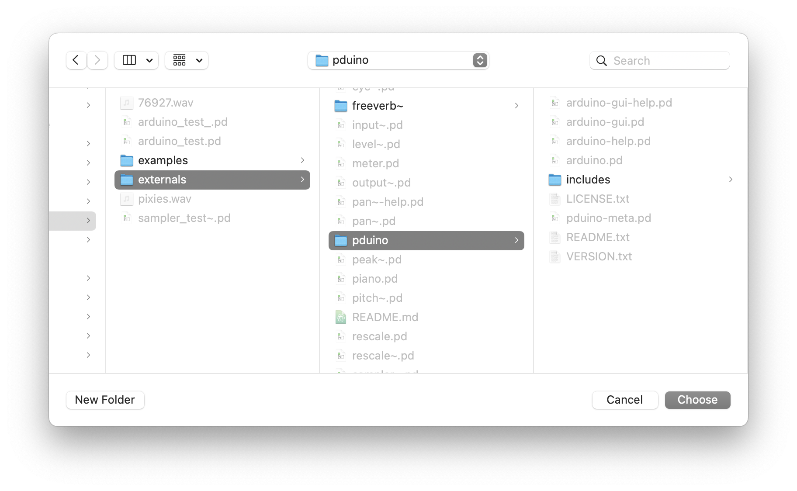
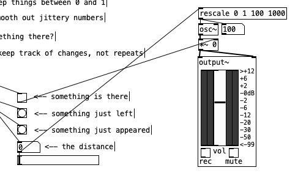

#### Prep

# Sensors

So far our work has been self-contained within our patches, and the "interfaces" we have created have consisted of bangs, sliders, and number boxes ... with the recent addition of using audio input itself as a means of control by analyzing the incoming signal. However, perhaps the most powerful aspect of Pd is that it can process data coming into the computer from external hardware. This might consist of physical knobs and buttons, or it might be sensors that measure the environment in some way. This capability allows us to use Pd to make interactive art, whether that means a custom musical instrument or a sculpture that responds to people who approach it.

## Arduino

In order to put together our own hardware, we'll need a way to interface between the computer and electrical circuits. We can do this with an Arduino, a user-friendly microcontroller that is able to measure voltages. An Arduino needs to be loaded with firmware—a short program that determines its functionality. In Digital Media II, we program our own firmware, but for our purposes now, I have pre-loaded our Arduinos with "StandardFirmata," which can be found under the examples in the Arduino programming IDE, and which simply passes data from the Arduino to the computer through the serial port.

Plug your Arduino into your computer before starting Pd (quit Pd if necessary before plugging in).

_Distribute Arduinos, USB cables, USB-c adapters as necessary_

## Pduino

_Need to also install comport if haven't already_

On the Pd side, we will once again need some external objects. Go to "Help" -> "Find externals" and type "Pduino". Click on "pduino[v0.7].dek" by rdz, or whatever the latest version is.

   

After doing this, we need to add Pduino to the search path. Go to the "Pd" -> "Preferences" -> "Path...", click "New..." and navigate to your Pd folder, inside of which should be a folder called "pduino." Choose this, and you an additional path should appear.

   

   

Once we do this, we should be able to create an "arduino" object in a new patch.

   

Connect a `print` object to the rightmost outlet of `arduino`. Next, connect a message "devices" to the inlet of `arduino`. Switch out of edit mode, click "devices", and try not to panic when it appears like Pd has frozen as it scans for devices. After 30 seconds or so, you should see a list of "available serial ports" show up in the Pd window.

   

Your Arduino will show up as something like "/dev/tty.usbmodem14101" (at least on a Mac). Make note of the number that comes before it. We'll create a new message that says "open 5" or whatever number comes up on your system. Now we can avoid clicking "devices" again, and just click this message instead, to connect to the Arduino.

When we click it, we should see "firmware StandardFirmata.ino 2 5" show up in the Pd log. This confirms that we've successfully connected.

   

## Wiring an ultrasonic range finder

We'll be using an [ultrasonic range finder](https://www.adafruit.com/product/172); it detects if something is in front of it, from 6 inches to about 20 feet, at a resolution of about an inch.

To make it easy to connect the sensor to the Arduino, we'll use a solderless breadboard. This is useful to prototype circuits (and even use for short-term installations), but if we wanted to make something permanent, we would solder the connections directly.

This sensor, like most sensors, needs three connections: one to power it, one to ground it, and one to carry the voltage that corresponds to the sensor value. Conventionally, we use red, black, and green wires for those purposes, respectively. It is important that we hook this up right, as it is possible to damage the sensor, the Arduino, or (though very unlikely) the computer.

Start with ground: plug one end of the black wire into the breadboard on the row in line with the pin just below the mounting hole of the sensor, and plug the other end into the socket marked "GND" on the Arduino.

Next, the power: plug one end of the red wire into the breadboard on the row in line with the next pin down from ground, and plug the other end into the socket marked "5V" on the Arduino.

Finally, the value: skip two rows down on the breadboard, and plug one end in there; plug the other end into the socket marked "A0" on the Arduino.

   

## Programming the patch

Here is an example patch of how to filter the data coming in from the Arduino. It makes use of the `route` object, which redirects a list of messages based on the first one, "smoother" from our piopd collection, and `rescale`, which we can use to shorten the range of sensor if we don't want to use all 20 feet.

   

Having processed the incoming data in this way, we're left with some simple bangs, a toggle, and a changing number that we can then attach to the rest of a patch in order to trigger actions or modulate parameters (hook up another `rescale` to the number box, for example, to make an oscillator change frequency).

   

