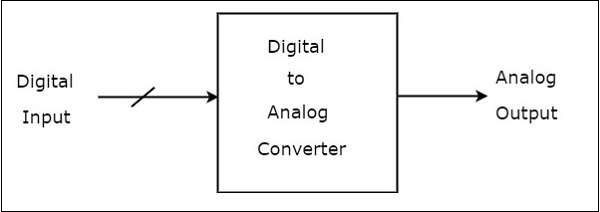
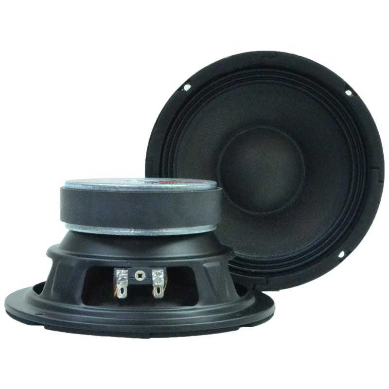
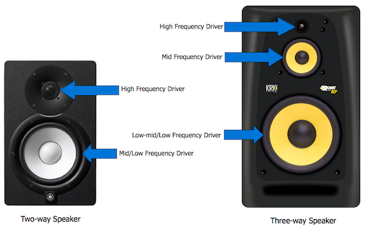
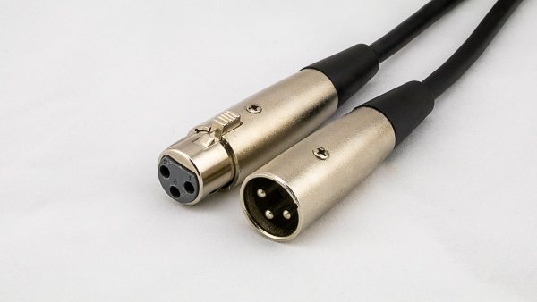
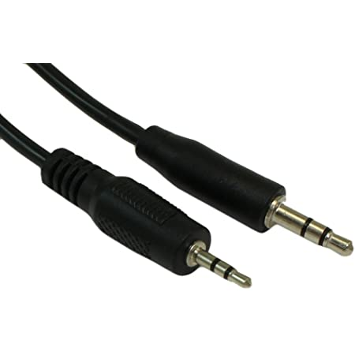
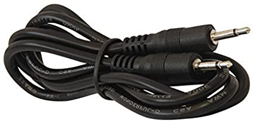
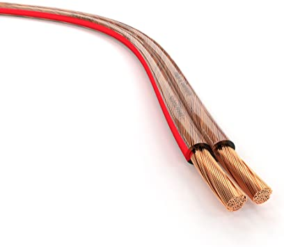

# Speakers

After having spent time listening to and recording sounds happening in the world and then digitally manipulating both recorded and synthesized sound with the computer, we're now going to explore what it means to re-situate sounds in our physical environment. While there are many ways to make sound, we're going to take the obvious approach: using speakers.

## Speaker signal chain

We've already covered this in our discussion of recording, but let's review what needs to happen for a speaker to work. Starting with digital audio, we'll need a means of converting that data into an analog audio signal (instead of 1s and 0s, we now have a variable flow of electricity). Then we'll need to amplify that signal. Finally, we have the speaker "driver" that converts electrical energy into air movement.

[diagram]

#### Source

Computer, DR-05X, etc.

#### DAC

The digital-to-analog converter is supplied by the computer itself, an external "audio interface", or another playback device such as our DR-05Xs (or iPhone, mp3 player, bluetooth stereo system, etc). The circuitry is usually hidden from us, but it's important to recognize that it's there.

#### Amp

The computer includes an amplifier for its built-in speakers, but that doesn't get us very far. Some speakers, known as "powered speakers" (as opposed to "passive speakers"), include an amplifier within them. This is helpful, but it can also mean less flexibility. But there are many different types of amplifiers available for us to use, including the Lepai amps we'll use in this course.

A standalone amp takes a line-level audio signal and boosts it to be strong enough to drive a speaker. Amps have two specifications that are important: watts (how powerful it can go), and ohms (the resistance of the line). We'll talk about these below.

Note that an amplifier like this and a guitar amplifier are almost the same thing. Guitar amplifiers are often combined with speaker enclosures (combos) and have multiple amplification stages (ie, a gain knob and a volume knob). Most significantly, guitar amplifiers are expecting an instrument level, rather than a line level signal, which we'll also come back to.

#### Driver

The speaker driver itself consists of a fixed magnet, an electromagnetic coil, and a paper cone. When the coil is magnetized by the audio signal, it pulls against the fixed magnet, moving the cone, and subsequently the air.

#### Speaker enclosures

We use the term "driver" to refer to a single cone—"speaker", or more properly "loudspeaker", can refer to an enclosure that includes one or more drivers. The bigger the driver, the better it is at reproducing low sounds, and vice versa for small drivers. If there are more than one driver, they are responsible for a different frequency range to take advantage of this, and they also include some circuitry to split the audio signal into the desired frequency bands. This is where we get the terms "tweeter", "mid", "woofer", "subwoofer", etc. The physical enclosure itself projects the sound in the intended direction and prevents sound waves coming off the back of the speaker from interfering with the desired sound.

We'll use bare 4" drivers, which, despite their small size, are full range, meaning they are intended to be used on their own.

## Plugging things in

To connect speaker drivers to our amplifiers, we'll use speaker wire. To connect our laptops or DR-05Xs to the amplifier, we'll use a stereo mini-jack. Why?

#### Audio levels

The first and most important factor is that there are five (or six) basic audio signal types:

- **Phono level (~.005v)**: this is what comes out of a turntable cartridge, and typically goes to a preamp to bring it to line level before going to other equipment.
- **Microphone level (~.01v)**: this is the softest level, and is the unamplified output coming out of a mic. It goes to a mic preamp to bring it to line level before going to a ADC or other analog equipment (remember the gain adjustment on the DR-05X adjusts the pre-amplifier).
- **Instrument level (~.75v)**: this is the level from an instrument that uses electromagnetic pickups, namely, a guitar (or electric bass, or 70s style electric piano). It also goes to a preamp.
- **Line level (1v)**: this is a baseline audio signal that is used to give to an amplifier or DAC, to transfer within an audio mixer or send to studio audio components like compressors or effects. To record audio, it needs to be at line level.
- **Speaker level (4v)**: this is an amplified signal intended for speakers. Voltage isn't the only significant factor here, as the current supplied by a speaker signal needs to be able to drive the speaker (measured in watts vs ohms).

In addition,
- **Headphone level** is somewhere between line and speaker—it's usually louder than line, but not enough to make the most of a speaker. Your computer has a headphone level output (as does the DR-05X).

You always want to give a device what it is expecting, whether that device is an amplifier, or a speaker, or a mixer, or a recorder. If you don't, it will either sound bad, be inaudible, or damage your equipment. Often inputs will be smart enough to handle multiple input types. But the key thing is that once a signal is amplified to speaker level, don't plug it into anything except a speaker.

#### Cables

Different cable types can sometimes help differentiate between level types, although they are not always consistent. As we saw when we wired our contact microphones, audio cables have one ground wire (the outside shielding) and one or two signal wires. Two signal wires can either carry two stereo channels or a "balanced" signal.

A balanced signal uses two wires to transmit the same signal, but it flips the polarity of one of the signals so that the waves are mirror images of each other. On the receiving end, the signals are added together, which should result in a flat signal—if it does not, the remainder is _noise_ introduced in transmission. This noise is then subtracted from the (non-inverted) signal, resulting in noise free audio. It's brilliant and awesome.

So, for cable types we have:

- 
The XLR cable, which is balanced, and is typically used for microphones to transfer mic-level signals, but is also commonly used for line-level signals. It is, ultimately, the best kind of cable.

- 
The 1/4" TRS (tip-ring-sleeve) cable is either used for awesome stereo headphones or for a mono balanced line-level signal on high-end audio gear. It is a rad cable.

- 
The 1/4" TS (tip-sleeve) is primarily used for (unbalanced) instrument-level signals, ie, guitars and guitar accessories. Confusingly, older guitar speaker cabinets use the same connector (though with thicker wires and no shielding) (newer ones use Neutrik connectors, but that's a different thing). It is the most punk rock of cables.

- 
The RCA cable, which is unbalanced and typically comes in stereo pairs. This is almost universally a line-level signal, except when it's coming out of a turntable, which is phono-level. This is not really a cool cable.

- 
The mini-TRS cable. Typically used for stereo headphones or short stereo line-level connections from consumer digital audio devices. It's ok.

- 
Mini-TS cable. Used for shitty little mics. It's doing what it can.

- 
Speaker wire for amplified signals. Comes in different "gauges", with the lower the number the thicker the cable and the further it can go (but the more powerful amp it will need). There are two wires, a ground and a signal, in each speaker wire cable. The signal is the red, copper, or lined wire, and the ground is the black, silver, or unlined wire.

Speaker wire can have various types of adaptors on the end, including "banana plugs": 

Adapters, converters, and splitters galore will let you change between cable types, but just because a cable fits doesn't mean it's going to do what you want.

#### Connecting an amplifier

When setting up an amplifier and speakers, for example for an installation, you'll run a line-level signal from your playback device to the amplifier, probably using a mini TRS (stereo) or RCA cable. You'll then have a (set of) speaker wire running to each speaker—each of the two wires in a single connection gets its own plug in on the amplifier.

#### Amplifier ratings

Here's the most important thing to pay attention to: your amplifier and your speakers will have a wattage and a resistance (ohms).

The wattage indicates how much power your amp can give, and how much your speakers can take. If the amplifier's wattage is greater than the speakers, that means it is capable of blowing out the speakers if it is turned up too high. So you typically want to have speakers that match the rating, to be safe.

The ohms indicate how quickly the speakers will pull power from the amp. The lower the number, the faster the flow. If the speakers have ohms that are less than the amp, the speakers can fry the amplifier. So you'll want these to match. Typically, you'll use 4 or 8 ohms—avoid speakers with different ratings.

(Remember that you'll also want to pay attention to the frequency range of the speakers)

## Workshop

- Soldering
- Splicing?
- Emphasize how the recorder can be used as audio input, output, or directly
