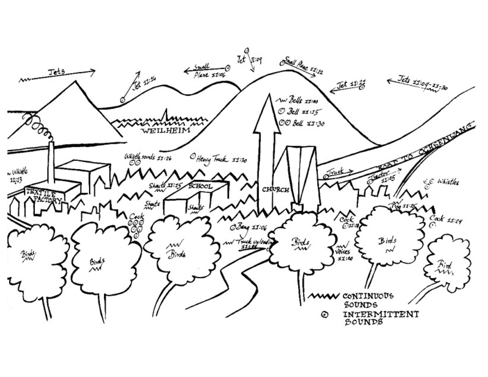
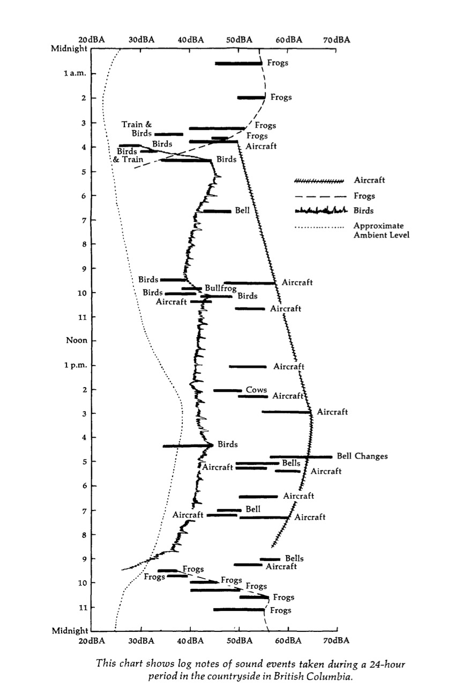
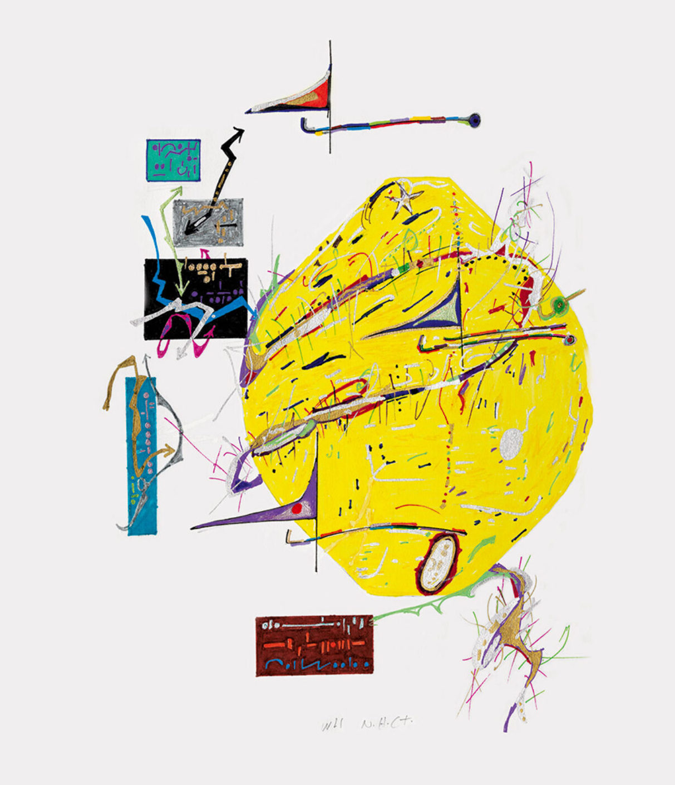

# Soundmaps

For this project, you will visually represent your sonic environment.

You may choose any stationary location or walkable area: a room indoors, a spot in the forest, a path through campus, the grocery store, etc (but no virtual or online spaces).

Spend at least a half-hour in your site listening. Then, make a 2D map, score, diagram, or impression of its sounds. Pay attention to their sources, qualities, and effects.

Make a high quality scan, photograph, or export of your result. Turn it in via Google Classroom and be prepared to be share it over Zoom.

## References

Some of the following are maps of sound in spaces; others are "graphic scores" intended to be performed by musicians or computers that might also serve the same purpose.

---

Murray Schafer, _Prominent sounds heard between 11:00AM March 6, 1975, from a hillside about 500 meters beyond the village of Bissingen_ (1975)

---

Murray Schafer, _24-hours in British Columbia_ (1976)

---

Michael Southworth, _Events in downtown Boston_ (1976)

---

Karlheinz Stockhausen, _Zyklus_ (1959)

---

Wadada Leo Smith, _Kashala_ (2011)

---

Brian Schorn, _Nebula_ (2017)
