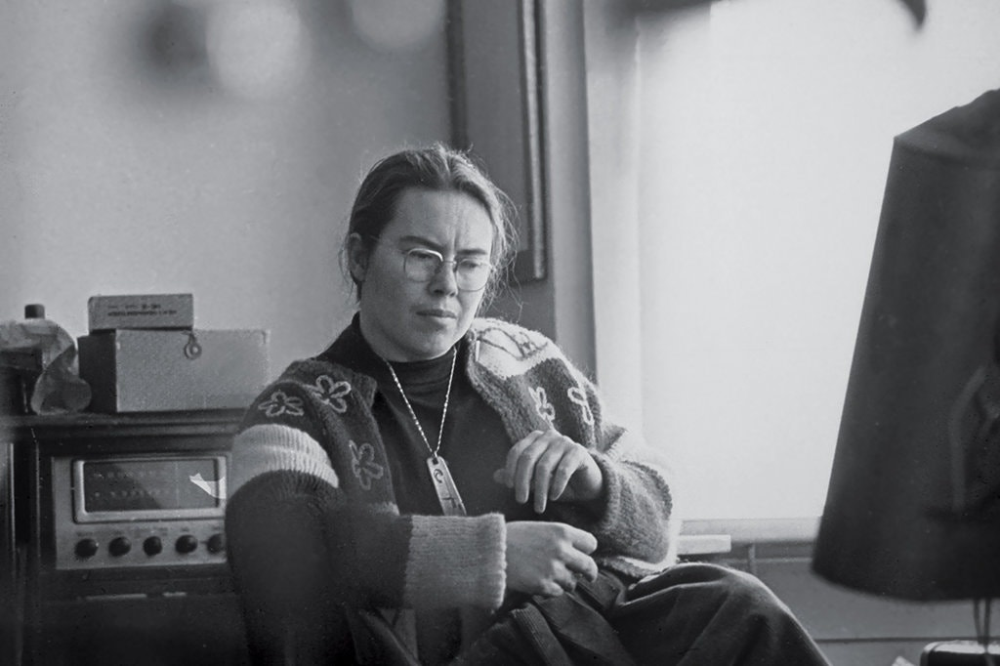

# Pauline Oliveros

[Performance Clip](media/oliveros_performance_1995.mp4)  (1995)

1932–2016

- A central figure in the emergence of sound art
- Originally from Texas of Tejano origin
- She was an accordionist, but was also of the first generation of musicians to experiment with tape loops and electronics, notably at the San Francisco Tape Music Center in the early 1960s and later Mills College, which became early West Coast hubs of experimental music; she relocated to New York State in the latter decades of her life
- Known as a composer whose work incorporates the audience and as a theorist associated with this concept of Deep Listening

[Interview Clip](media/oliveros_interview_1995.mp4)

This text is an introduction to manual on deep listening exercises / meditations / compositions / group exercises ... for Oliveros, the distinction between all of these is very fluid.

- For examples, this is one of her pieces, _Collective Environmental Composition_, from 1975.

- This instructional style of avant-garde artists from the 1960s like Fluxus
- Throughout art history, this relationship between art and life, and Oliveros is a someone who works to collapse that boundary

This text is from 2003, but I've seen various versions going to back to the 80s.

Differentiate listening from hearing. What are those differences?
- listening is active, intentional, involves interpretation

What is _deep_ listening?
- "surpasses one’s present understanding or has too many unknown parts to grasp easily" (listen to _that_)
- requires both self-discipline and self-expansion

What are the influences in this piece?
- science and biology/physiology
    - audio cortex
- Jonathan Sterne, media theorist
    - how our experience of the world is mediated by cultural objects
- Stephen Handel, psychologist
- Thich Nhat Hanh, buddhist teacher
    - known for mindfulness (extention of meditation practice into the everyday)

///

Yahli:
agency
a tool for resolving conflict

what about other senses?

Iris:
always avoided silence [nice, why?]

Alex:
how much can we learn about each other by sharing the sounds of our environment?

Elena:
lots of things happening neurologically

Isaac:
article described it as a survival technique

John:
"If a tree falls in a forest and no one is around to hear it, does it make a sound?" 
animal listening [ties to isaac and alex]

Navie:
in church, "background" sounds

Zach:
anechoeic chamber

(Andrew is doing John Cage)

