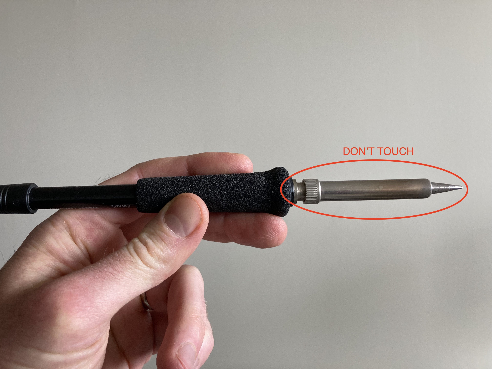
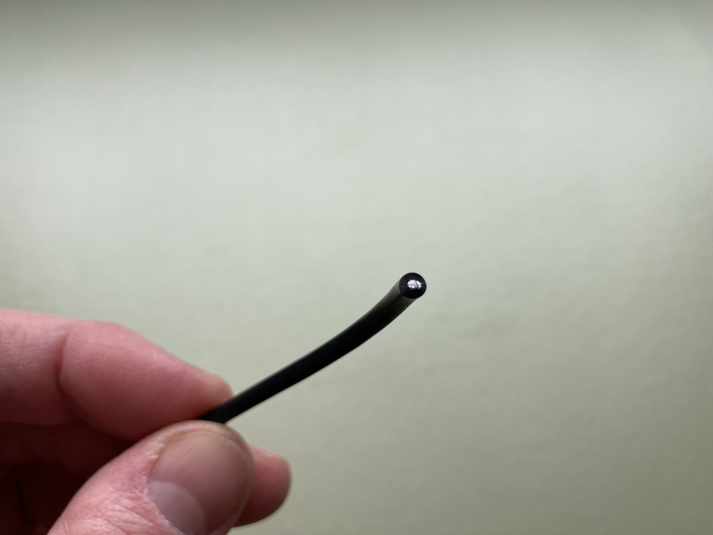
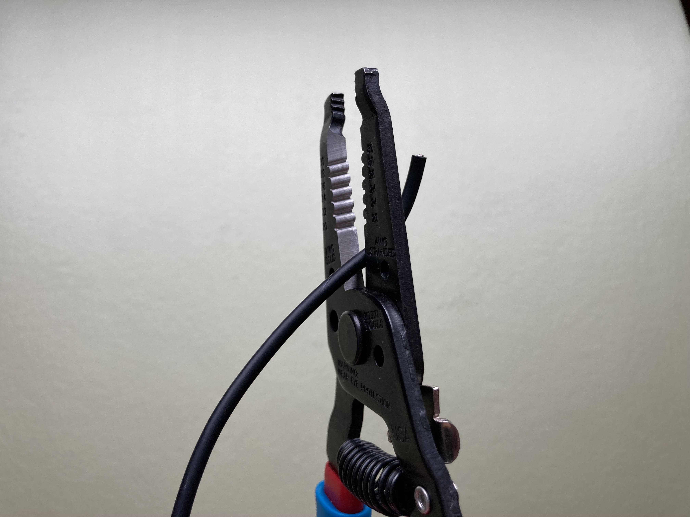
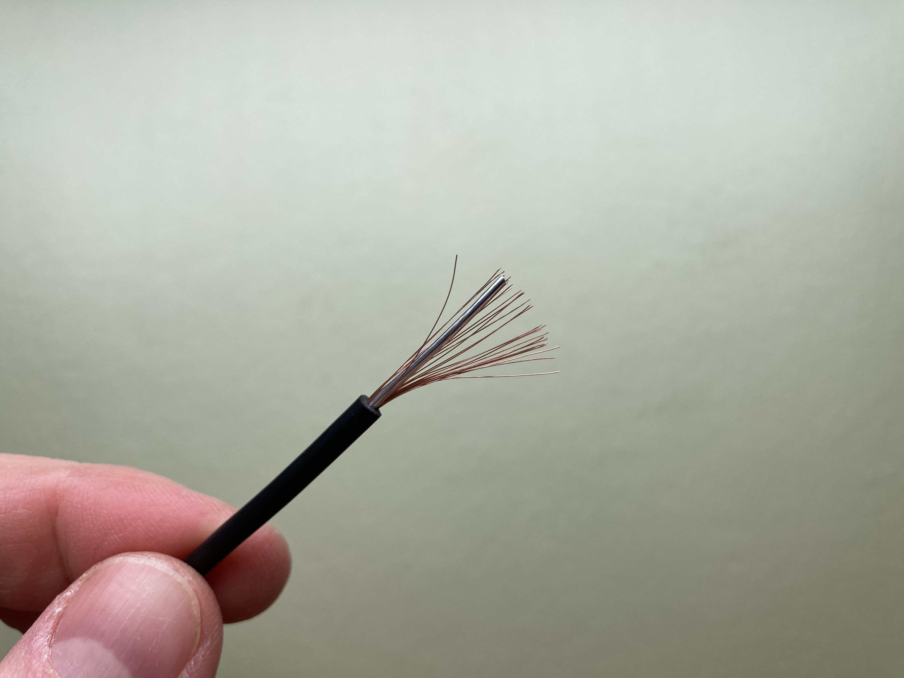
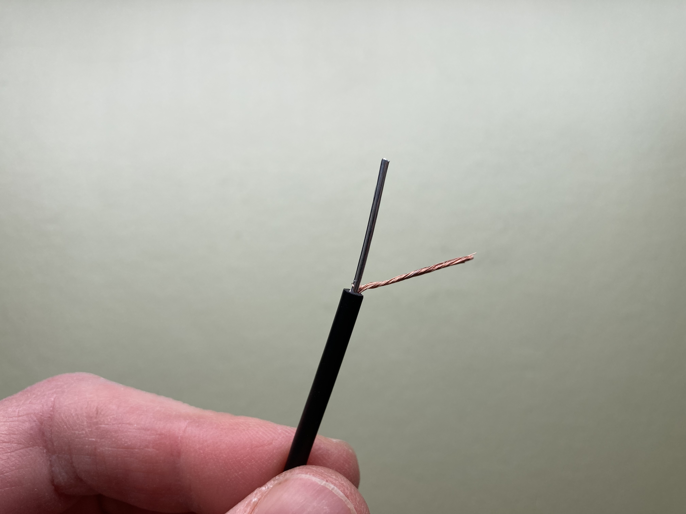
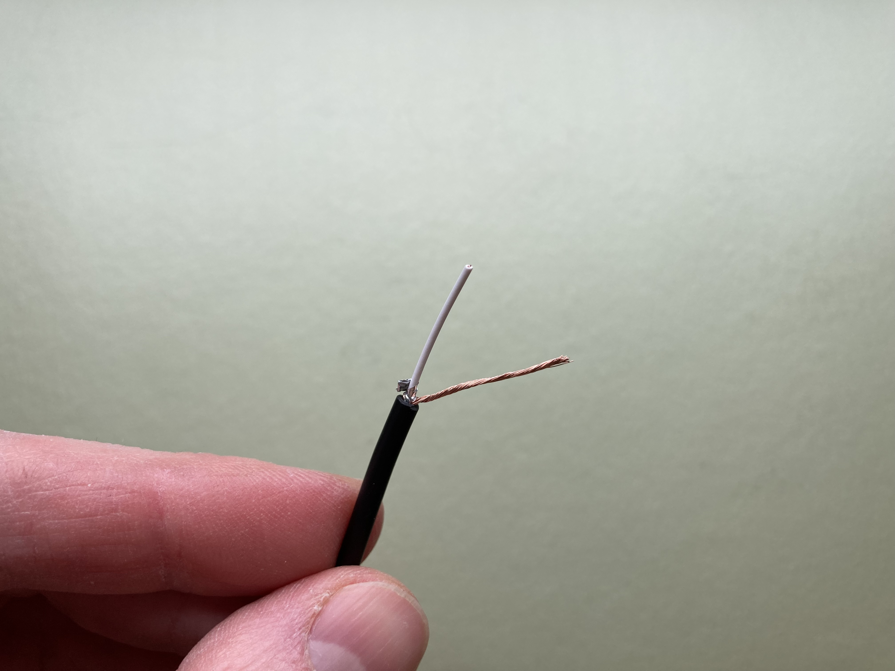
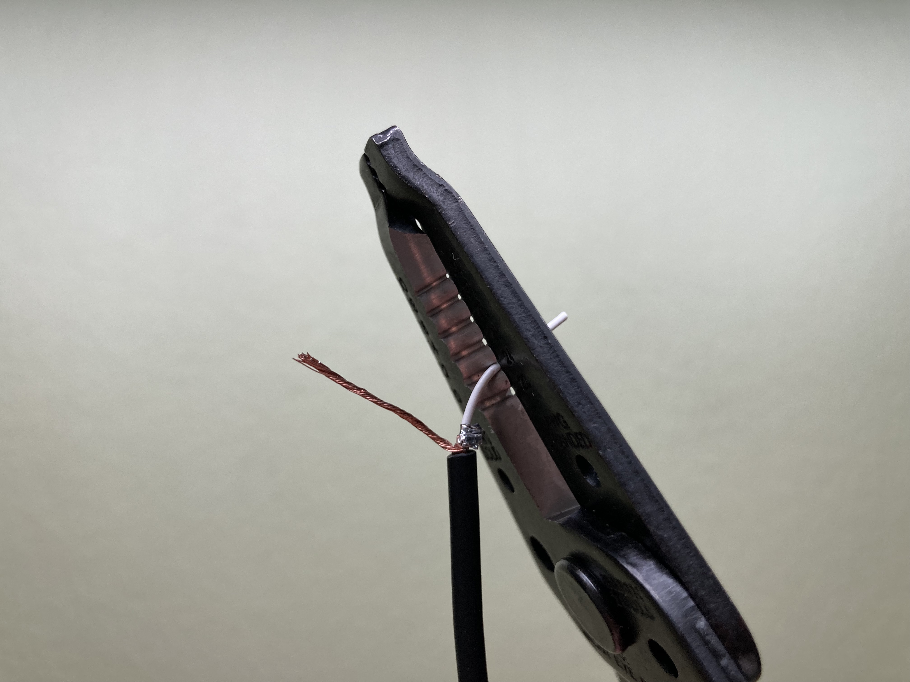

# Contact Microphones

### Materials
- Piezo elements
- 1/8" TS (mono) cable
- Solder
- Plasti-Dip
- Electrical Tape
- Blue Tack
<!-- also check bandaids -->

### Tools
- Wire strippers (small and large)
- Soldering stations (w/ smoke extractors and "helping hands")
- Scissors

## Soldering

1. **DON'T TOUCH THE METAL PART—IT'S HOT AND IT WILL BURN YOU!**
1. Solder contains small amounts of lead, so don't solder if you are pregnant, and wash your hands afterwards 
1. Try not to breathe the smoke, which is not lead (small amounts will not hurt you)
1. If the soldering iron isn't in your hand, put it back in its holder—nowhere else!
1. heat to 650

### If You Burn Yourself

1. Keep the burn under cool running water for 5 minutes
1. Don't apply any creams or ointments
1. Cover with a bandaid to protect it
1. If the skin breaks, go see the Health Center  
(Open Monday–Friday 8:30am–5pm except Wednesdays 8:30–10am and 1–2pm)

wet the sponge

make sure it's turned off

if it's very bad, we call

## Instructions

1. Cut the cable in half (share with your partner).

1. Strip 2" off the outer insulation. This is too big for any of the slots on our strippers, so you'll have to "nibble"—gently squeeze to cut part way through—all the way around the cable until you can pull the insulation off. Don't cut too deep, because you don't want to damage what's inside. If you do, just make a clean cut and start over.

1. Twist the strands of the outer shielding together to form a wire. 

1. Remove the inner shielding (twisting it back and forth can help get it loose) and cut it off.

1. Strip .5" off the inner insulation using a slot on the wire strippers, and twist those strands together.

1. Strip .5" of additional insulation off of the piezo leads (be very careful not to pull the leads off of the disc).

1. Twist together

1. Electrical tape
1. Submerge in plasti-dip

### Using a contact mic with the DR-05X

The jack for an external mic is at the top of the DR-05X.

Note that both the contact mic and the coil are _mono_ signals. In order to hear the sounds in both ears while you are recording, select "MONO" under "Menu → REC SETTING → TYPE" on your recorder.

## How it works

import from open circuits

## Additional Resources

https://www.zachpoff.com/resources/building-contact-mics/  
