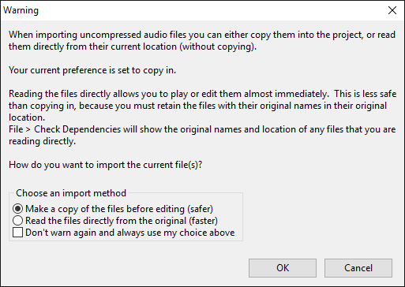
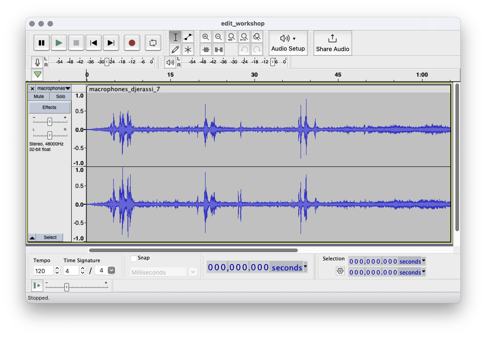
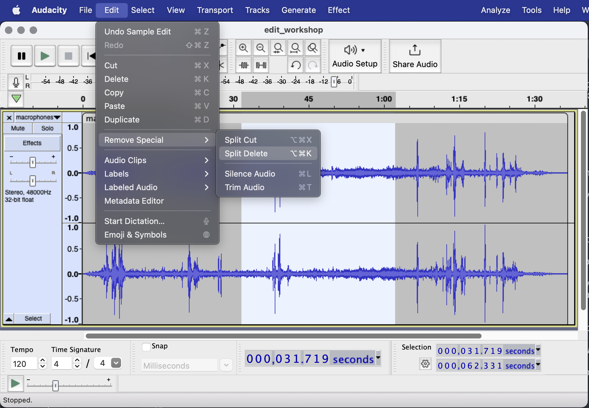
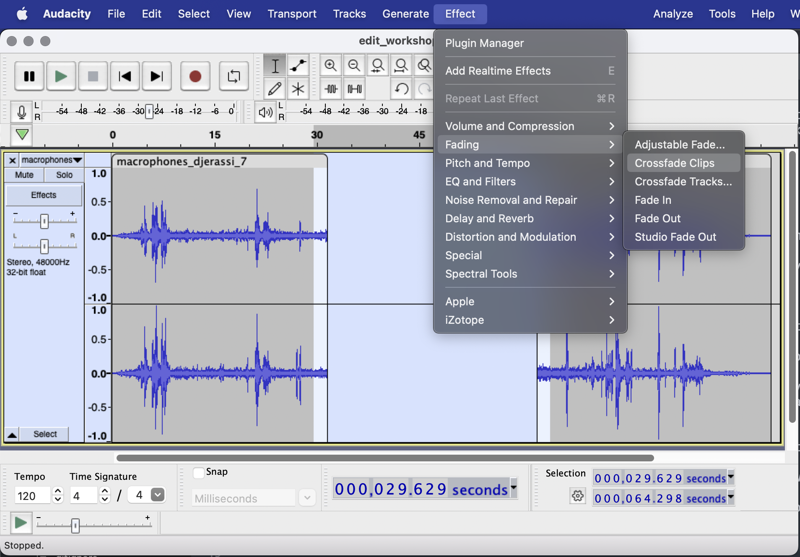
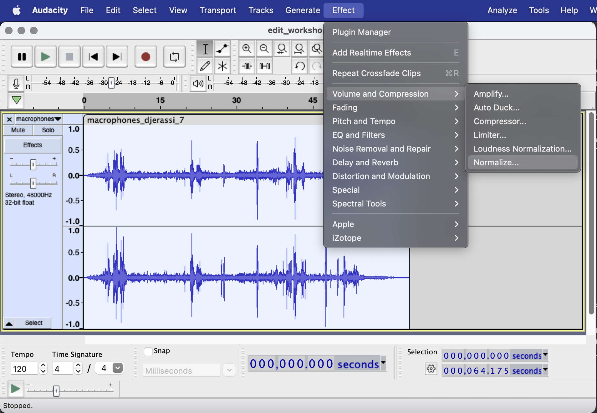
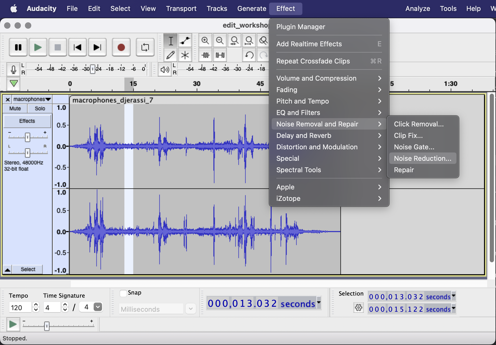
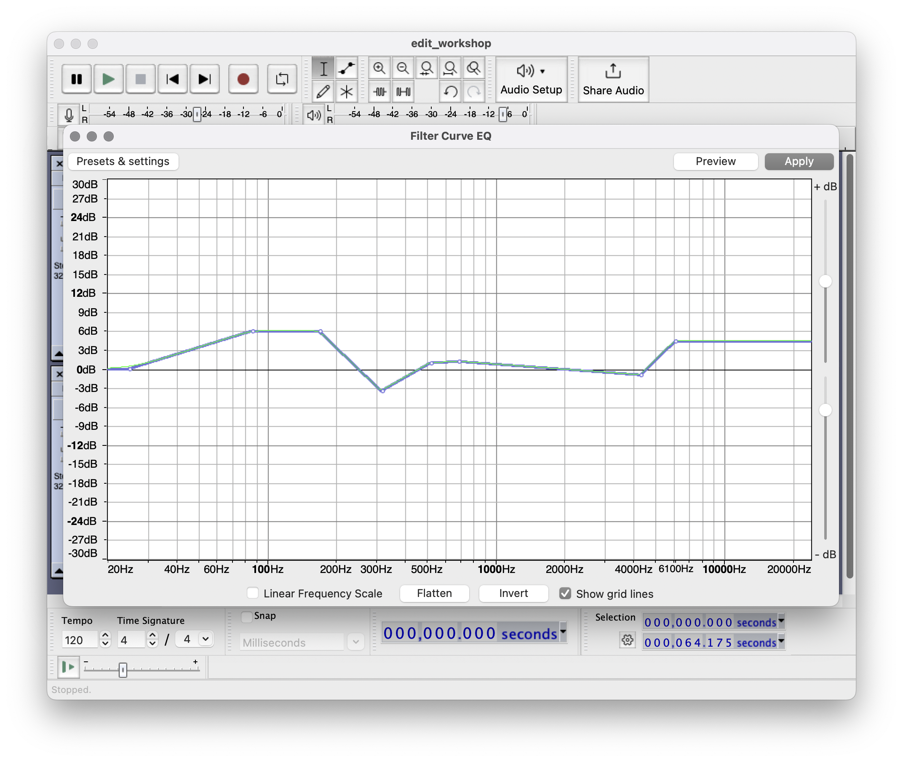
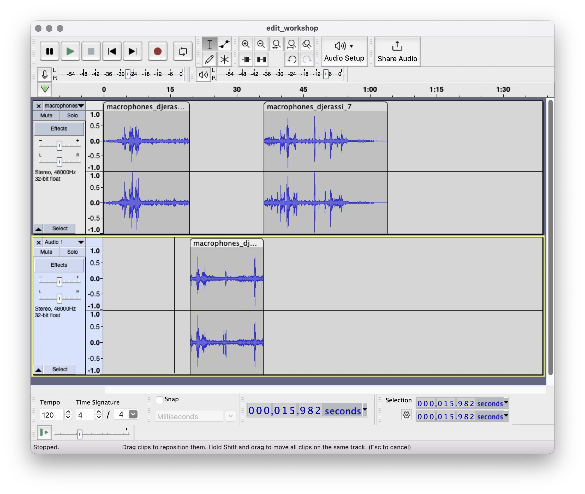
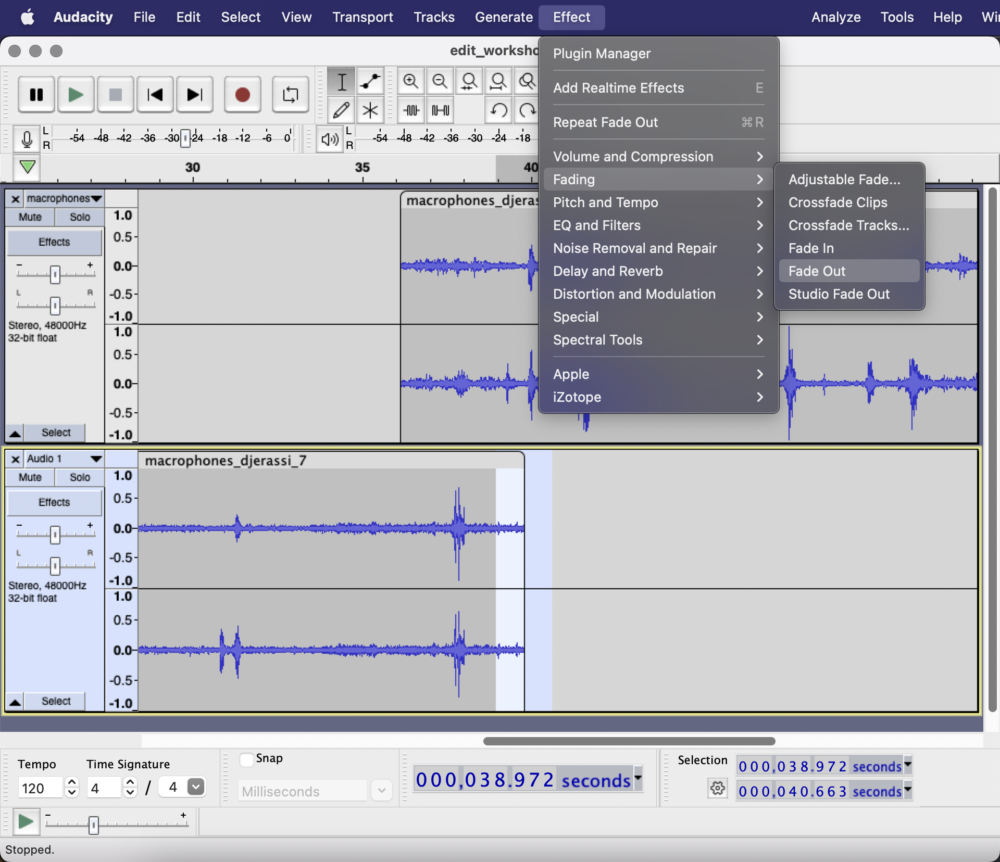
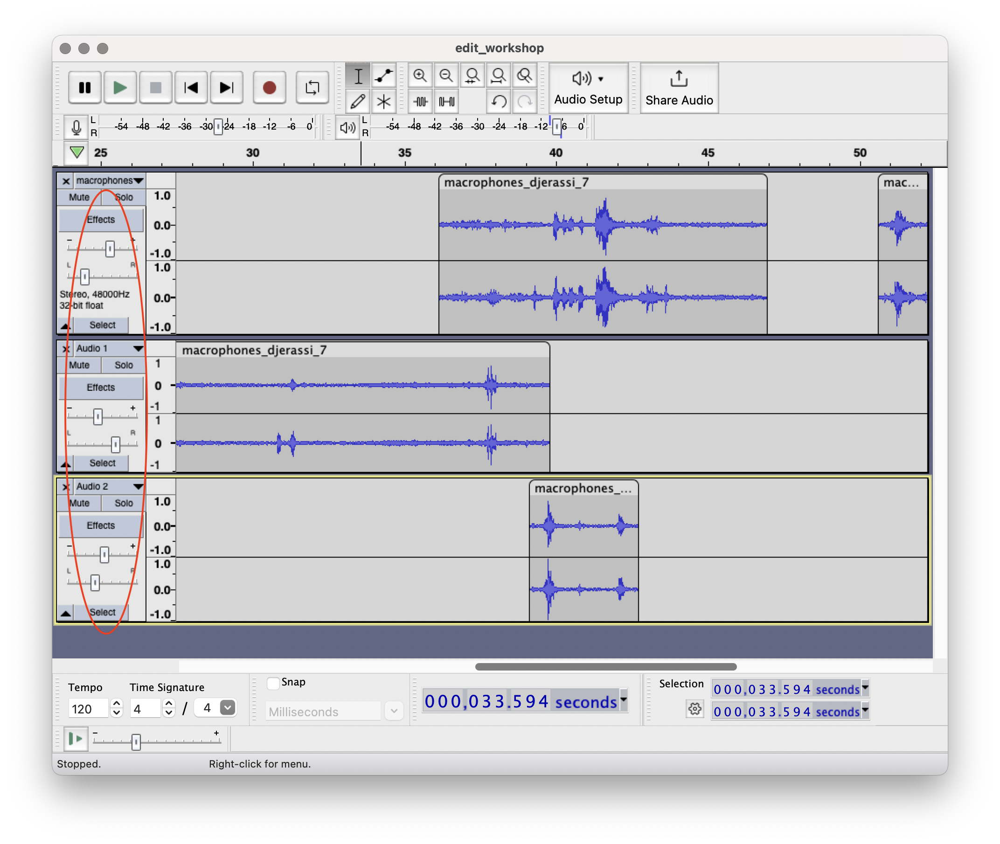

# Editing

There are two mediums in which we can edit audio—magnetic tape, and digital. Many of the artists we've talked about so far have used tape, and to edit tape means literally cutting it and taping the pieces back together. We're going to do things digitally, using Audacity.

Audacity is an open source program and is free to use. In some ways, it is clunkier than commercial production software, but it is also singularly flexible and can do things that other programs cannot. It is not intended to be a full Digital Audio Workstation (DAW) like Logic or Protools, but it is about directly manipulating recordings, a model it inherits from tape editing.

## Download and install

Download [Audacity](https://www.audacityteam.org)

Drag the application from the DMG folder into the Applications folder on your computer.

Open Audacity, and Choose "File → Import → Audio..." and select your audio file from your computer. If you get a warning dialog box about importing uncompressed audio files, choose the "safer" option and select "Don't warn again":

Once you've loaded a file, save your Audacity project, "File → Save Project → Save Project". You'll get a warning telling you this saves a project, not a listenable audio file, and that's fine, that's what we want (you can click "Don't show this warning again" if you like). Save it as "edit_workshop.aup" to your computer.

(If you haven't already, I suggest that everyone makes a folder on their computer for this class where you can copy recordings as well as project files. I find that many students are so used to using Google Drive that organizing things locally on their computers can cause unexpected problems. Please ask questions if you get lost with things like saving and moving files.)

(Also saving. I have a twitch at this point to hit Command-S, and it's one that you should develop. Save your project file.)

## Lay of the land

Ok, so what do we have here?

It's a waveform representation of the sound. You have two sounds grouped together, because it's stereo. You have time in seconds, and you have amplitude expressed in terms of maximum and minimum.

On the left, it shows the sample rate and bit depth, but you'll notice it's converted the bit-depth to 32-bit float, which is even higher resolution than we recorded it at.

Tools:
- Selection — use it to select audio  
- Magnifying glass(es) — you can zoom all the way in until you see the samples (or see everything in an overview)
- Draw — if you're zoomed in, you can actually draw sample values directly!

## Splicing and Crossfading

So the first thing you want to do is to delete the sections you don't want to work with. This could be because there is an unwanted "clip" or "rumble" in that section, or it could be that it's just not a section you're interested in. **This wont affect the original audio file**—that's why we saved this as an audio project.

Use the select tool to select the audio. Then use: "Edit → Remove Special → Split Delete":

This leaves a blank space. You can then recombine the two sections with a short _crossfade_ by select a bit of audio from each clip on either side of the gap. Then choose "Effect → Fading → Crossfade Clips"

Crossfading is critical. We've seen that we need a smooth waveform, otherwise it will produce distortion. Making your edits this way will ensure you don't introduce more unwanted noises into your audio.

## Processing

Once we have a clean take, with all the clicks removed, we're going to do some more post-processing to make things sound better.

### Normalization

First we're going to run normalization.

"Edit → Select All" (or Command-A)
"Effect → Volume and Compression → Normalize": "Normalize stereo tracks independently" should be OFF

What this does is scale everything up so that the loudest portion is at the maximum amplitude. This is important so that you use the maximum bits you have available when you change your audio. Also that the scale of your audio is aligned with other sounds and the volume controls in general, so you're not turning everything up to hear quiet sounds.

### Noise Reduction

It could be that there is a lot of hiss in your recording because what you were trying to capture wasn't loud enough. Or maybe there's the sound of machinery in the background, or some other consistent, unwanted noise. It's not always possible to get rid of this, but sometimes it is.

First, select a section of your audio that is representative of the noise you want to remove (it should have no other sound in it—just the noise). Then choose "Effect → Noise Removal and Repair → Noise Reduction..." Then click "Get Noise Profile", and click OK. We've now loaded in a "profile" of the noise that will be filtered out.

Next, select the rest of the audio with "Edit → Select All" (or Command-A). Choose "Effect → Noise Removal and Repair → Noise Reduction..." again. Now we can set some parameters:
- "Noise reduction (dB)" is the amount [12]
- Sensitivity" is how close the match has to be to be considered noise [6.00]
- "Frequency smoothing (bands)" is how it handles any glitches [6]

Give this a shot and see if it helps, or if it makes things sound worse. Adjust the parameters accordingly.

### Equalization

Select all your audio "Edit → Select All" (or Command-A)

Choose "Effect → Filter Curve"

You'll see a graph similar to what we saw when we learned about the loudness curve of the human ear, and about how all microphones have their own frequency responses.

What we can do here is adjust the overall balance of the audio by raising and lowering frequencies. This is a powerful tool, and small changes can make a big difference, you'll want to make adjustments of just 6dB or less.

## Arranging

So far, we have been working with a single stereo "track" of audio. However, Audacity lets us create as many tracks as we want in order to create layers.

Choose "Tracks → Add New → Stereo Track". An empty track will appear below the initial one.

Select some audio, and choose "Edit → Remove Special → Split Cut". This behaves similarly to when we use Split Delete to remove a portion of a clip. However, this time the audio is stored in the clipboard.

Select somewhere on your new track, and choose "Edit → Paste". Your clip will appear on the new track. Grab the top of the clip to move it forward and backward in time.

Note that once you create multiple tracks, "Select All" will select your entire project. To just select all the audio on one track, there is a "Select" button on the track controls. To just select a single clip, use the selection tool and double-click on the clip you want.

### Fading

Now that you have audio on multiple tracks, we need to make sure that audio doesn't start or end abrubtly. For this, we can use fades. Select the beginning or end of a clip, and choose "Effect → Fading → Fade Out" or "Fade In".

**IMPORTANT**: Every clip that is separated in a track should fade in and fade out. It makes a difference.

### Basic Mixing

If audio on two different tracks overlaps, you will hear them at the same time. The controls on the left of the tracks allow us to adjust the relative gain (aka volume) as well as the stereo position between left and right. Distributing clips at various points across the stereo field will make a much more immersive result.

## Additional Effects

### Audio rate manipulation

There are a few more additional techniques that mimic what is possible with magnetic tape. The first is changing the playback speed of a track. Click on the track name, and select "Rate"—you'll see a list of standard sample rates, and an option to supply your own.

If you recorded your audio at 48kHz, selecting 16kHz will play back the audio at 1/3 the speed. It will be both slower and lower in pitch. Play around with different track modifications and listen to what they do to the sound.

In addition, there is "Effect → Reverse", which will flip the order of samples in a clip.

### Dynamic volume

By crafting "envelopes," you aren't limited by the dynamics of your recordings or even the basic mixing enabled by the track controls—you can expressively alter how audio is presented to the listener.

Select the envelope tool in the palette. By clicking, holding, and dragging up and down on a clip, you can see how the amplitude of the waveform is adjusted. By just clicking once, you'll create a new control point, and either side of that point can be adjusted independently. To remove a control point, simply drag it outside the track.

### Panning

Envelopes can be used to simulate a panning curve, which is otherwise missing in Audacity.

To do this, we first have to separate our stereo track into two mono tracks. Do this by clicking on the name of the track and selecting "Split Stereo to Mono". As a result, each channel in the stereo track is now on its own new track.

Using the track controls, pan the top one all the way to the left, and the bottom all the way to the right. This will create the same result as the original stereo track.

Now we can adjust the envelopes of each side independently. If the audio envelope between the two tracks differs, we will hear the sound move through space.

### Reverb

An important aspect of spatialization is the reverberation in the space of the recording. "Reverb" is an effect that simulates this acoustic effect.

Select some audio, choose "Effect → Reverb", and play with the parameters.

In order to make things sound like a real space, you'll want to use Select All to apply the effect to all of the audio. Applying separate reverbs in multiple places will create artificial or distorted senses of space. Of course, if that's what you want, that's fine too.

### More

By now you have noticed that there are other effects that we haven't talked about. Audacity provides many built-in possibilities, though its options tend to be fairly utilitarian in nature. Commercial "Digital Audio Workstations", or DAWs, like Logic and Protools, will be loaded with advanced effects of all kinds. These are all great, and feel free to explore. Remember, however, the that the techniques we've looked at here (splicing, normalization, eq/filter, arranging) are the foundation, and work with these first to craft your audio intentionally without relying on layers of processing as a crutch.

## Exporting

Choose "File → Export Audio" and select "MP3 File". Include your name in the title of the file.
