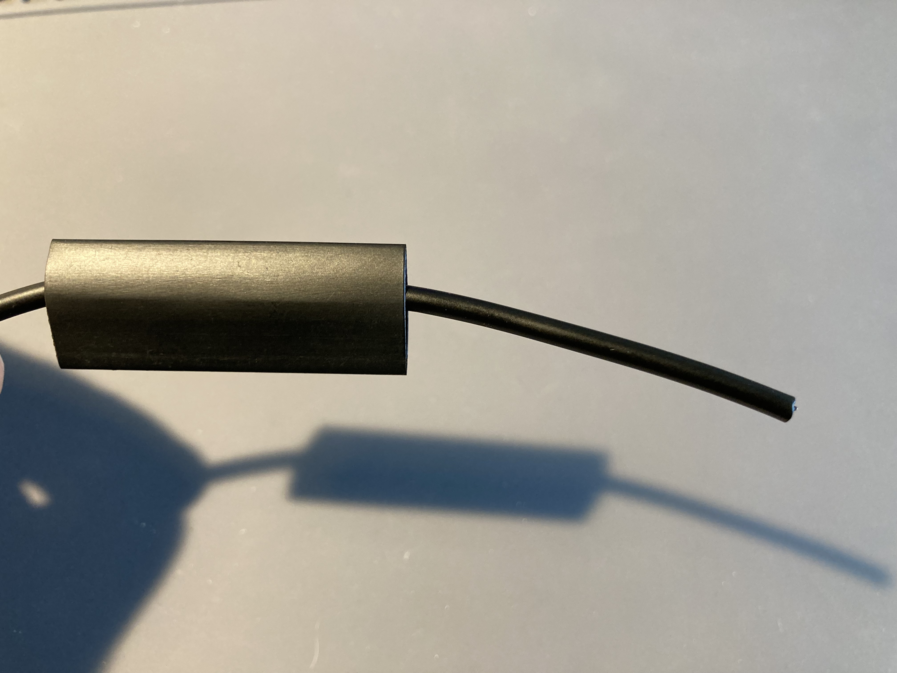
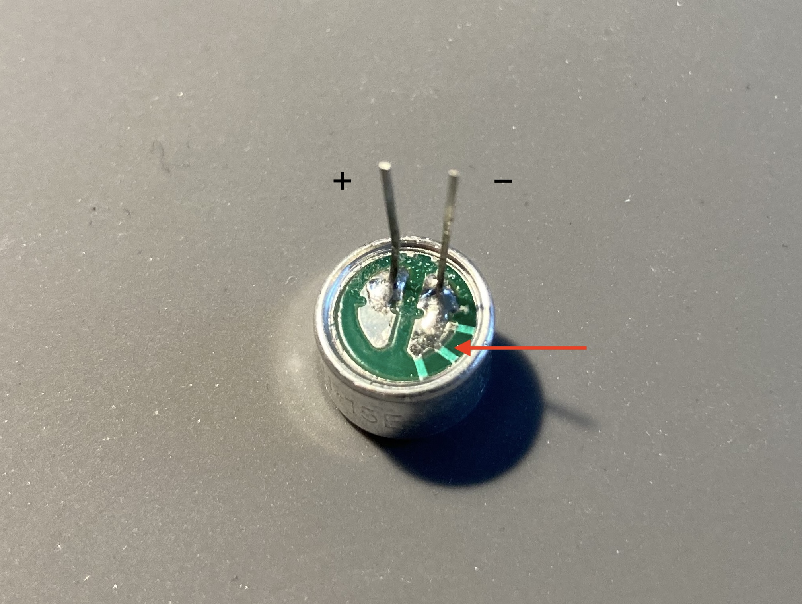
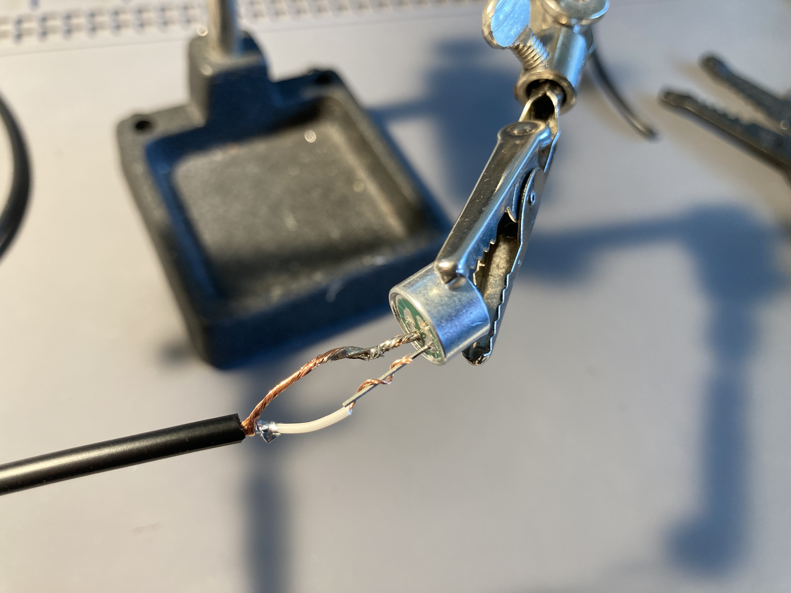
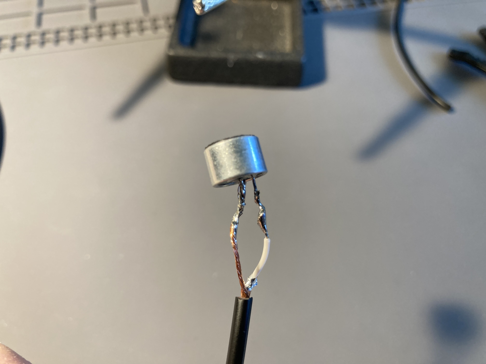
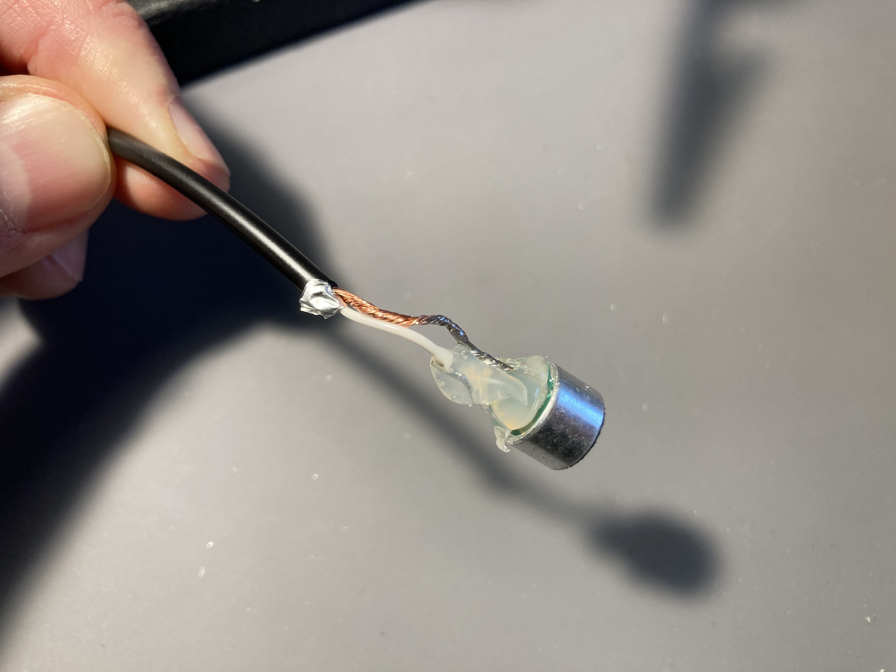
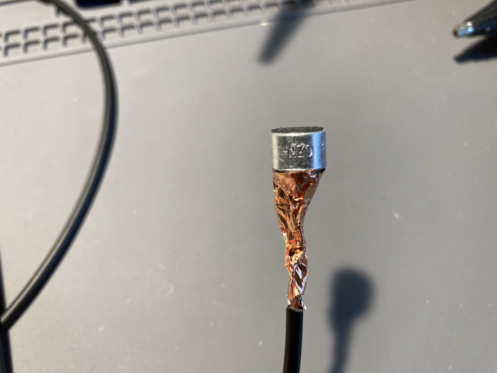
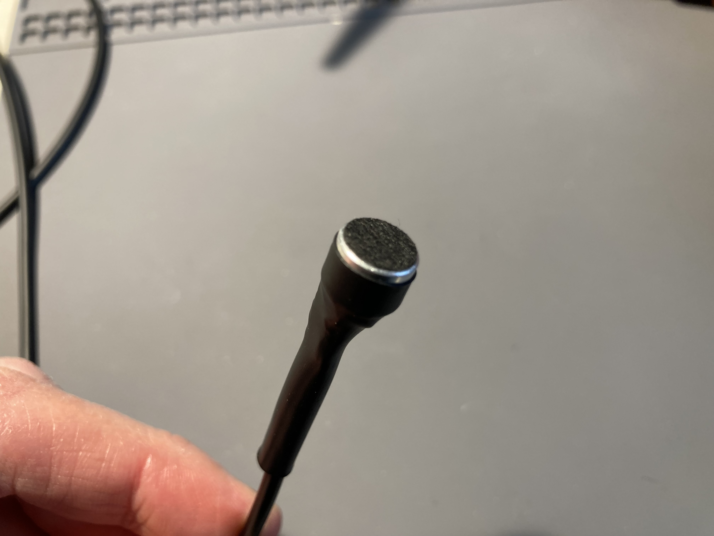
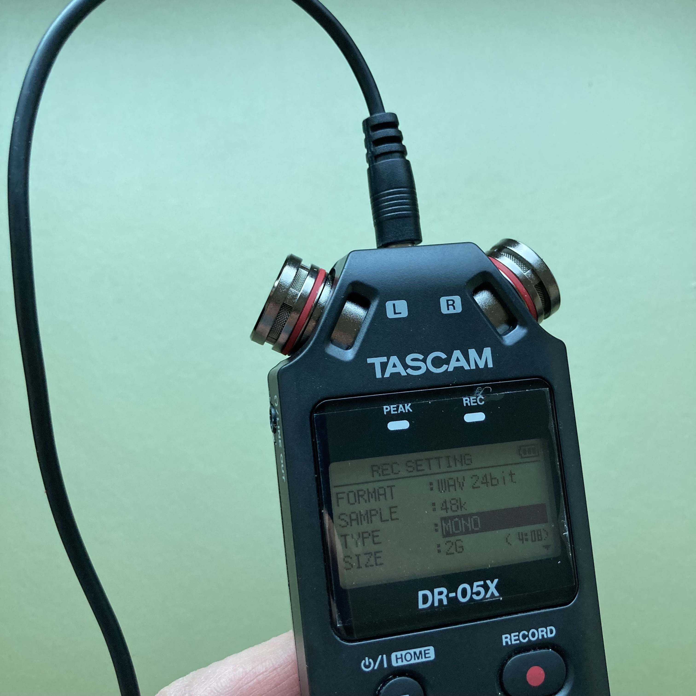
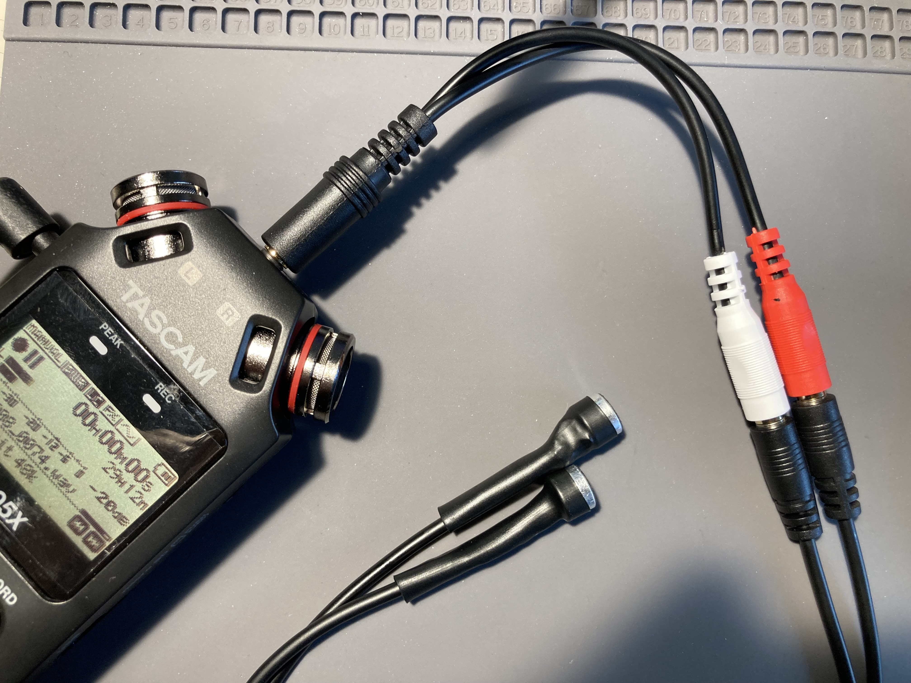

# Electrets

### Materials
- Electret element
- 1/8" TS (mono) audio cable
- Shielding tape
- 1/2" shrink wrap

### Tools
- Coarse wire strippers (yellow band)
- Fine wire strippers (red band)
- Soldering stations (w/ smoke extractors and "helping hands")
- Scissors
- Hot glue gun
- Heat gun

## Instructions
1. Cut the audio cable in half (share with your partner). Slip a 2" length of heat shrink tubing over the end.

1. Follow the first several instructions for [building contact mics](../contact_mics/contact_mics.md) to prepare the ends of the audio cable. 

1. Instead of using a piezo, wrap each lead from the cable around the legs of an electret element. One of the legs of the electret has three little bars connecting it to the outside of the circular case—ideally, this leg connects to the outside wire of the cable (-).

1. Solder the connection.

1. Put a bit of hot glue so that it covers the bottom of the electret, including all of the connection pads. In addition, cover all of the exposed wire leading into the inner white cable. If hot glue gets on the other wire, that's fine, but make sure the two leads are not touching.

1. Now cover both wires entirely with shielding tape.

1. Slide up the shrink tubing over the shielding and onto the sides of electret, and use a heat gun to make it tight.

## Mono Use

Your electret mic may be used as an external input to the DR-05X via the jack at the top of the unit between the built-in mics.

The electret mic is just a single signal, so you'll want to switch to "MONO" under "Menu → REC SETTING → TYPE" on your recorder (remember to switch it back if you're going to return to the built-in mics!).

Other than that, all the same recording procedures apply as in the standard [recording_checklist](../workshops/recording_checklist.md).

## Stereo Use

If you build two electret mics, you can use them together to create a stereo signal (this is useful for making binaural recordings and playing with unconventional stereo space). To do this, you will need an 1/8" stereo-to-dual-mono adaptor.

