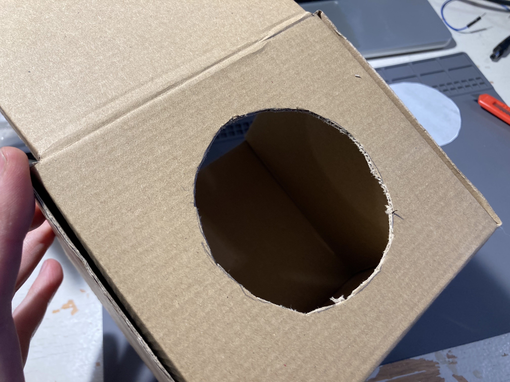
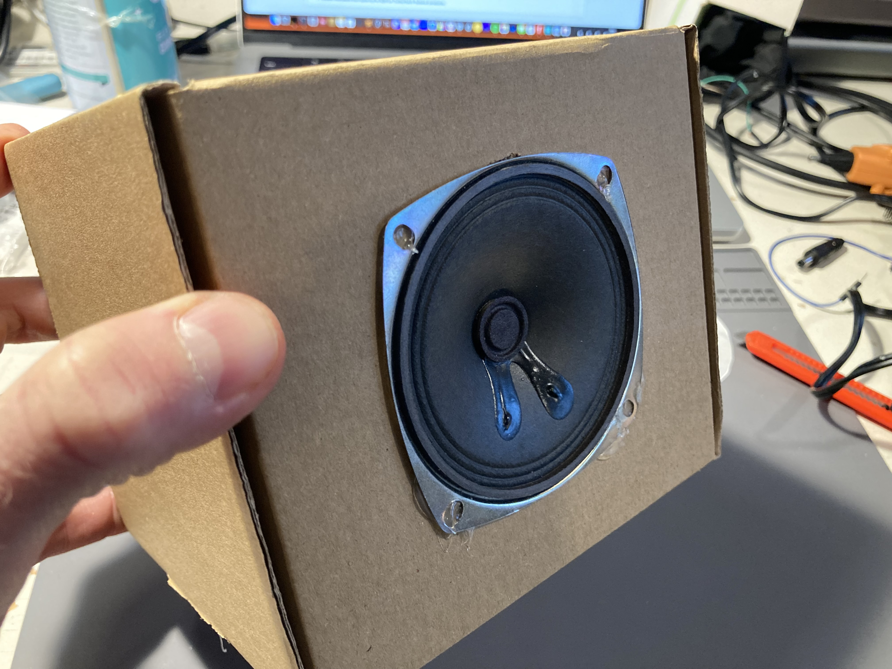
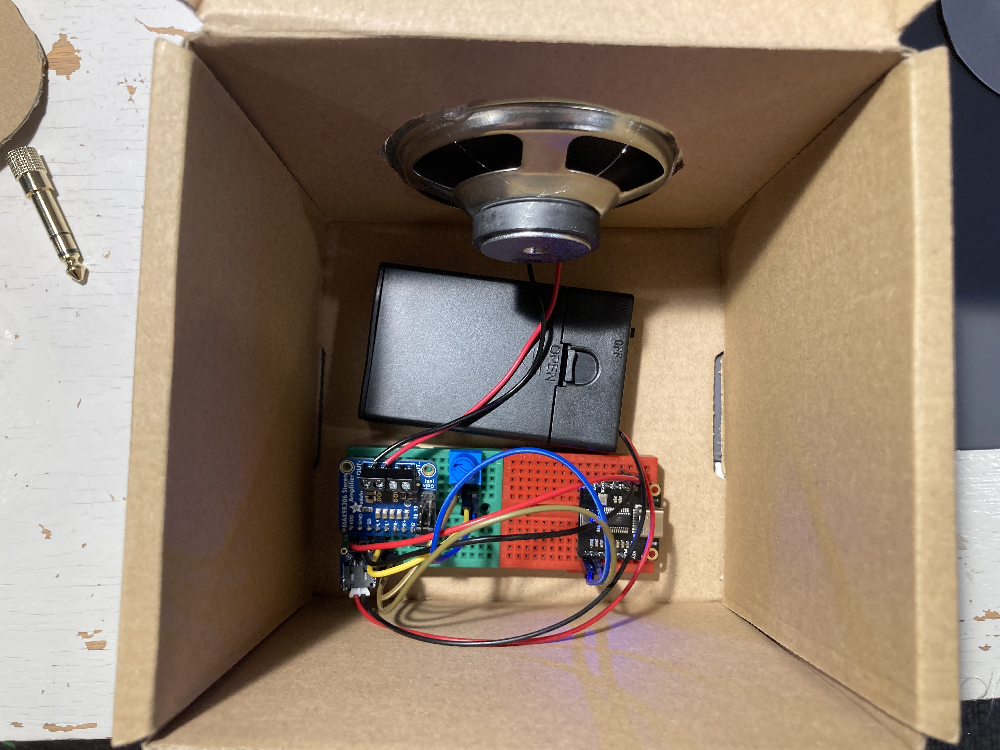

# Speaker Enclosures

### Materials
- [Amplifier](../modules/amp.md) (+ speaker) and [Player](../modules/player.md) modules
- A good box or pieces of cardboard
- Printed out [Speaker template](speaker_template.jpg)

### Tools
- Pencil
- Scissors
- Box cutter
- Hot glue

## Instructions

1. Cut out the speaker template and trace it on your cardboard box.

1. Cut the cardboard with the box cutter (**carefully**!)

1. Finish building the enclosure if necessary. Insert speaker. Use hot glue to hold in the speaker.

