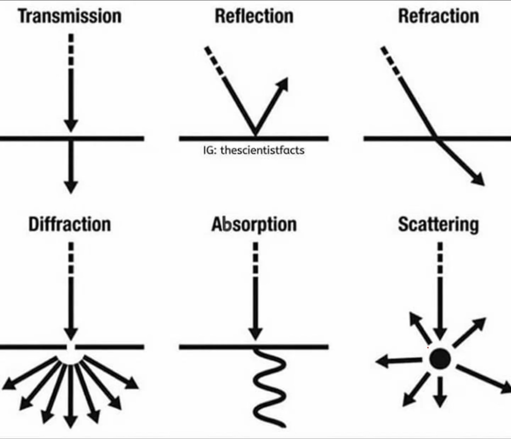
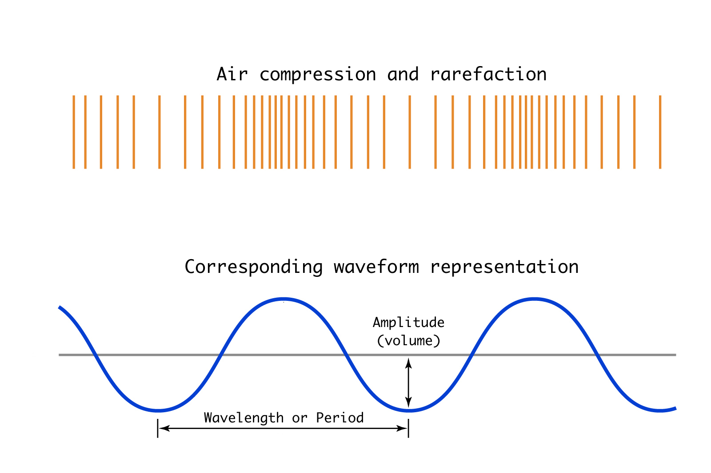
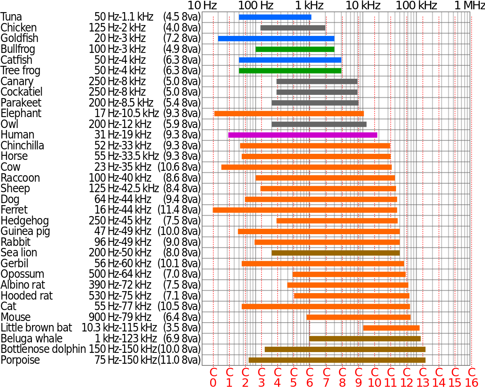
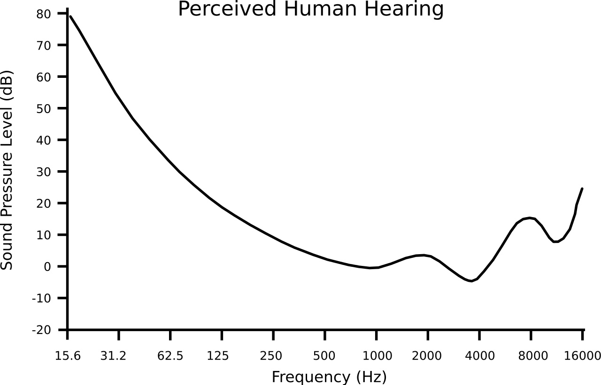
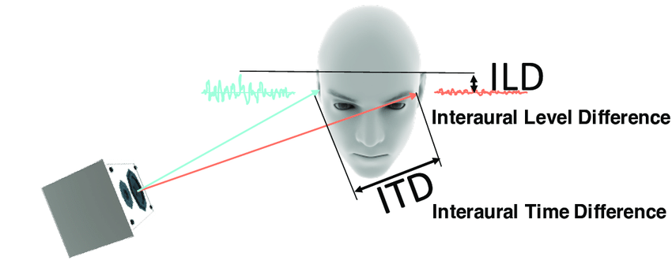

# Hearing and Acoustics

_Acoustics_ is sound via the language of science. As artists working with sound, all of its material aspects are in play, whether or not we choose to work with them through scientific language. In this context, _hearing_ is the physiological description of how human bodies respond to sound.

## 1. Movement and Medium

Last time we gave a definition of sound: _Sound is movement that we can hear_

So when we're talking about sound, we're talking about something that is moving.

That this _something_ is variable makes sound different from other kinds of phenomena. Light, for example, is composed of photons, it has its own materiality. Photons travel in a wave through space from the sun to reach us. Radio waves are actually another form of the same electromagnetic radiation. They are a _something_ in and of themselves. But sound is not. Sound is something _else_ that is moving (without that something else—like in space, which is a vacuum—there is no sound).

When we say that something "makes a sound," we're saying that something that moved, somewhere, also made the the air move, and that moving air made our inner ears move. Or at least, we're typically talking about air (a gas), but sound also propagates through water (a liquid), or even a solid material.

## 2. Sound Waves and the Shape of Sound

Sound propagates through air (or other mediums) as a wave. When we say wave, we often think ocean wave, but that's a misleading image, because ocean waves are "transverse waves"—sound waves are "longitudinal" waves, which look like this:

Video: [Longitudinal wave](media/longitudinal_wave.mp4)

In this video, imagine that the slinky is air. So the air is compressing and expanding, ie, changing pressure, as the wave travels from one place or another. Here's another view:

As you can see, an individual particle of air doesn't itself move very far, but the pattern of _compression_ and _rarefaction_ (expansion) does. This view is slightly misleading, however, because sound waves aren't linear. They're more like this:

**Of course, we also have to imagine these waves propagating in three dimensions, like a sphere.**

How fast do sound waves propagate? Well, it depends on the density and temperature of the medium they are traveling through. For air at 68 degrees, it is 767 mph (for air at less pressure at high altitudes, it's also less spatially dense, which cancel each other out so the speed is the same for the same temperature). An approximate rule of thumb that's easier to remember is that sound travels about 1000 feet per second.

What happens when these waves run into things? We get:

What happens when the waves encounter other waves? Similar to like waves in a puddle, you get _interference_ where waves overlap with each other and create a complex three-dimensional topography that we are inhabiting every day. So it is fundamental to keep in mind that sound can radically change as it moves through space, and the sound we hear is dependent on the environment nearly as much as the source of the sound.

### Waveform Representation

When we work with sound, we often depict it as a waveform of _amplitude_ over time. Waveforms _look_ like transverse / ocean waves, so they are a little misleading, because we know it's actually about compression and expansion. But they are useful.

The _amplitude_ is the strength of the wave, quite literally the "_volume_" of air that is being moved. Amplitude is typically measured in _decibels_ (dB), which is a units of "sound pressure" (ie, the change in air pressure due to sound).

The _wavelength_ is the size of the sound wave, the distance between each compression. Since sound waves move at a constant rate, wavelength has a direct relationship with the _period_, which the time between each compression passes a fixed location.

We hear sounds as being higher if the wavelength is shorter; lower if it is longer. We typically talk about high and low in terms of _frequency_, which is the number of compressions that pass per second.

The _frequency_ of a sound is just the inverse of the period, and we express it in _Hertz_ (Hz), which is "oscillations per second." So if a sound has a frequency of 100 Hz, the air is compressing and expanding 100 times in one second.

An 100 Hz sound has a period of 1/100, or 0.01 seconds long. Since we know that the wavelength in feet is (very approximately) 1000 times the period in seconds, that means the wavelength is about 10 feet. I personally think it's surprising how big sound waves actually are, and that low sounds can engulf our bodies.

## 3. The Ear and Transduction

So what happens when a sound wave reaches our ears? Let's watch a vintage video.

Video: [The Inner Ear](media/inner_ear.mp4)

If we trace the path from a sound source to "sound" as we hear it, it's anything but simple:

> [source movement] → [air pressure wave] → [eardrum movement] → [bone movement] → [fluid wave] → [cilia movement] → [neuroelectrical signal] → [brainwave] → [cognition]

This chain of transformations where energy changes from one type to another is called transduction. And we find this kind of thing everywhere in sound and sound art. What it means when one thing turns into another thing is therefore one of our fundamental questions.

### Sensitivity

The biological means of human hearing are highly specialized "Normally," human ears respond to frequencies between 20 Hz and 20,000 Hz (20 kHz), but individuals can have all sorts of different sensitivities. Sound lower than 20 Hz we call _infrasound_ (which we can sometimes perceive with our sense of touch), higher than 20 kHz is _ultrasound_. But these are all anthropocentric terms—"sound" means something different depending on your biology.

We talked about amplitude being the volume of air being moved. However, humans are more sensitive to some frequencies than to others—two sounds of the same volume might not be equally loud if they are of different frequencies. _Loudness_ is the technical term for that. The following graph shows the amount of sound pressure needed to create the same loudness at different frequencies. Note that humans are most sensitive at the bottom of the curve, which roughly corresponds to the frequencies of the human voice.

But it's important to note here that all ears are different. Even watching those videos, we're looking at an "idealized" ear that may or may not match yours, or any arbitrary person. Not everyone's ears are functional. So at the point where we move from the physics into perception, we have to be aware of the normalizing language we use.

### Localization

So how do we tell where a sound is coming from?

There's actually at least three ways that we distinguish the position of a sound, most of which benefit from the fact that we have two ears:

- "Interaural Time Difference" (ITD), which just means that sounds will arrive at your ears at slightly different times. This allows the brain to get a sense of where the sound is coming from.

- "Interaural Level Difference" (ILD), which is that closer sounds are louder—especially if there is a head between the ear and the sound.

- But what if a sound is directly in front of you or directly behind you? The outer ear—all your subtle folds of skin and cartilage—is called the _pinna_, and it subtly filters the sound you ear. Therefore the same sound from different angles will be different enough that it can help the brain figure out where the sound is coming from.

Localization still doesn't always work, especially for low sounds—which is why it doesn't matter where you put your subwoofer.

## 4. Audiometry

See [here](audiometry.md)
