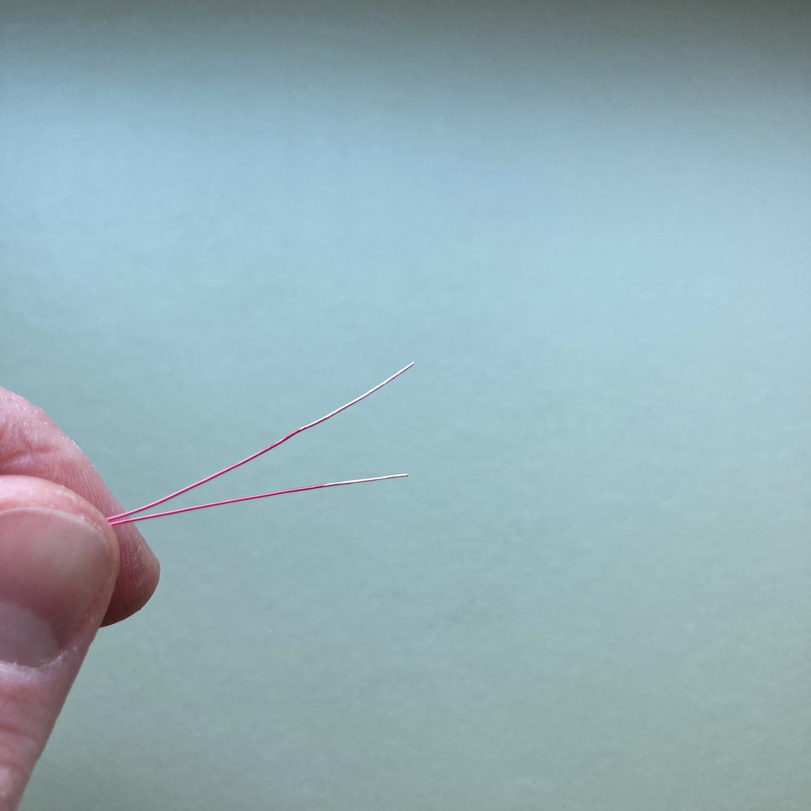
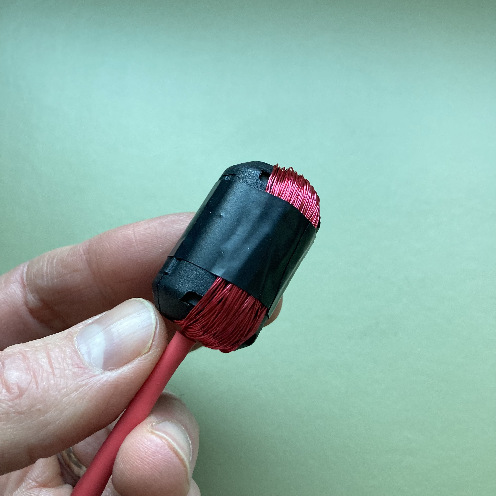

# Inductors

### Materials
- 13mm Split-core ferrite magnet (cable noise suppressor)
- 28 AWG Enameled Magnet Wire Spool
- 1/8" TS (mono) audio cable
- Electrical Tape
- Heat shrink tubing
- Sandpaper
<!-- also check bandaids -->

### Tools
- Coarse wire strippers (yellow band)
- Fine wire strippers (red band)
- Soldering stations (w/ smoke extractors and "helping hands")
- Scissors
- Heat gun

## Instructions

1. Open your ferrite core by gently pulling up on the tabs.

1. Lay the end of the spool of magnet wire in the groove, leaving some slack hanging over the end.

1. Carefully wind the wire from the spool around one side of the core. Make this nice and taught and as even as possible.

1. Wind **~100** times, then carefully close and latch the core. Cut the wire so that you have two even leads about an inch long.

1. Carefully sand off the insulation/enamel from the magent wire (the red coating) on both leads to leave .5" of the copper exposed.

1. Cut the audio cable in half (share with your partner). Slip a 3" length of heat shrink tubing over the end.

1. Follow the remaining instructions for prepare the ends of the audio cable from the instructions for [building contact mics](../contact_mics/contact_mics.md), and solder each lead of your inductor to the wires of the cable (polarity doesn't matter).

1. Wrap a small piece of electrical tape around the joint with the inner wire.

1. Slide the shrink wrap tubing up to the base of the ferrite core, covering all your joints and solders, and use the heat gun to shrink it down.

1. Tightly wrap the ferrite core with electrical tape to protect the coil

## Use

Your inductor be used as an external input to the DR-05X via the jack at the top of the unit between the built-in mics.

The inductor is just a single signal, so you'll want to switch to "MONO" under "Menu → REC SETTING → TYPE" on your recorder (remember to switch it back if you're going to return to the built-in mics!).

From there, all the same recording procedures apply.

## How it works

Electricity flowing through the coil creates a magnetic field as it moves around the poles of the magnet. When it encounters interference from other sources of electromagnetism in the environment, this field is altered, which produces a changing differential in the signal that is analogous to the nature of the source and which the recorder registers as audio.

## Additional Resources

- http://www.unterzuber.com/tap.html  
- https://www.amazon.com/Telephone-Microphone-Suction-Cup-Pickup/dp/B0034I75IK