# Assembling an Amplifier and Speakers

### Materials
- MAX98306 solid-state amplifier breakout board (pre-soldered)
- JST jack breakout board
- Speaker (4Ω or higher and rated for at least 3W)
- 18 or 20 gauge speaker wire
- Potentiometer (knob)
- Assorted jumper wires
- Mini breadboard
- 3x AA battery holder
- 3x AA batteries
- [Player module](player.md)

### Tools
- Coarse wire strippers (yellow band)
- Fine wire strippers (red band)
- Soldering stations (w/ smoke extractors and "helping hands")
- Mini screwdriver set

## Circuits and Audio

According to the dictionary, in the general sense the word circuit means "a roughly circular line, route, or movement that starts and finishes at the same place." That applies in the electrical sense, too. A circuit is a loop, or rather, it's typically a whole knot of loops, in which electrical current is flowing from "power" back to "ground" and making something happen along the way. Between power and ground, we use positive (+) and negative (-) to indicate the direction of the flow. 

When it comes to audio, we can also think of the flow of current in terms of an audio signal. An amplifier takes an audio signal, boosts it with additional current, and then sends it out to a speaker, which transduces that current into physical motion in the air.

## Prepare the speaker

First, let's wire the speaker. As we know, speakers typically consist of a metal frame, a magnet, an electromagnetic coil, and a paper cone. There are two important specifications for speakers:
- Ohms (Ω): this is the resistance that the speaker offers to the circuit. The amplifier has to be prepared for this—too high ohms aren't a problem, but too low ohms can produce a situation like when you try and lift an object that you think is heavier than it actually is, and it so goes flying (eg, the amp burns out).
- Watts (W): this is the amount of power that the speaker can handle. Go above this too often, and the speaker will burn out (or tear). 

Our amps put out 3W when connected to a 4Ω circuit. So ideally the numbers on the speaker match or are higher. If the speaker is too big, that's fine, the amp just won't be able to put much sound out through it.

To wire a speaker, we use speaker wire, which is really two stranded wires stuck together—red for the positive pole of the speaker, and black for the negative. 18 or 20 gauge is good for our purposes (this is the thickness of the wire—the higher the number, the thicker). All we have to do is solder the connection.

1. Use the cutter on your strippers to cut the length of speaker wire that you want.
1. Separate an inch or two of the wires on both ends.
1. Strip off about 1/4" of insulation of each wire on one end, and about 3/4" off each on the other. Look at the labels on the strippers to find the appropriate hole for your wire's gauge on the coarse strippers.
1. Twist the strands together on all the ends.
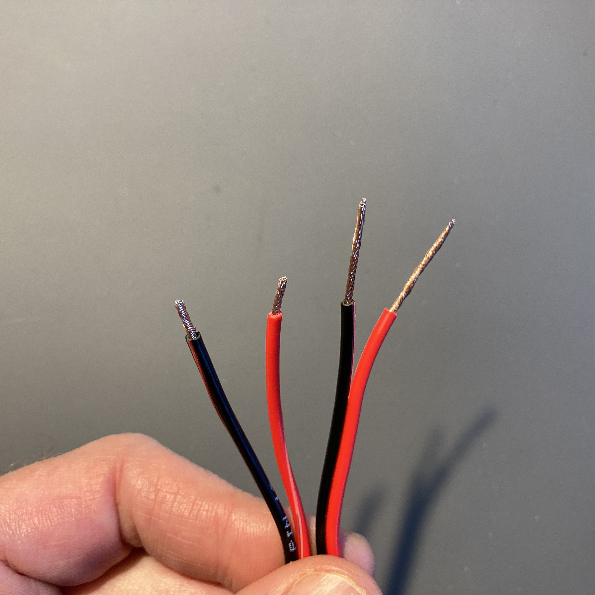

1. Take the longer leads, and match the black wire to - and red to + on the connection tabs of your speaker. Feed them through the holes halfway down the exposed copper, taking care not to let any strands separate off and not to damage the speaker cone on the other side. 
1. Fold the wires and twist them around themselves. Position the wires so that they extend flat, aligned with the face of the speaker rather than poking out perpendicular from it.
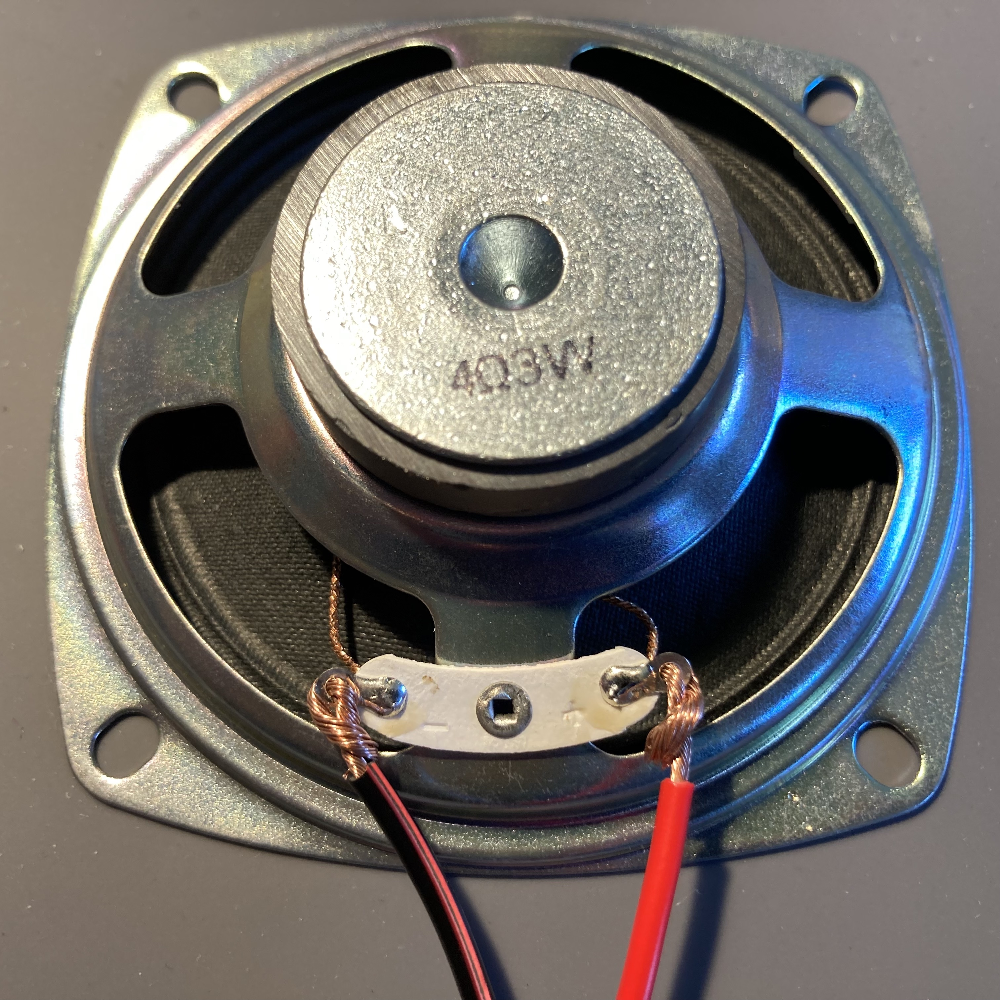

1. With your soldering iron, heat the joint between the speaker tab and the stranded wire ends. Feed solder into the joint until it is completely covered. Do not skimp on the solder. When you're done, there should be no wiggle in the joint.
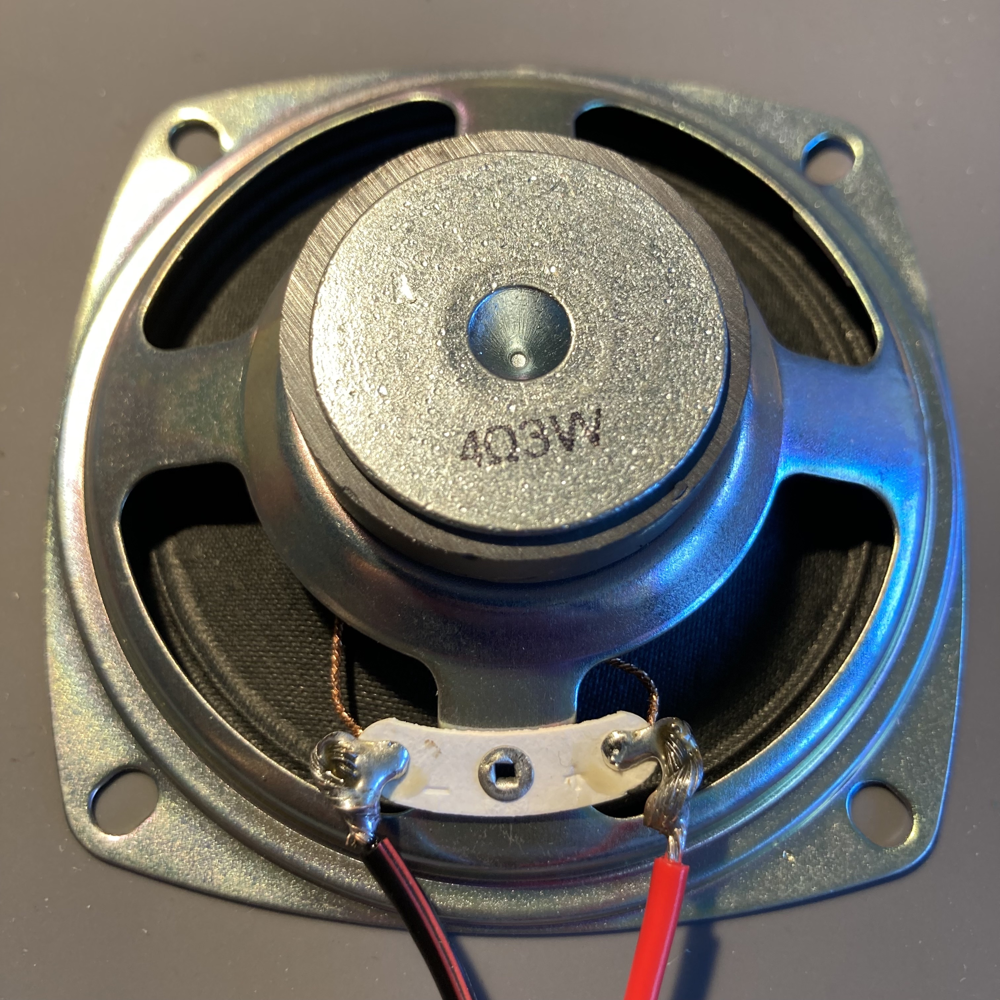

## Prepare the amplifier

Everything will be assembled on a breadboard. A breadboard is a helpful tool for prototyping and making quick connections—every row of holes is eletrically connected, so by inserting wires into the holes, a circuit can be made without soldering. This is especially helpful with "breakout boards" that have a row of pins. Inserting a wire in the row next to a pin makes a connection.
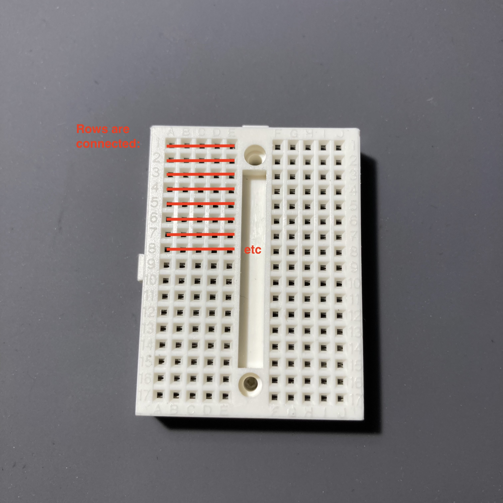

1. Use screws, the adhesive backing, or some other method to attach the breadboard where you need it. Or just leave it loose if you are prototyping.

1. Insert the MAX98306 circuit board into the breadboard. Leave as much room as possible along the side with the pins so that you have room to plug things in; also leave space to the left of the board for additional electronics.
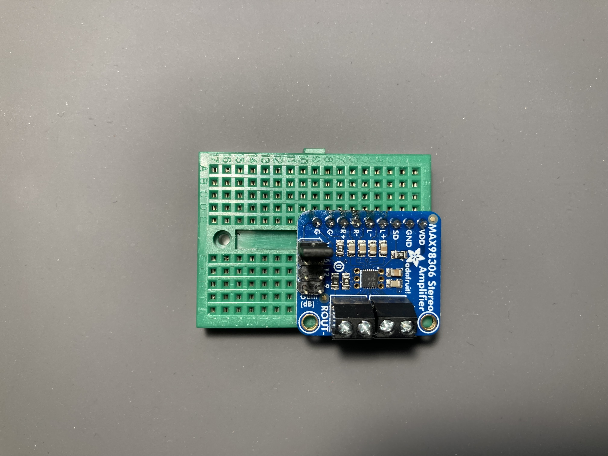

1. With a mini screwdriver, make sure the terminal blocks on the breakout board are open. Don't use any force with these, as they are easy to break. Insert the ends of each set of speaker wires into the holes, matching black to - and red to + as labeled on the board, and gently tighten the screws to secure them. There shouldn't be too much exposed copper wire, and be certain that there is no danger of any two speaker wires touching (if they do, this is likely the end of the amp: 0Ω). Trim the wires if necessary. There should be no loose strands.
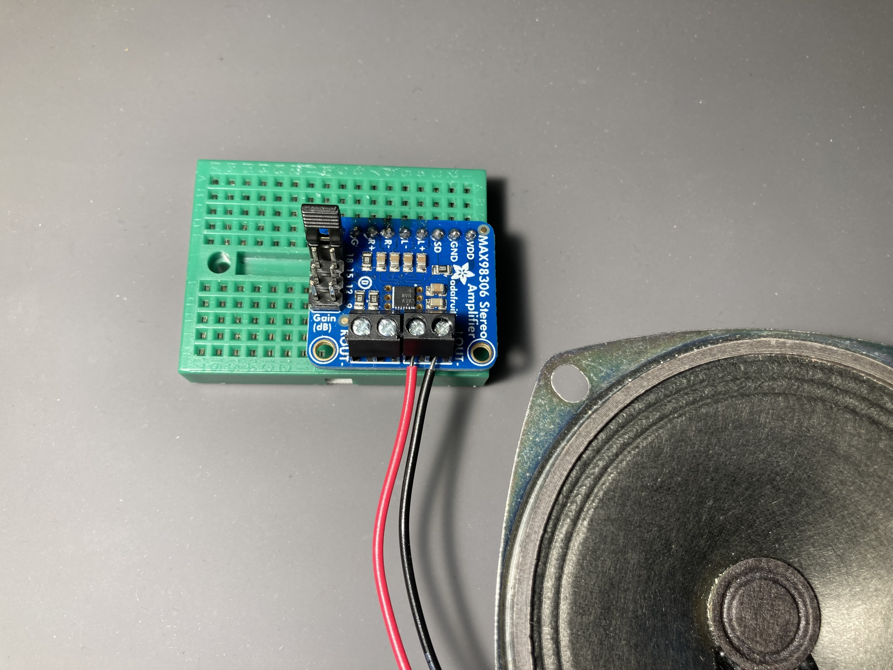

1. Plug the JST jack breakboard into the breadboard such that the + pin lines up with VDD on the amplifier board and the - pin lines up with GND. This will result in the edges of the boards being flush with one another. Be careful to get this right, as putting this in the wrong place can potentially fry the amp.

1. Insert three AA batteries into the battery holder and secure it. Make sure the switch is in the OFF position, and plug it into the JST jack. (If you ever need to unplug the battery holder, make sure to pull on the white part of the plug, not the wires)

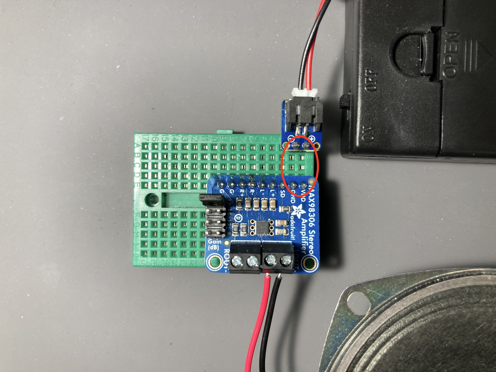

## Wire the circuit

1. Now we'll add the volume knob. This can be properly understood as a **voltage divider**. That is, it's purpose is to siphon off some of the input signal (depending on the position of the knob) and send it back to ground instead of to the amplifier.   In the following diagram, the purple wire shows the input signal. A portion of this flows through the orange wire to the positive input of the amplifier (L+); another portion flows through the green wire and then back through the brown wire to the ground of the player (L-) without having travelled to the speaker.

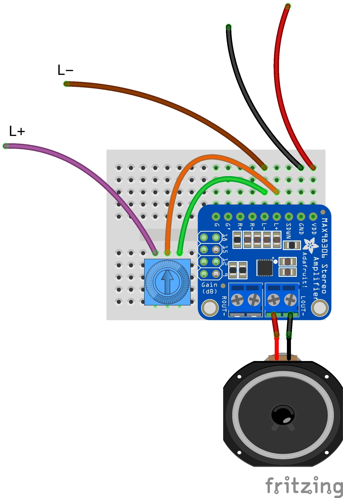

## Use

1. Build a [player module](player.md) and connect it:

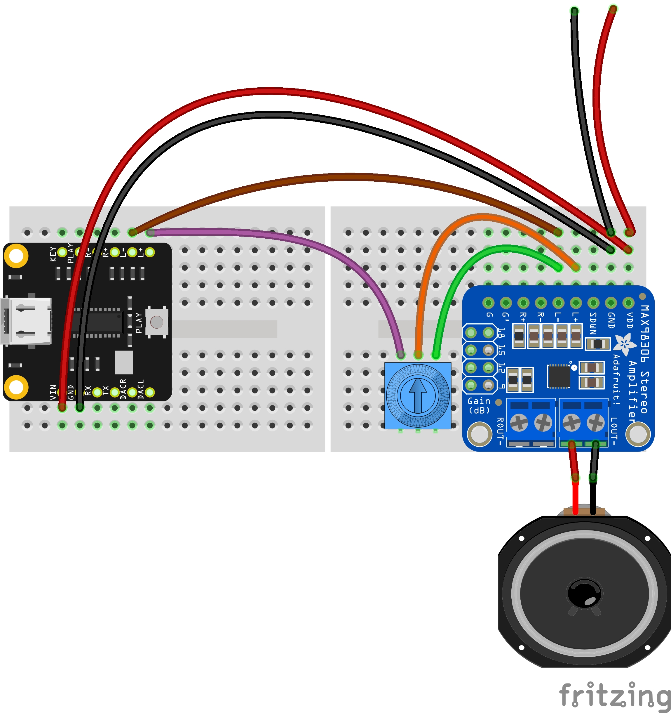

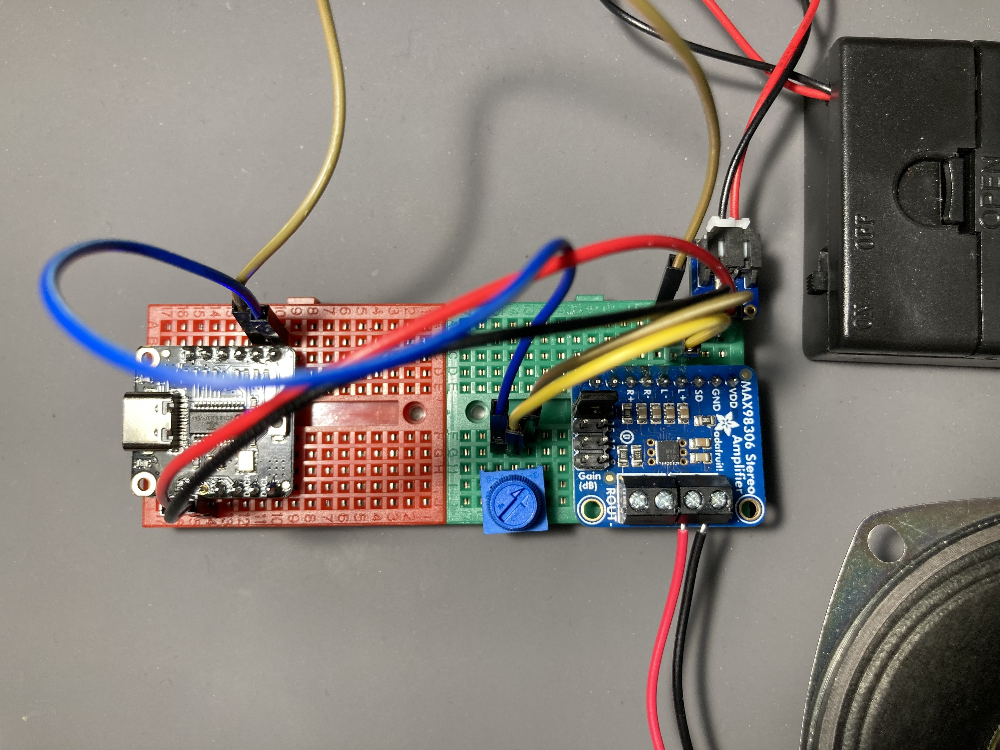

1. Turn the battery pack to ON, press the button on your player, and you should hear the sound you've loaded.

1. By default, the amp is set to 9dB of gain. By placing the include jumper plug on the gain headers of the amplifier board, you can increase the volume. Most likely, you'll want to have this at the highest setting at which your speakers do not distort when the loudest sound from source you are using is played. This might take some experimentation.
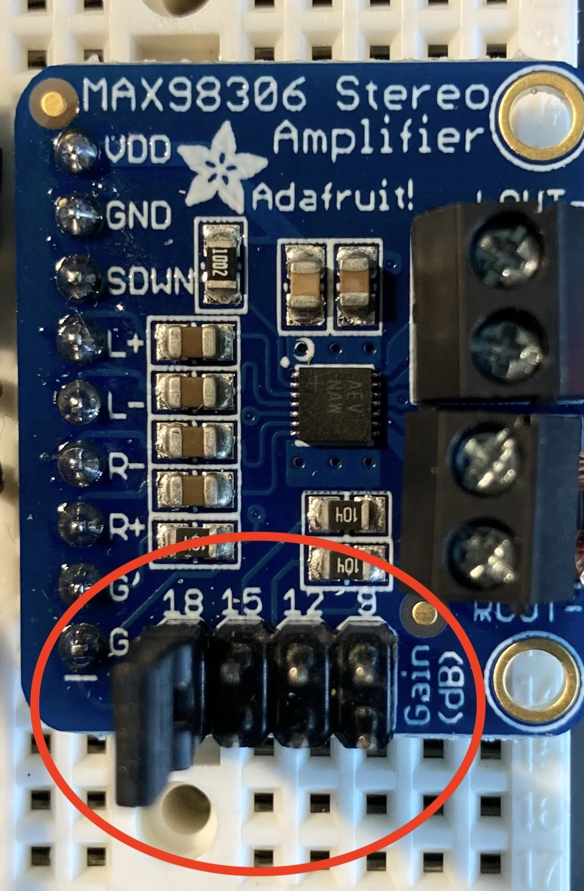

<!--
###	
https://www.hairballaudio.com/blog/resources/diy-resources/balanced-and-differential
-->