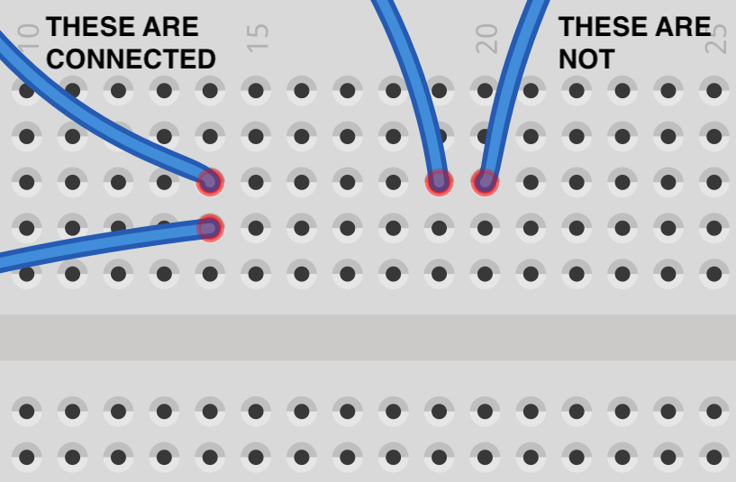

### Breadboard

A breadboard is a helpful tool for prototyping and making quick connections—every row of holes is eletrically connected, so by inserting wires into the holes, a circuit can be made without soldering. This is especially helpful with "breakout boards" that have a row of pins. Inserting a wire in the row next to a pin makes a connection.

Use screws, the adhesive backing, or some other method to attach the breadboard where you need it. Or just leave it loose if you are prototyping.

