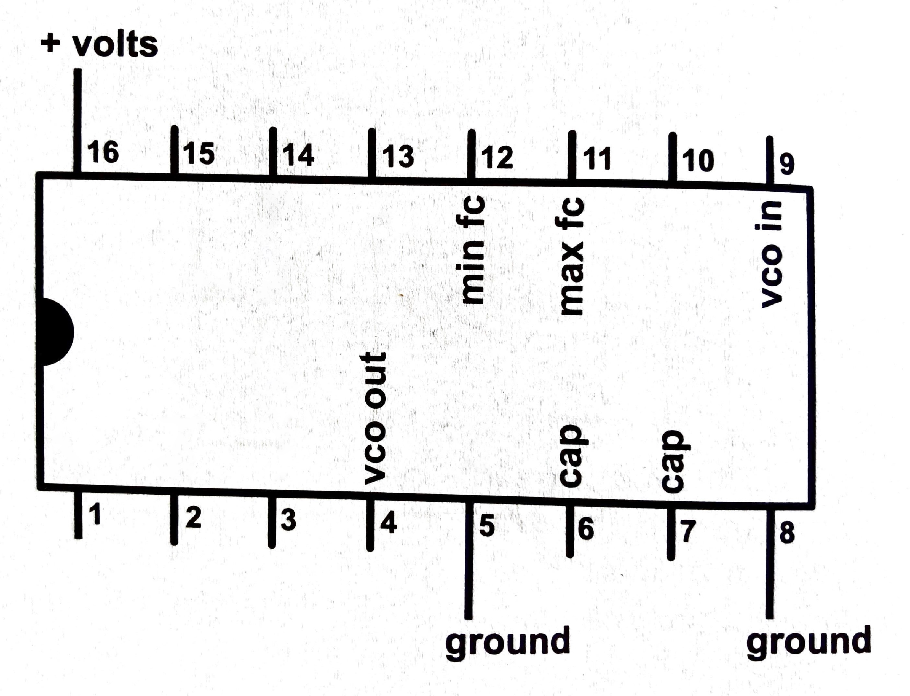
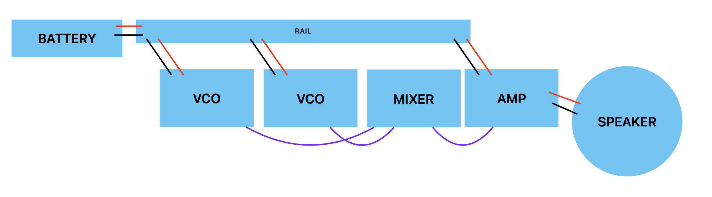

# Oscillators

### Materials
- CD4046 chip
- Potentiometer (knob)
- 10kΩ resistor (brown-black-red-gold)
- .1µF capacitor
- Assorted jumper wires
- Mini [breadboard](breadboard.md)
- [Amplifier module](amp.md) + powerpack

Optional:
- Photocell
- 2.2kΩ resistor
- Diodes

## Preparation

Get started with [synthesis](synthesis.md).

## Voltage-Controlled Oscillator (VCO)

This module is perhaps the most fundamental to synthesis: an oscillator.

There are many ways to create oscillators. We're going to do it using an Integrated Circuit (IC) chip, in this case one called a "CD4046". What is an IC? In essence it is an elaborate switch—it turns a signal on and off.

What does turning a signal on and off produce? A square wave.

Hook a square wave up to a speaker, and it becomes a sound wave (a rather buzzy one!).

The CD4046 produces a square wave on one of its pins at a rate that depends on what is connected to the other pins. First of all, we need to connect power and ground. In addition, we'll connect:
- a potentiometer that will control the frequency of the oscillator by varying the voltage
- a capacitor that controls the ratio between voltage and frequency
- a resistor that sets the _maximum_ frequency (we'll leave the minimum set to zero)

Because this circuit controls frequency via voltage, it's called a Voltage-Controlled Oscillator, or VCO, which is a common term in synthesis.
 
Here is a diagram of the relevant pins on the CD4046:

And here is our circuit:

_NOTE: to be able to attach the modules together later in a consistent way, keep the knobs on your mini-breadboard pointing up and to the right._

After building this module, connect power and ground to your power rail. Then, connect the output wire together with the input wire of your amplifier module. Turn it on—you should hear something!

### Sensor VCO

A pot is not the only kind of voltage divider. In fact, there are many kinds of sensors that you can use. 

One of these is a photovoltaic resistor, aka a photocell, that changes its resistance according to light. By combining this with a regular, static resistor, this functions similarly to a pot.

Another option is a Force-Sensive Resistor (FSR), which is wired in the same way as the photocell above.

<!-- 
### VCO-Controlled VCO

What happens if you plug the output of one VCO into the potentiometer input of another VCO?

**diagram goes here**

 -->

## Mixer

What if you want to combine the signals from two VCOs?

Use diodes! These have a small stripe which should be on the end pointing in the direction of the current flow.

You can make this into its own module, or use the power-rail breadboard for mixing.

	