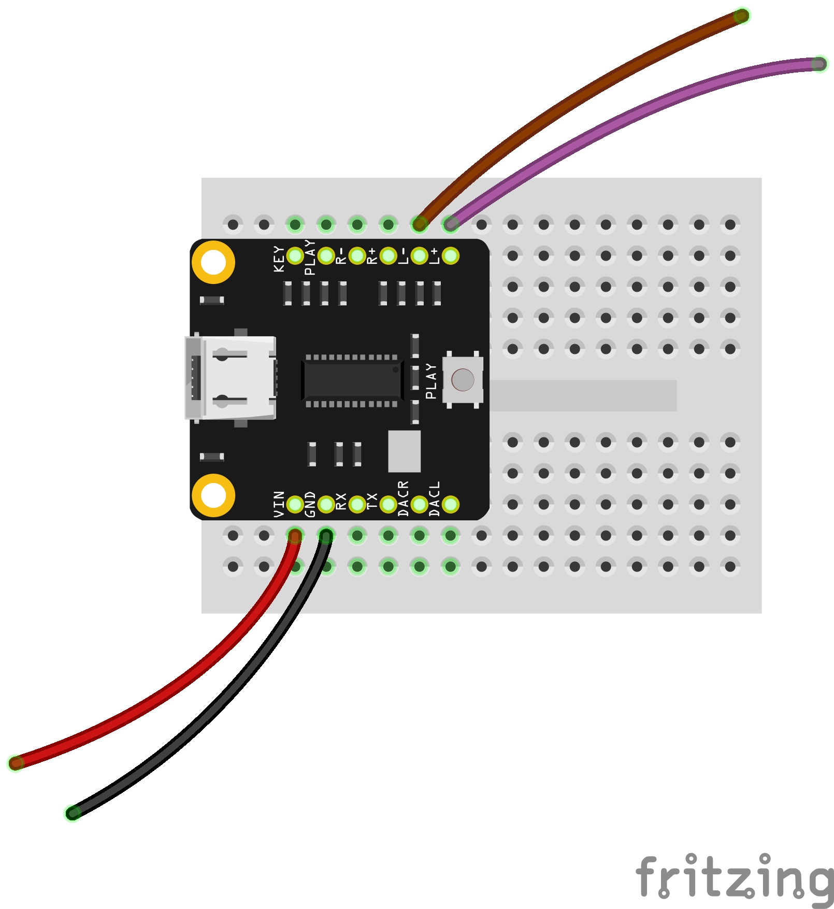
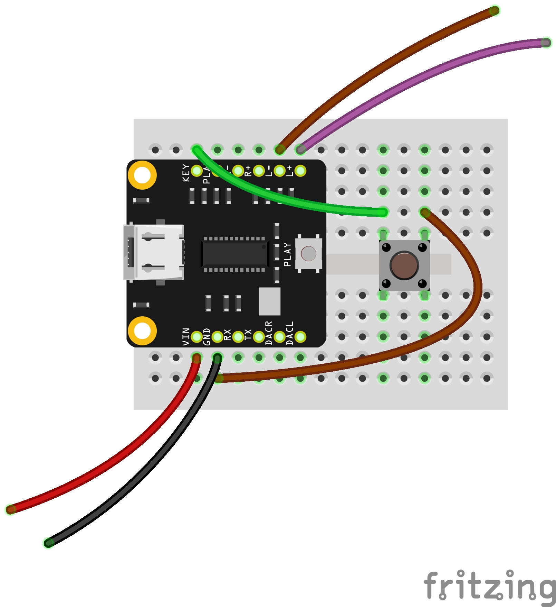

# Assembling a Audio Player

### Materials
- DFR0768 Player Pro media player (pre-soldered)
- USB-C cable
- Button (optional)
- Mini breadboard
- [Amplifier module](amp.md)

## Assembling the module

Plug your DFPlayer into the breadboard so that its two rows of legs are on either side of the breadboard's center gap. Place the USB-C jack toward the edge to make it easier to plug into your computer. That's it!

Connections:
- VIN will connect to a power source (+)
- GND will go to the ground of a power source (-)
- L+ is the audio signal (+)
- L- is the inverse of the audio signal, which will go to speaker ground (-)

## Loading audio

NOTE: **DO NOT CONNECT USB AND A BATTERY AT THE SAME TIME** It will damage your computer.

Before it is connected to anything else, plug a USB-C cable into the DFPlayer and connect it to your computer. It should show up as a storage device. Copy an mp3 file into the folder. If you're going to use more than one file, start them with numbers (`1XXXmp3, 2XXX.mp3, etc`).

The player will run through all the files in the folder and then repeat them.

## Playing

Hook your player up to an [amplifier module](amp.md).

Once powered, the DFPlayer needs a "push" to begin playing, and it will pause if it receives another push. You can do this manually using the onboard switch or by adding a button:

When the button is pressed, it connects the KEY pin of the DFPlayer to ground, which activates the Play/Pause function. <!-- wire your own buttons -->

<!-- 
## More information

https://wiki.dfrobot.com/DFPlayer_PRO_SKU_DFR0768 -->

<!--
Disabling the prompt and changing default volume:

- Wire VIN –> ftdi red, GND –> ftdi black, RX -> ftdi orange (TX), and TX -> ftdi yellow (RX)
- Use the Arduino IDE
- Select "Arduino Pro or Pro Mini" for the board
- Choose the port
- Open Serial Monitor
- Select "Both NL & CR" and 115200 baud
- type `AT` should response `OK`    
- then `AT+PROMPT=OFF`
- then `AT+VOL=10` (0-30 or ?)
- then `AT+PLAYMODE=2`
- then `AT+SAVE`

Playmodes:
1: repeat one song
2: repeat all
3: play one song and pause
4: Play randomly
5: Repeat all in the folder
-->

