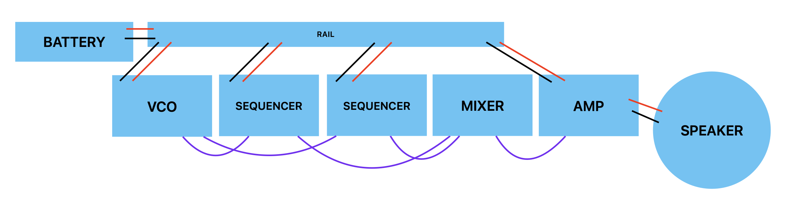

## Sequencer

Now that we're able to make sound and modulate it in various ways, it's time to introduce a sequencer.

A sequencer is a mechanism that has a looping series of steps and activates them one at a time in turn. By hooking a sequencer up to one or more oscillators, we can create patterns (although we can also use sequencers to create sound directly, as we'll see).

Because a sequencer is in essence a bunch of switches, we can use an IC chip very similar to our CB4046 oscillator—the CB4017.

The CB4017 is a 10-step counter, which means it has 10 switches that it turns on and off in order (numbered 0 through 9). Note that because the IC is just a wrapper for a bunch of internal transistors, these 10 steps follow the needs of the internal layout rather making any sense to us on the outside in terms of how they are spatially arranged.

In addition, the CB4017 has a "clock" pin. This pin takes an oscillating signal and uses it as the basis for one cycle through its steps. In other words, you'll hook an oscillator module's output up to this pin, turn the oscillator down so it's really slow, and the CB4017 will divide it into 10 steps.

Except ... it doesn't have to be 10 steps, that's just a maximum. If you want, say, 8 steps, you can make a connection between that step number and the "rst" (reset) pin. So you'll get step number 0 through 7, and then step 8 (which is really the 9th step) will immediately set things back to 0.

The following schematic is wired for 8-steps:

Notice that we've also added an LED (small red light) to step zero so that we can see visually when the sequencer starts over. We could add an LED to every step if we wanted, but that's a lot of wiring. We always have to use a 2.2kΩ resistor with the LED to make sure it doesn't use up all the juice we need for powering our circuit.

Ok, so how do we use this?

### Sequencing a VCO

The most straightforward use is to use the sequencer to turn on and off an oscillator. This means we will need _two_ oscillator modules—one to use as the clock, and one to be the signal that is turned on and off.

Note that we're connecting the signal output on the 0-step pin of the sequencer to the **power** of the VCO.

Now, this will just turn the VCO on for step 0 of the sequence. What if we want to turn it on for another step?

In this case, we need a diode mixer module. We connect **two** outputs from the sequencer from the steps we want to the mixer. The result then goes to the power.

If you have an LED on step 0, you'll notice that step 0 produces a different pitch in the VCO. That's because some of the voltage is getting siphoned off to power the LED before it can power the VCO. You can use this to make different tones using one VCO by putting resistors prior to the mixer.

### Sequencing two VCOs

Of course, we could also just sequence two (or more) VCOs directly from the sequencer.

### Using sequencers as tone generators

Another option that pushes the definition of "sequencer" a bit is to use the CB4017 as a tone generator. If you just route a step output directly to your amplifier, you'll hear a tone, albeit one at a frequency that is a fraction of the clock VCO. That fraction depends on which step you've wired to be the reset step.

The opportunity here is that with **two** sequencers set to different fractions, you can get musical intervals (you may have noticed this is tricky with pots, sensors, and regular resistors).

In this case, you need to connect the clock VCO to both sequencers (you don't need a mixer for this, just connect them on a breadboard), and then mix the output of both sequencers together.

What intervals do you get? If one sequencer resets at 8 steps, and the other at 4, the ratio between them is 1/2, and the musical interval is a perfect fifth / sol. If the second sequencer resets at 2, then the ratio is 1/4, and you get a major third / mi. 

    1/2 is a perfect fifth
    1/3 is a perfect fourth
    1/4 is a major third 
    1/5 is a minor third
    1/6 is a fourth another octave down
    1/7 is ... ?
    1/8 is a major second
    1/9 is ... ?
    1/10 is a third another octave down
