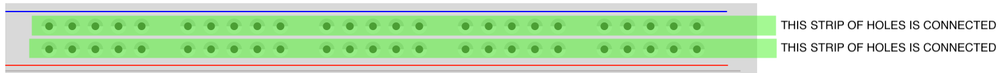
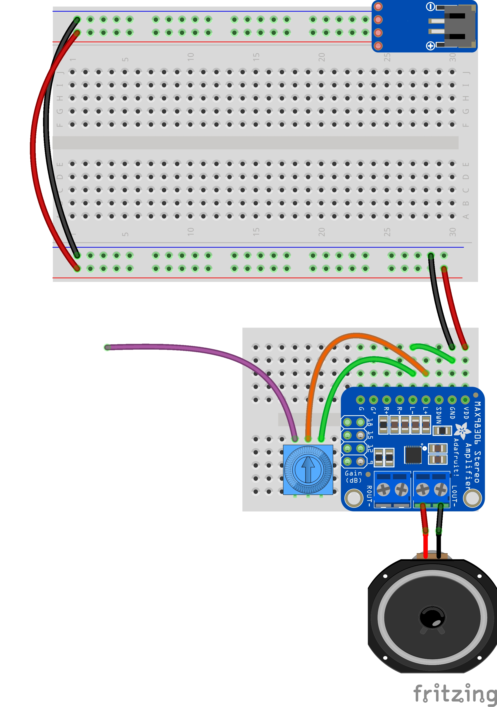

# Synthesis

As we have explored, sound is a phenomena that relates perception, vibration, space, and meaning. So far, working with sound has meant listening and recording acoustic signals. To do that, we've also touched eletrical analog audio by assembling microphones, speakers, and amplifiers, and even manipulated things digitally. But sound has always begun with physical movement. 

However, there is another fundamental way in which sound is understood in relation to technology, and that is to create sound directly with electronics, either analog or digital. This is called synthesis. Rather than approach things using the fanciest digital signal processing software on our laptops, we will explore this using the foundational circuitry used in hardware synthesizer design. 

## Circuits and Audio

According to the dictionary, in the general sense the word circuit means "a roughly circular line, route, or movement that starts and finishes at the same place." That applies in the electrical sense, too. A circuit is a loop, or rather, it's typically a whole knot of loops, in which electrical current is flowing from "power" back to "ground" and making something happen along the way. Between power and ground, we use positive (+) and negative (-) to indicate the direction of the flow. 

When it comes to audio, we can also think of the flow of current in terms of an audio signal. For example, an amplifier takes an audio signal, boosts it with additional current, and then sends it out to a speaker, which transduces that current into physical motion in the air.

## Preparation

### Breadboards

Review [how breadboards work](breadboard.md).

### Power rails

This time we're also going to use power rails — aka, the sides of a slightly larger breadboard that have longer rows for connections.

The two rails on these breadboards can be bridged so that you have lots of connection points for power and ground.

### Setup

To make a simple synth, we will still need an amplifier + speaker like we've used before. However, we'll make one small modification, which is to bridge L- and GND. 

Instead of plugging the JST directly into the amplifier module, we'll plug it into a power rail, and we'll wire the amp into that.

## Modules

So we're going to be making knots of electrical loops, using breadboards. This can get extremely complex very fast. One way to make things more manageable is break things up into modules. This is a strategy that has been foundational to electronic music pretty much from the beginning.

We're going to build each module on its own mini-breadboard. Each one will be connected to power and ground independently. And each one will take a signal as input from another module, work with it in some way, and then pass it along to the next one. So one way to think about it is that each module is its own loop/circuit between power and ground, and there's one big loop/circuit between modules with the signal. And then within the modules, there's lots of mini-loops. Knotty!

_NOTE: to be able to attach the modules together later in a consistent way, keep the knobs on your mini-breadboard pointing up and to the right._

- [Amplifier](amp.md)
- [Oscillator](oscillator.md)
- [Sequencer](sequencer.md)

