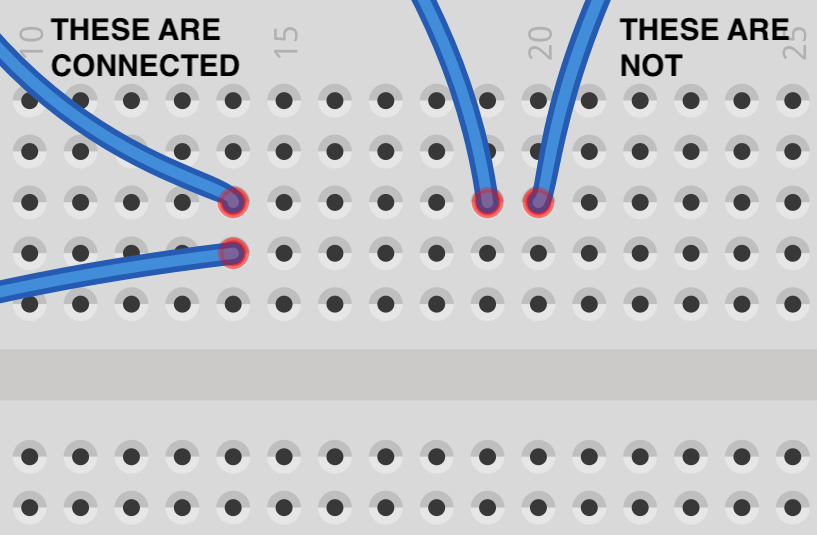
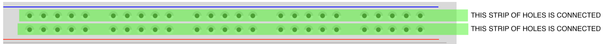
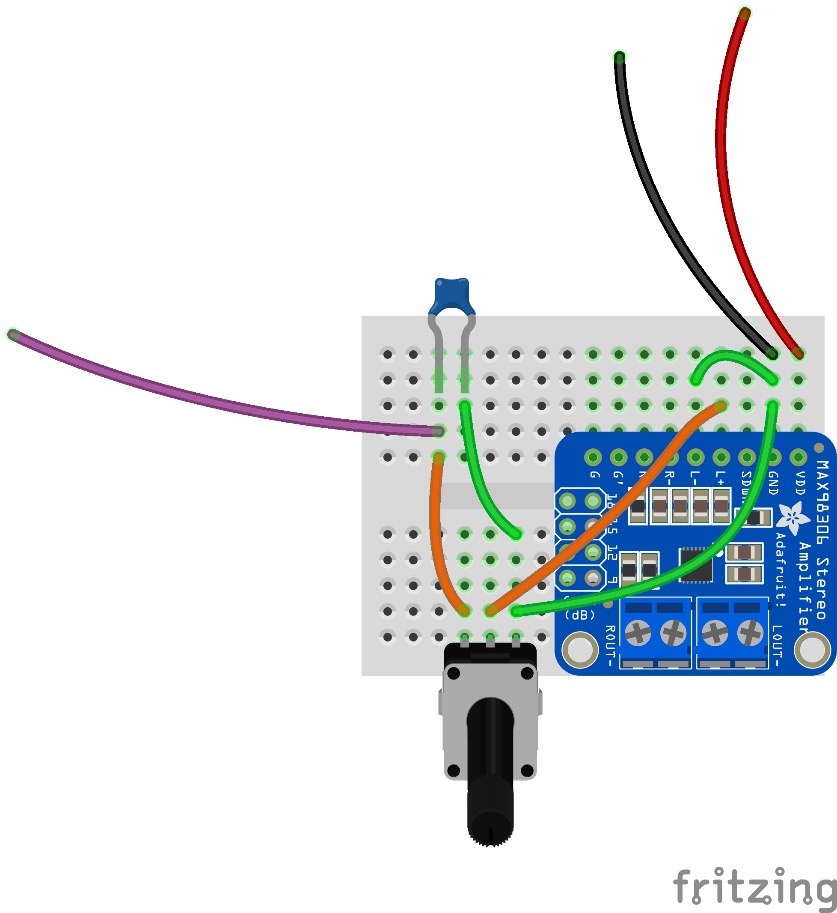
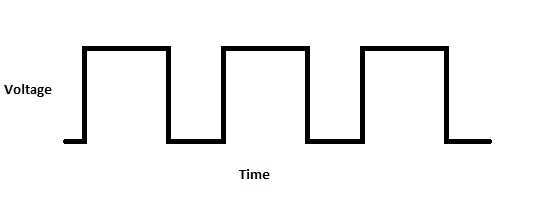
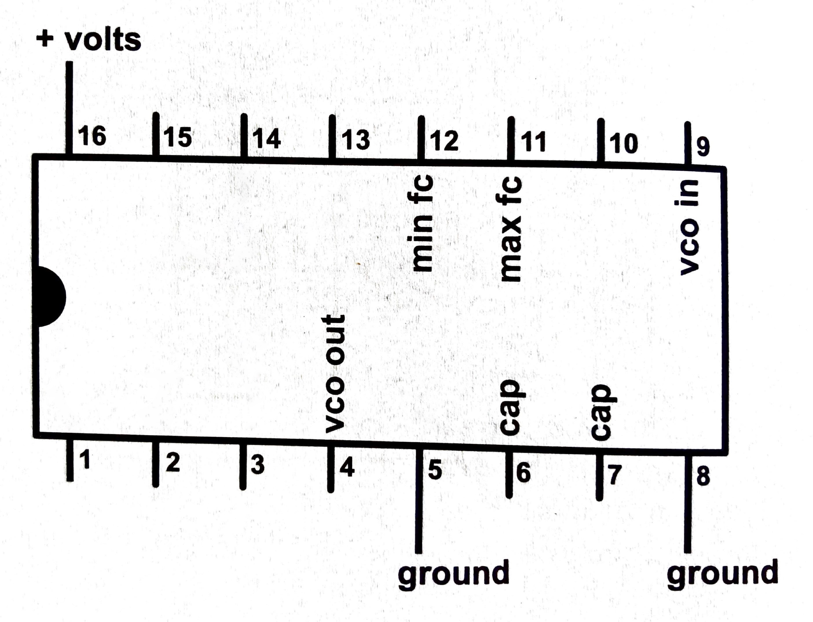
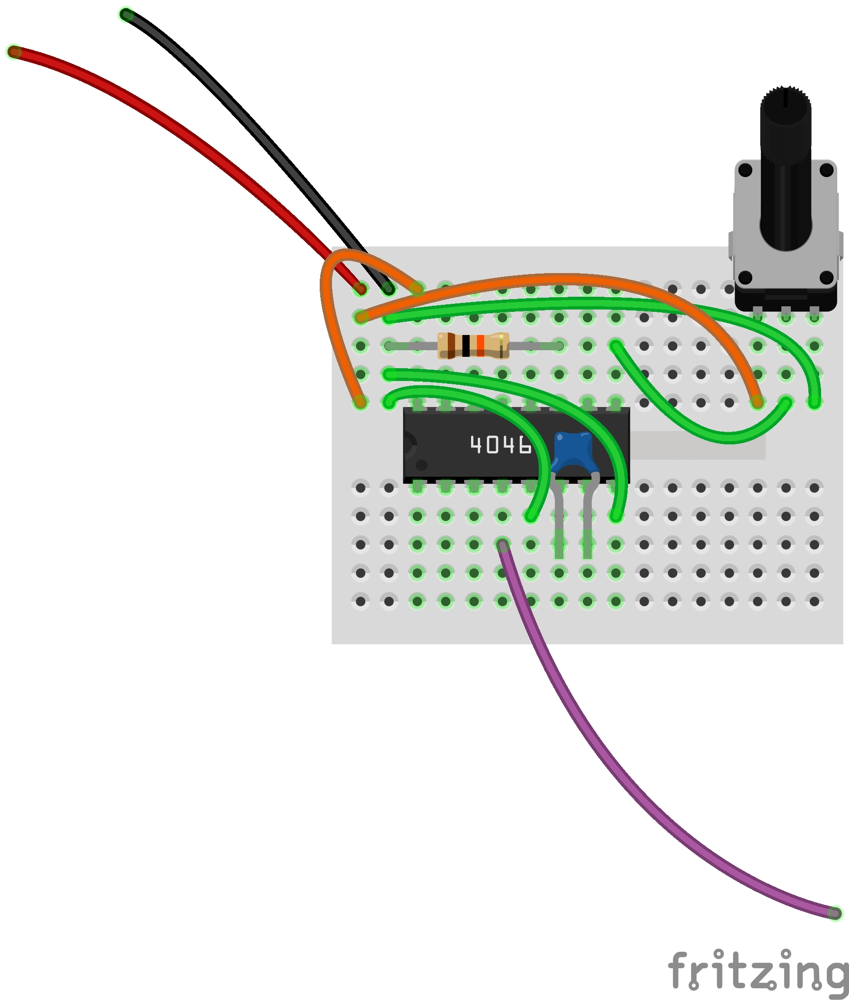
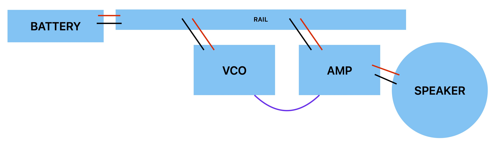
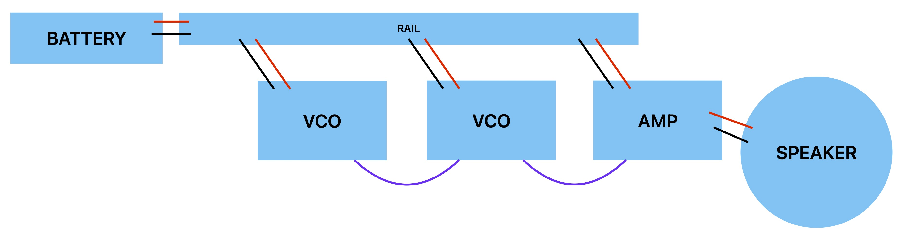
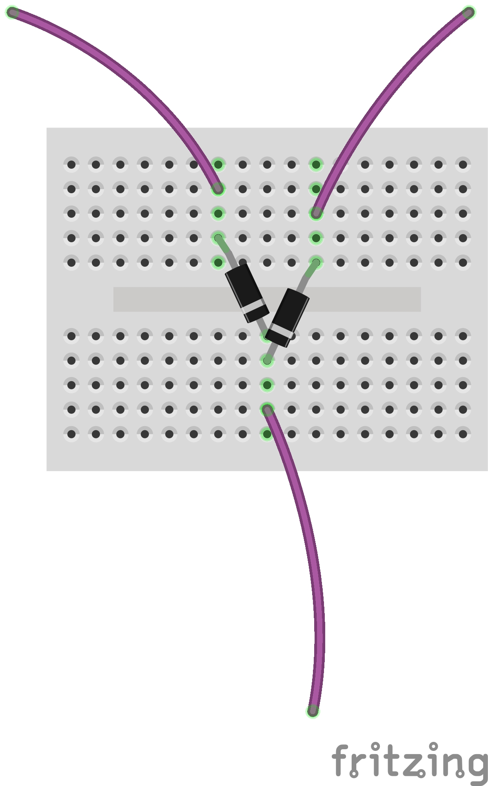
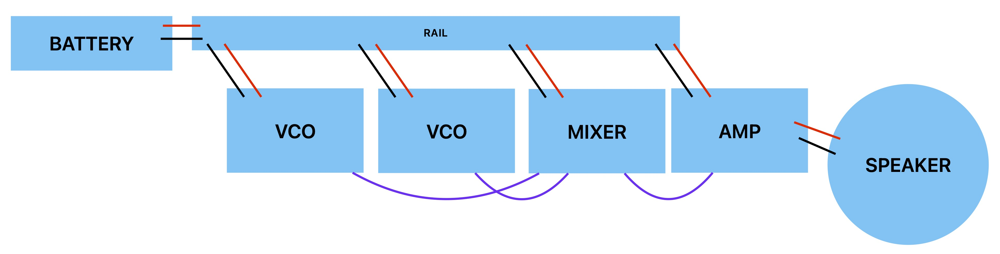

# Oscillators

<!-- brush tables clean -->

## Synthesis

As we have explored, sound is a phenomena that relates perception, vibration, space, and meaning. So far, working with sound has meant listening and recording acoustic signals. To do that, we've also touched eletrical analog audio by assembling microphones, speakers, and amplifiers, and even manipulated things digitally. But sound has always begun with physical movement. 

However, there is another fundamental way in which sound is understood in relation to technology, and that is to create sound directly with electronics, either analog or digital. This is called synthesis. Rather than approach things using the fanciest digital signal processing software on our laptops, we will explore this using the foundational circuitry used in hardware synthesizer design. 

## Circuits and Knots

According to the dictionary, in the general sense the word circuit means "a roughly circular line, route, or movement that starts and finishes at the same place." That applies in the electrical sense, too. A circuit is a loop, or rather, it's typically a whole knot of loops, in which electrical current is flowing from "power" back to "ground" and making something happen along the way. Between power and ground, we use positive (+) and negative (-) to indicate the direction of the flow. 

When it comes to audio, we can also think of the flow of current in terms of an audio signal. 

### Breadboard review

A breadboard lets us experiment with circuits without soldering, which is very helpful when we're in the process of figuring things out. Let's remind ourselves how these mini breadboards work:

### Power rails

In addition, this time we're also going to use a power rail.

Put a JST-PH socket into your power rail, making sure to line up the + and - indicators. Now plug in a 3xAA (4.5v) battery pack. Everything we build will get power from the rail, and you can turn things on and off with the switch on the pack.

## Modules

So we're going to be making knots of electrical loops, using breadboards. This can get extremely complex very fast. One way to make things more manageable is break things up into modules. This is a strategy that has been foundational to electronic music from pretty much the beginning.

We're going to build each module on its own mini-breadboard. Each one will be connected to power and ground independently. And each one will take a signal as input from another module, work with it in some way, and then pass it along to the next one. So one way to think about it is that each module is its own loop/circuit between power and ground, and there's one big loop/circuit between modules with the signal. And then within the modules, there's lots of mini-loops. Knotty!

### Amplifier

You are already familiar with the first loop—it is an amplifier chip. However, this time we're going to power it from the power rail, we're going to add a volume knob and a low-pass filter (to protect our ears), and it will take a signal from our circuit directly.

Additionally, for our purposes now we're going to stick to one channel. So we only need to wire up one speaker.

The following diagram shows the connections. The speaker wire is left out; the red and black wires shown go to the power rail. The purple wire is the signal coming in.

_NOTE: to make things fun later on, keep the knobs on your mini-breadboard pointing up and to the right._

<!--

#### Voltage dividers

Notice that this module uses a potentiometer

-->
<!--

#### Capacitors and filters

Notice that this module uses a capacitor. What is a capacitor?

-->

### Voltage-Controlled Oscillator (VCO)

The next module is perhaps the most fundamental to synthesis: an oscillator.

There are many ways to create oscillators. We're going to do it using an Integrated Circuit (IC) chip, in this case one called a "CD4046". What is an IC? In essence it is an elaborate switch—it turns a signal on and off.

What does turning a signal on and off produce? A square wave.

Hook a square wave up to a speaker, and it becomes a sound wave (a rather buzzy one!).

The CD4046 produces a square wave on one of its pins at a rate that depends on what is connected to the other pins. First of all, we need to connect power and ground. In addition, we'll connect:
- a potentiometer that controls the frequency of the oscillator by varying the voltage
- a capacitor (this controls the _range_ of the frequency)
- a resistor (this controls the _center_ of the frequency range)

Because this circuit controls frequency via voltage, it's called a Voltage-Controlled Oscillator, or VCO, which is a common term in synthesis.
 
Here is a diagram of the relevant pins on the CD4046:

And here is our circuit:

_NOTE: to make things fun later on, keep the knobs on your mini-breadboard pointing up and to the right._

Note the colors on the resistor!

After building this module, connect power and ground to your power rail. Then, connect the output wire together with the input wire of your amplifier module. Turn it on—you should hear something!

<!--

#### Resistors

Notice that this module uses a resistor. What is a resistor?

-->

### Sensor VCO

A pot is not the only kind of voltage divider. In fact, there are many kinds of sensors that you can use. 

One of these is a photovoltaic resistor, aka a photocell, that changes its resistance according to light. By combining this with a regular, static resistor, this functions similarly to a pot.

Another option is a Force-Sensive Resistor (FSR).

### VCO-Controlled VCO

What happens if you plug the output of one VCO into the potentiometer input of another VCO?

**diagram goes here**

## Mixer

What if you want to combine the signals from two VCOs?

