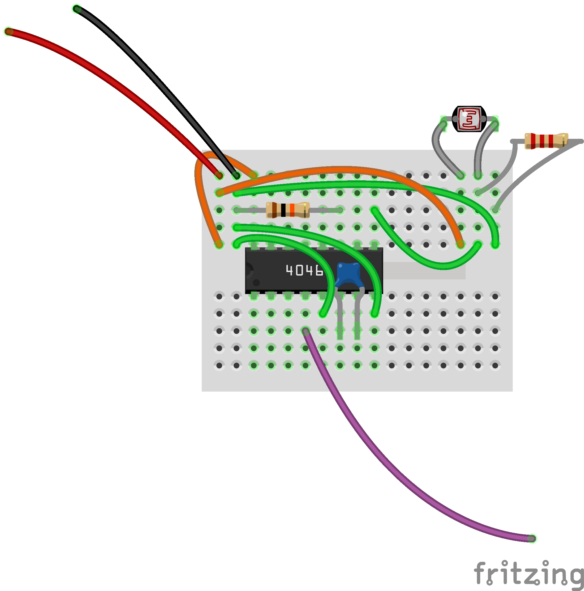
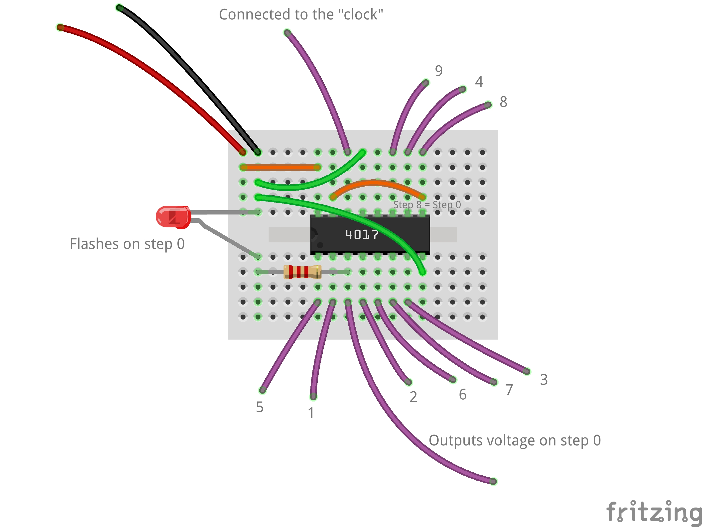
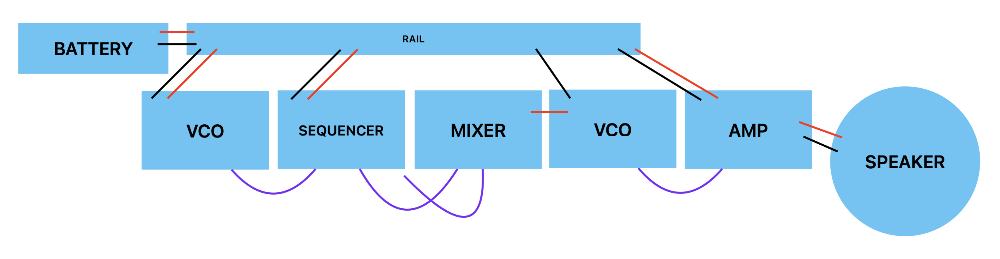
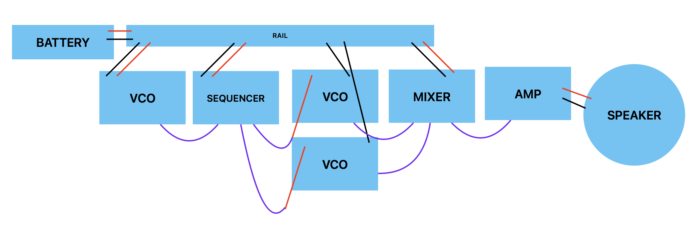

# Oscillators

<!-- brush tables clean -->

## Synthesis

As we have explored, sound is a phenomena that relates perception, vibration, space, and meaning. So far, working with sound has meant listening and recording acoustic signals. To do that, we've also touched eletrical analog audio by assembling microphones, speakers, and amplifiers, and even manipulated things digitally. But sound has always begun with physical movement. 

However, there is another fundamental way in which sound is understood in relation to technology, and that is to create sound directly with electronics, either analog or digital. This is called synthesis. Rather than approach things using the fanciest digital signal processing software on our laptops, we will explore this using the foundational circuitry used in hardware synthesizer design. 

## Circuits and Knots

According to the dictionary, in the general sense the word circuit means "a roughly circular line, route, or movement that starts and finishes at the same place." That applies in the electrical sense, too. A circuit is a loop, or rather, it's typically a whole knot of loops, in which electrical current is flowing from "power" back to "ground" and making something happen along the way. Between power and ground, we use positive (+) and negative (-) to indicate the direction of the flow. 

When it comes to audio, we can also think of the flow of current in terms of an audio signal. 

### Breadboard review

A breadboard lets us experiment with circuits without soldering, which is very helpful when we're in the process of figuring things out. Let's remind ourselves how these mini breadboards work:

### Power rails

In addition, this time we're also going to use a power rail.

Put a JST-PH socket into your power rail, making sure to line up the + and - indicators. Now plug in a 3xAA (4.5v) battery pack. Everything we build will get power from the rail, and you can turn things on and off with the switch on the pack.

## Modules

So we're going to be making knots of electrical loops, using breadboards. This can get extremely complex very fast. One way to make things more manageable is break things up into modules. This is a strategy that has been foundational to electronic music from pretty much the beginning.

We're going to build each module on its own mini-breadboard. Each one will be connected to power and ground independently. And each one will take a signal as input from another module, work with it in some way, and then pass it along to the next one. So one way to think about it is that each module is its own loop/circuit between power and ground, and there's one big loop/circuit between modules with the signal. And then within the modules, there's lots of mini-loops. Knotty!

## Amplifier

You are already familiar with the first loop—it is an amplifier chip. However, this time we're going to power it from the power rail, we're going to add a volume knob and a low-pass filter (to protect our ears), and it will take a signal from our circuit directly.

Additionally, for our purposes now we're going to stick to one channel. So we only need to wire up one speaker.

The following diagram shows the connections. The speaker wire is left out; the red and black wires shown go to the power rail. The purple wire is the signal coming in.

_NOTE: to be able to attach the modules together later in a consistent way, keep the knobs on your mini-breadboard pointing up and to the right._

<!--

#### Voltage dividers

Notice that this module uses a potentiometer

-->
<!--

#### Capacitors and filters

Notice that this module uses a capacitor. What is a capacitor?

-->

## Voltage-Controlled Oscillator (VCO)

The next module is perhaps the most fundamental to synthesis: an oscillator.

There are many ways to create oscillators. We're going to do it using an Integrated Circuit (IC) chip, in this case one called a "CD4046". What is an IC? In essence it is an elaborate switch—it turns a signal on and off.

What does turning a signal on and off produce? A square wave.

Hook a square wave up to a speaker, and it becomes a sound wave (a rather buzzy one!).

The CD4046 produces a square wave on one of its pins at a rate that depends on what is connected to the other pins. First of all, we need to connect power and ground. In addition, we'll connect:
- a potentiometer that will control the frequency of the oscillator by varying the voltage
- a capacitor that controls the ratio between voltage and frequency
- a resistor that sets the _maximum_ frequency (we'll leave the minimum set to zero)

Because this circuit controls frequency via voltage, it's called a Voltage-Controlled Oscillator, or VCO, which is a common term in synthesis.
 
Here is a diagram of the relevant pins on the CD4046:

And here is our circuit:

_NOTE: to be able to attach the modules together later in a consistent way, keep the knobs on your mini-breadboard pointing up and to the right._

Note the colors on the resistor! This needs to be 10kΩ of resistance.

After building this module, connect power and ground to your power rail. Then, connect the output wire together with the input wire of your amplifier module. Turn it on—you should hear something!

<!--

#### Resistors

Notice that this module uses a resistor. What is a resistor?

-->

### Sensor VCO

A pot is not the only kind of voltage divider. In fact, there are many kinds of sensors that you can use. 

One of these is a photovoltaic resistor, aka a photocell, that changes its resistance according to light. By combining this with a regular, static resistor, this functions similarly to a pot.

Another option is a Force-Sensive Resistor (FSR), which is wired in the same way as the photocell above.

<!-- 
### VCO-Controlled VCO

What happens if you plug the output of one VCO into the potentiometer input of another VCO?

**diagram goes here**

 -->

## Mixer

What if you want to combine the signals from two VCOs?

Use diodes! These have a small stripe which should be on the end pointing in the direction of the current flow.

You can make this into its own module, or use the power-rail breadboard for mixing.

## Sequencer

Now that we're able to make sound and modulate it in various ways, it's time to introduce a sequencer.

A sequencer is a mechanism that has a looping series of steps and activates them one at a time in turn. By hooking a sequencer up to one or more oscillators, we can create patterns (although we can also use sequencers to create sound directly, as we'll see).

Because a sequencer is in essence a bunch of switches, we can use an IC chip very similar to our CB4046 oscillator—the CB4017.

The CB4017 is a 10-step counter, which means it has 10 switches that it turns on and off in order (numbered 0 through 9). Note that because the IC is just a wrapper for a bunch of internal transistors, these 10 steps follow the needs of the internal layout rather making any sense to us on the outside in terms of how they are spatially arranged.

In addition, the CB4017 has a "clock" pin. This pin takes an oscillating signal and uses it as the basis for one cycle through its steps. In other words, you'll hook an oscillator module's output up to this pin, turn the oscillator down so it's really slow, and the CB4017 will divide it into 10 steps.

Except ... it doesn't have to be 10 steps, that's just a maximum. If you want, say, 8 steps, you can make a connection between that step number and the "rst" (reset) pin. So you'll get step number 0 through 7, and then step 8 (which is really the 9th step) will immediately set things back to 0.

The following schematic is wired for 8-steps:

Notice that we've also added an LED (small red light) to step zero so that we can see visually when the sequencer starts over. We could add an LED to every step if we wanted, but that's a lot of wiring. We always have to use a 2.2kΩ resistor with the LED to make sure it doesn't use up all the juice we need for powering our circuit.

Ok, so how do we use this?

### Sequencing a VCO

The most straightforward use is to use the sequencer to turn on and off an oscillator. This means we will need _two_ oscillator modules—one to use as the clock, and one to be the signal that is turned on and off.

Note that we're connecting the signal output on the 0-step pin of the sequencer to the **power** of the VCO.

Now, this will just turn the VCO on for step 0 of the sequence. What if we want to turn it on for another step?

In this case, we need a diode mixer module. We connect **two** outputs from the sequencer from the steps we want to the mixer. The result then goes to the power.

If you have an LED on step 0, you'll notice that step 0 produces a different pitch in the VCO. That's because some of the voltage is getting siphoned off to power the LED before it can power the VCO. You can use this to make different tones using one VCO by putting resistors prior to the mixer.

### Sequencing two VCOs

Of course, we could also just sequence two (or more) VCOs directly from the sequencer.

### Using sequencers as tone generators

Another option that pushes the definition of "sequencer" a bit is to use the CB4017 as a tone generator. If you just route a step output directly to your amplifier, you'll hear a tone, albeit one at a frequency that is a fraction of the clock VCO. That fraction depends on which step you've wired to be the reset step.

The opportunity here is that with **two** sequencers set to different fractions, you can get musical intervals (you may have noticed this is tricky with pots, sensors, and regular resistors).

In this case, you need to connect the clock VCO to both sequencers (you don't need a mixer for this, just connect them on a breadboard), and then mix the output of both sequencers together.

What intervals do you get? If one sequencer resets at 8 steps, and the other at 4, the ratio between them is 1/2, and the musical interval is a perfect fifth / sol. If the second sequencer resets at 2, then the ratio is 1/4, and you get a major third / mi. 

	1/2 is a perfect fifth
	1/3 is a perfect fourth
	1/4 is a major third 
	1/5 is a minor third
	1/6 is a fourth another octave down
	1/7 is ... ?
	1/8 is a major second
	1/9 is ... ?
	1/10 is a third another octave down

	