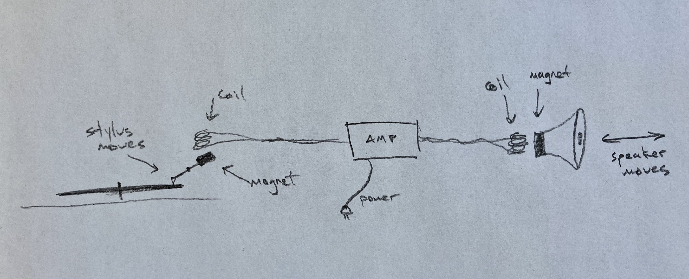
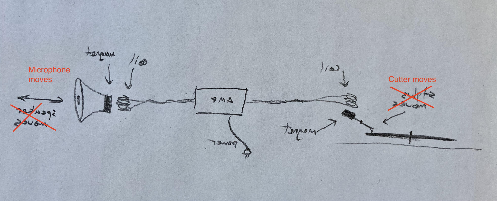
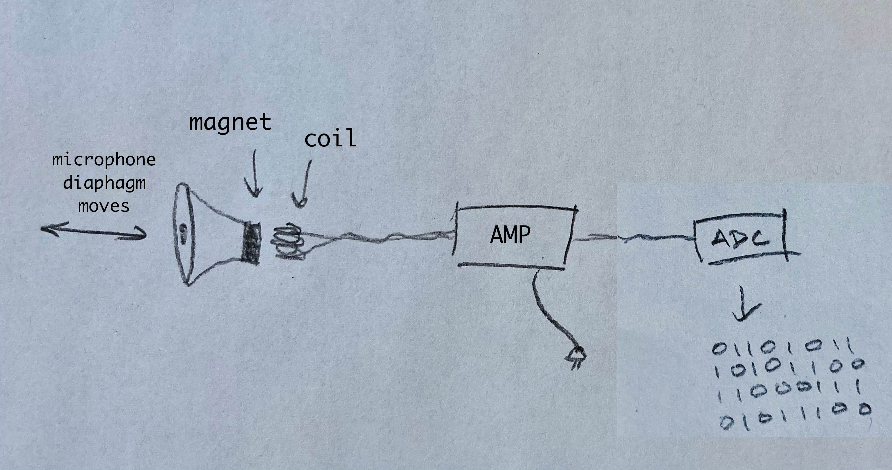

# Recording

Sound recording by technical means has taken on many different forms throughout history, from the "phonautograph" of the mid-nineteenth century to the digital audio recorders of today. For this course, we're going to be using a Tascam DR-05X, which is a capable little digital device that streamlines a lot challenges present in past methods. Before we begin using it, let's unpack some of the technical aspects behind what it does.

## Analog vs Digital

### Analog

Though we often use "analog" today to indicate anything that isn't "digital"—ie, something in the "real" world—the technical meaning of the term implies that there is a material analogy between sound and some recording medium.

Take vinyl records. The groove in the record is analogous to the shape of the sound waves. There are two sound waves for stereo records, one on each side of the groove—"stereo" just means two sound files for a pair of speakers.

[Record electron microscope](media/02_01_record.mp4)

When the needle moves, it moves a magnet. When a magnet moves near a _voice coil_, a small electrical signal is created. This signal is then amplified and activates another coil, which pulls a speaker diaphragm toward another magnet. (this diagram is slightly wrong in that it shows the diaphragm attached to the magnet, while it is actually attached to the coil, since coils are lighter).

This process of conversion between physical media is called _transduction_. And when a sound has become a signal is when we call it _audio_.

Note that a vinyl record works like this for playback—_recording_ a record is the exact same thing, but in reverse. A microphone is, in essence, the same thing as a speaker (and you can use speakers as microphones and microphones as speakers). And a special needle cuts a groove into the vinyl platter (this is the master, or dubplate -- subsequent records are "pressed" with an inverse mould of the original).

Point being, all analog media involve some chain of transduction. Before electricity, you just had to make sound loud enough that it would cut the record with direct vibrations.

Magnetic tape, on the other hand, stores the magnetic signature itself.

### Digital

Digital media break the chain of transduction, because they encode signals symbolically. That's not to say that digital media aren't material, but there's no longer a one-to-one relationship between what is on the recording media and the sound wave it produces.

An "analog-digital-converter", or _ADC_, samples an electrical signal into discrete numerical values.

Digital audio always has these jagged edges, at least when it's stored as information. To become sound again, it's converted back into an electrical signal, which smooths it out.

The _sampling rate_ is how often the signal is sampled.

You need a sampling rate that is _twice_ the highest frequency of the sound you are sampling. Since the human range of hearing is (approximately in a normative case) 20kHz, you need a sampling rate of at least 40kHz to satisfy the ear. CDs support a sampling rate of 44.1kHz; for digital audio today, 48kHz is a better standard. Higher than that is only really useful if you're going to process the sound later, or slow it down—just like with a digital image higher resolution lets you zoom in or apply more convincing effects.

The _bit depth_ is how accurately each sample measures the wave.

Bit depth is important because it establishes what the _dynamic range_ is, which is the difference between the softest and the loudest sounds that are sampled. A low bit depth means there's not much range, and things can start sounding mechanical or robotic. Bit depth is measured in bits per sample—how many 0s and 1s are used to represent each sample. 16 bits has long been the standard in digital audio, but 24-bits is a better standard for recording because it is more forgiving when it comes to picking up sounds at different amplitudes.

You can think about sampling rate and bit depth visually in terms of horizontal and vertical pixel resolution.

#### Mono vs Stereo

Mono is one _channel_ —aka an audio signal— that is either routed to just one speaker, or to two speakers that play the same thing.

Stereo is two _channels_ that are each routed to a separate speaker (such as one on each side of headphones). Stereo came about with the realization that the distribution of sounds in space could be simulated with multiple speakers (whether those are big ones in the room or little ones in headphones that you wear). 

Remember from the previous lecture, Interaural Time Difference, Interaural Level Difference, and Pinna Filtering? Which of these do stereo speakers take into account? It depending on the recording. If stereo mics are used, then ITD is present in the recording—the sound will then be played by one speaker at a slightly different time than the other. But even a mono signal can seem to come from one direction or another if it's played through the speakers at different volumes—this is ILD, but it's a matter of mixing, not recording.

What about Pinna Filtering? To get that effect, you need to stick the microphones in your ears (or the ears of a dummy head). No joke; the artist Janet Cardiff is famous for this, and recently ASMR has made this in vogue. This is called binaural recording. It is also possible to simulate that in the mixing stage using something called HRTFs, but we don't have time to get into that.

Surround sound or multichannel audio is multiple channels routed to an array speakers in order to establish even greater spatial fidelity. There's a whole world of this, and we might have a dedicated course on it someday.

#### WAVs, AIFs, MP3s, M4As, AACs, etc

WAVs and AIFs are essentially the same thing by different names, one being the Microsoft standard, the other being via Apple. Both are the full sample data—in essence, they contain just a list of numbers that represent each sample (two lists for stereo files).

WAV is predominant—you should use it exclusively. It's equivalent in the visual domain is TIFF.

The other formats are all methods of digital compression—ie, they make the file size smaller, especially for the purpose of distributing over the internet. MP3s and other formats are _lossy_, which means they degrade the original quality in some way (and how intelligently they degrade it and with what biases is the difference between them). The visual equivalent of these file types are JPGs, GIFs, PNGs, etc.

The best format for our purposes is going to be a **48kHz 24-bit WAV**.

## Microphones

As discussed, a microphone is just a diaphragm sensitive enough to move with the air that is attached to an electrical voice coil. When the coil moves relative to a stationary magnet, an small electrical signal is created.

That's the basic setup. But microphones can be built in many different ways that give them different capabilities and characters.

One question we can ask about microphones is about their directionality—do they pick up sounds from all directions equally, or do they have to be pointed at the sound source?

The directional sensitivity of a microphone is called a _polar pattern_. There are several standard types:

The most common are cardioid and omnidirectional. So what you need to remember is that if you are using a cardioid mic, it picks up what is in front of it. But if you are using an omnidirectional mic, it's going to be sensitive in all directions. Keep in mind that you can't necessarily tell what kind of mic it is from its shape.

Another thing to know about microphones is that just like the human ear, they are not equally sensitive to all frequencies. A mic with a very flat frequency response curve is "transparent", while one that has a bumpy one will have more character.

The difference in frequency response between mics comes from all the small contingencies in its manufacture that add up. No microphone is perfectly constructed (and of course, the more expensive the microphone, the greater its _fidelity_ to what our ears would hear.

### Gain and the noise floor (and room tone)

Once a microphone generates an electrical audio signal, that signal needs to be amplified before it can be digitally sampled and recorded. This amplification is not as much as will later be needed to power a speaker— rather, it's what is called _pre-amplification_, and the level of pre-amplification is called _gain_. All microphones need to be routed to a _preamp_ of some kind, whether that is embedded in the mic itself, in an audio mixer, a computer interface, or a stand alone preamp device.

Setting the gain of a mic's preamp is a crucial part of recording, because we want to record a strong signal, but not one so loud that it will cause _distortion_, ie, artificial frequencies that are the result of the hardware itself being overpowered rather than the soundwave moving the diaphragm. When an audio signal briefly exceeds the capacity of the recorder, we call it a _peak_.

While gain is necessary, it unfortunately introduces electrical noise into the recorded sound. The more expensive your preamps, the less of this noise is introduced, while makes preamps potentially the most valuable parts of an audio recording system. This noise is called _self-noise_, and the level at which it interferes with the signal is the _noise floor_. We can digitally filter some of this out later, as long as we have a reference. For this, it is useful to have a recording of only the self-noise, which you can do by burying the mic in pillows (or putting it in an anechoic chamber if you have one). Record the self-noise at approximately the same gain of a recording you'd like to clean up.

Note, however, that all spaces short of that anechoeic chamber have some inherent resonance to them, known as _room tone_. This may or may not be part of the signal you want to capture. If it is, separating the self-noise of your mics from the room tone of a space will be an important consideration. If it's not, the room tone might in fact be a part of the noise floor you're trying to filter out. In that case, it should be included in your reference.

### Position + wind

Mic placement is a whole science unto itself. It radically affects the nature of the signal that is captured—so if you have a particular sound source you are interested in recording, finding the place to put the mic that gets the sound that you want is going to take some experimenting. Keep in mind everything we learned about acoustics—placing a mic near a wall or in the center of the room, or next to a reverberant service or soft one, these are all going to have different results.

In many cases when we record, we record with two mics at once to create two stereo channels. The resulting audio will mostly be the same, but the slight difference in the position of the mics will result in a spatial effect when it's played back. The further apart the mics are, the more exaggerated effect. Placing the mics the same distance as our ears are apart will create the closest approximation of what we'd hear in the space. But that's not always possible, or desired.

One last thing to consider with microphones is wind, whether outside or coming out of someone's mouth. Wind is not sound waves, but it will still move the diaphragm of the mic, resulting in unwanted distortion in the recording. To help with this, mics are often used with windscreens, either ones that are "fuzzy" or simple "foam"—a sock will also work in a pinch. Windscreens dampen wind while letting sound waves through mostly unchanged.

## DR-05X

This recorder has two built-in omnidirectional microphones. This is good, because it's going to pick up everything around it with a consistent stereo image. But it also means we don't have a lot of options when it comes to playing with mic placement.

Before you begin recording, make sure it's set to the right format. Press the "MENU" button, choose "REC SETTING", set the "FORMAT" to "WAV 24bit" and set the "SAMPLE" to "48k".

There's another setting we're going to want to turn on. This is "LOW CUT", also under "REC SETTING", which should be set to "40Hz".

What this does is cut out all frequencies below 40 Hz. Why would we do this? Because most of the sound in that range that this recorder is going to pick up is wind and your hand moving the recorder. LOW-CUT helps us reduce that rumble and make our recordings more clear. (There's a couple other options for frequencies—the higher you go, the more unwanted low sound is cut out, but the more wanted sound you may miss.)

When you hit the record button, the record light begins to flash. **It is not yet recording**. You can hear the mic input in your headphones, but to start recording, you have to hit record a second time (the record light becomes solid).

The reason for this intermediate stage is so you can set the gain, or "INPUT LEVEL" on this recorder. The meter on the display shows the sound level in dBs. Note that they are this is relative to the maximum amplitude that can be recorded. By pressing the "|<<" and ">>|" keys, you change the gain (**be careful not to confuse this with the headphone volume**, "VOL", which is controlled with the "+" and "-" keys).

You want to have a strong signal, which means that the sound level reaches -12db or so, but you don't want the signal to hit the upper limit (which results in the _peak_ light turning red). For best results, **don't change the gain after you start recording**.

### Transferring files

While it is off, plug the recorder into your computer using the USB cable. You'll have the options "BUS POWER", "SD CARD READER", and "AUDIO I/F"—choose "SD CARD READER" to access the recorded files. You'll should see the device appear as a disk on your computer and folder inside, "MUSIC", that contains your WAV files. Copy these to your computer before working with them further.
