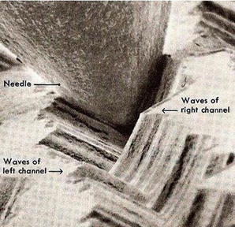
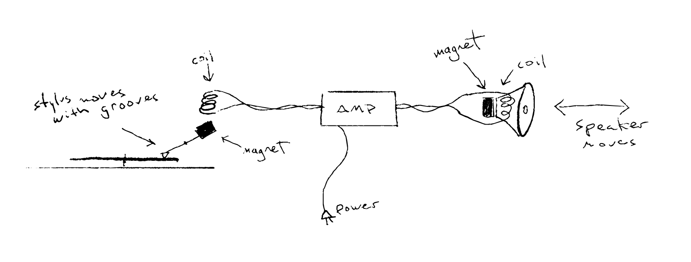
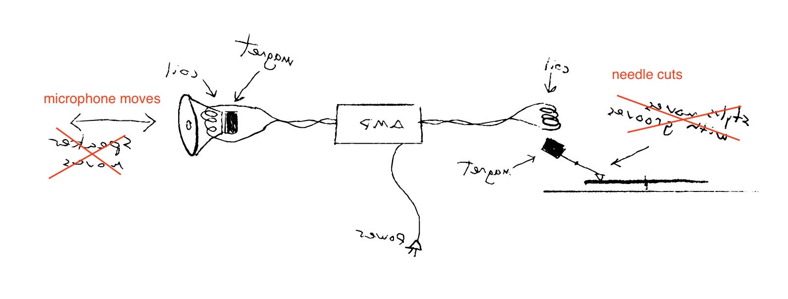
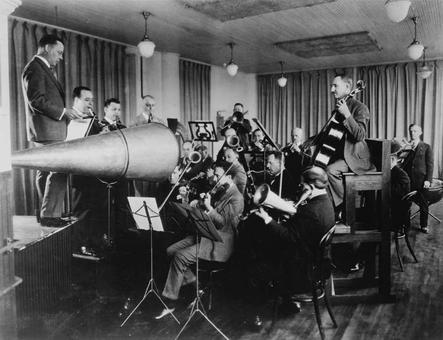
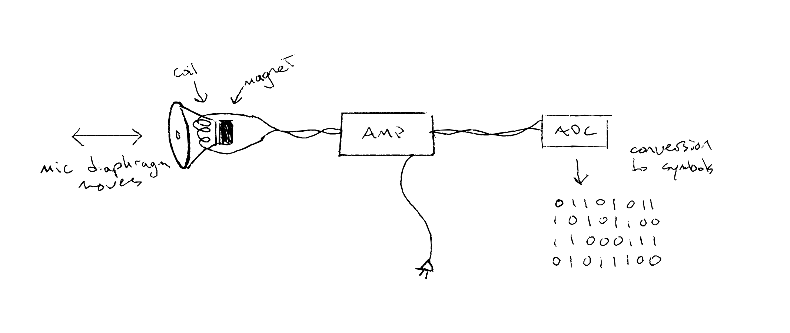
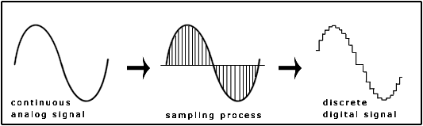
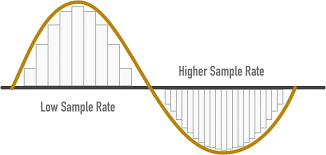
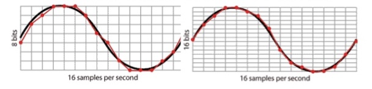
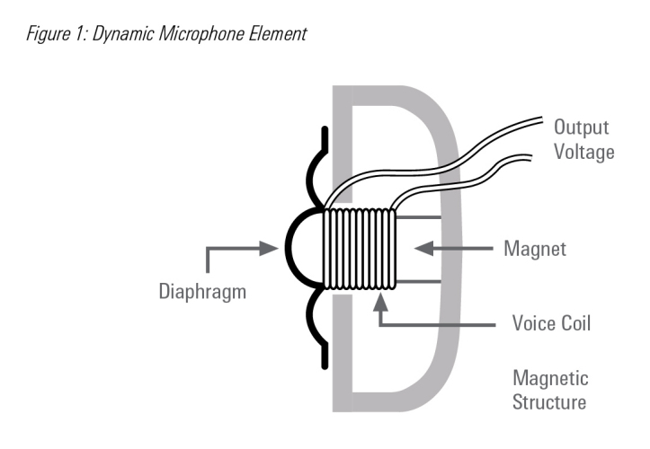
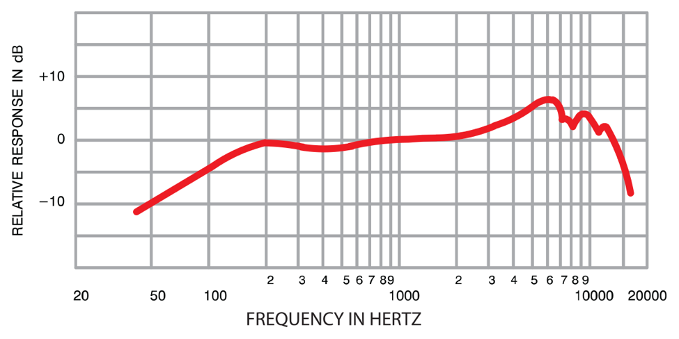

# Recording

Sound recording by technical means has taken on many different forms throughout history, from the "phonautograph" of the mid-nineteenth century to the digital audio recorders of today. For this course, we're going to be using a Tascam DR-05X, which is a capable little digital device that streamlines a lot challenges present in past methods. Before we begin using it, let's unpack some of the technical aspects behind what it does.

## Analog vs Digital

### Analog

Though we often use "analog" today to indicate anything that isn't "digital"—ie, something in the "real" world—the technical meaning of the term implies that there is a material analogy between sound and some recording medium.

Take vinyl records. The groove in the record is analogous to the shape of the sound waves. There are two sound waves for stereo records, one on each side of the groove—"stereo" just means two sound files for a pair of speakers.

[Record electron microscope](media/2_record.mp4)

When the needle moves, it moves a magnet. When a magnet moves near a _voice coil_, a small electrical signal is created. This signal is then amplified and activates another coil, which pulls a speaker diaphragm toward another magnet. (this diagram is slightly wrong in that it shows the diaphragm attached to the magnet, while it is actually attached to the coil, since coils are lighter).

One again, this process of conversion between media is called _transduction_. When a sound has become an electrical signal is when we start to call it _audio_.

Note that a vinyl record works like this for playback—_recording_ a record is the exact same thing, but in reverse. A microphone is, in essence, the same thing as a speaker (and you can use speakers as microphones and microphones as speakers). And a special needle cuts a groove into the vinyl platter (this is the master, or dubplate -- subsequent records are "pressed" with an inverse mould of the original).

This reversibility is an essential feature of transduction. (Demonstration of headphones as microphones).

The term "audio" in the analog sense refers to electrical signal that fluctuates in a way that is analogous to a sound wave—and which is then transduced into one (whether or not it _originated_ as one).

Turntables aside, magnetic tape is an analog medium that stores the magnetic signature of the electrical signal itself, which it can then reproduce.

But all analog media involve some chain of transduction, even without electricity. Before electricity, you just had to make sound loud enough that the medium would be cut directly with mechanical vibrations.

### Digital

Digital media break the chain of transduction, because they encode signals symbolically. That's not to say that digital media aren't material, but there's no longer a one-to-one relationship between what is on the recording media and the sound wave it produces.

An "analog-digital-converter", or _ADC_, samples an electrical signal into discrete numerical values. In other words, digital == measurements.

Digital audio always has these jagged edges, at least when it's stored as information. To become sound again, it's converted back into an electrical signal, which smooths it out.

The _sampling rate_ is how often the signal is sampled.

You need a sampling rate that is _twice_ the highest frequency of the sound you are sampling. Since the human range of hearing is (approximately in a normative case) 20kHz, you need a sampling rate of at least 40kHz to satisfy the ear. CDs support a sampling rate of 44.1kHz; for digital audio today, 48kHz is a better standard. Higher than that is only really useful if you're going to process the sound later, or slow it down—just like with a digital image higher resolution lets you zoom in or apply more convincing effects.

The _bit depth_ is how accurately each sample measures the wave.

Bit depth is important because it establishes what the _dynamic range_ is, which is the difference between the softest and the loudest sounds that are sampled. A low bit depth means there's not much range, and things can start sounding mechanical or robotic. Bit depth is measured in bits per sample—how many 0s and 1s are used to represent each sample. 16 bits has long been the standard in digital audio, but 24-bits is a better standard for recording because it is more forgiving when it comes to picking up sounds at different amplitudes.

You can think about sampling rate and bit depth visually in terms of horizontal and vertical pixel resolution.

#### WAVs, AIFs, MP3s, M4As, AACs, etc

WAVs and AIFs are essentially the same thing by different names, one being the Microsoft standard, the other being via Apple. Both are the full sample data—in essence, they contain just a list of numbers that represent each sample (two lists for stereo files). WAV is predominant. Its equivalent in the visual domain is TIFF.

The other formats are all methods of digital compression—ie, they make the file size smaller, especially for the purpose of distributing over the internet. MP3s and other formats are _lossy_, which means they degrade the original quality in some way (and how intelligently they degrade it and with what biases is the difference between them). The visual equivalent of these file types are JPGs, GIFs, PNGs, etc.

The best format for our purposes is going to be a **48kHz 24-bit WAV**.

## Microphones

As discussed, a microphone is just a diaphragm sensitive enough to move with the air that is attached to an electrical voice coil. When the coil moves relative to a stationary magnet, an small electrical signal is created.

That's the basic setup. But microphones can be built in many different ways that give them different capabilities and characters.

For example, just like the human ear, microphones are not equally sensitive to all frequencies. A mic with a very flat frequency response curve is "transparent", while one that has a bumpy one will have more character.

The difference in frequency response between mics comes from all the small contingencies in its manufacture that add up. No microphone is perfectly constructed (and of course, the more expensive the microphone, the greater its _fidelity_ to what our ears would hear).

## DR-05X

This recorder has two built-in omnidirectional microphones (we haven't discussed polar patterns, but this means that it's going to pick up sound in every direction with a consistent stereo image).

Before you begin recording, make sure it's set to the right format. Press the "MENU" button, choose "REC SETTING", set the "FORMAT" to "WAV 24bit" and set the "SAMPLE" to "48k".

There's another setting we're going to want to turn on. This is "LOW CUT", also under "REC SETTING", which should be set to "40Hz".

What this does is cut out all frequencies below 40 Hz. Why would we do this? Because most of the sound in that range that this recorder is going to pick up is wind and your hand moving the recorder. LOW-CUT helps us reduce that rumble and make our recordings more clear. (There's a couple other options for frequencies—the higher you go, the more unwanted low sound is cut out, but the more wanted sound you may miss.)

When you hit the record button, the record light begins to flash. **It is not yet recording**. You can hear the mic input in your headphones, but to start recording, you have to hit record a second time (the record light becomes solid).

The reason for this intermediate stage is so you can set the gain, or "INPUT LEVEL" on this recorder. The meter on the display shows the sound level in dBs. Note that they are this is relative to the maximum amplitude that can be recorded. By pressing the "|<<" and ">>|" keys, you change the gain (**be careful not to confuse this with the headphone volume**, "VOL", which is controlled with the "+" and "-" keys).

You want to have a strong signal, which means that the sound level reaches -12db or so, but you don't want the signal to hit the upper limit (which results in the _peak_ light turning red). For best results, **don't change the gain after you start recording**.

Also check that you are recording in stereo. Once again under "REC SETTING", go to type, and verify that "STEREO" is selected.

### Transferring files

While it is off, plug the recorder into your computer using the USB cable. You'll have the options "BUS POWER", "SD CARD READER", and "AUDIO I/F"—choose "SD CARD READER" to access the recorded files. You'll should see the device appear as a disk on your computer and folder inside, "MUSIC", that contains your WAV files. Copy these to your computer before working with them further.

### Manual

The full manual for the recorder is [here](media/tascam_manual.pdf).
