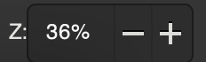
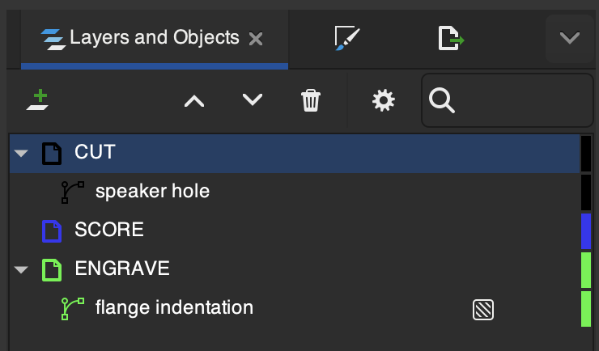
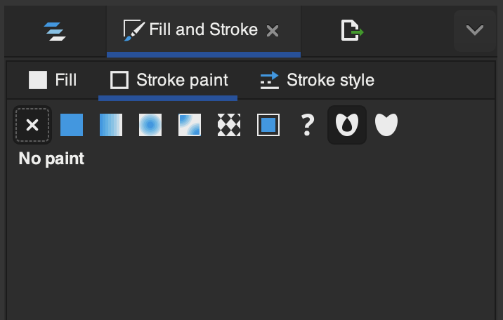
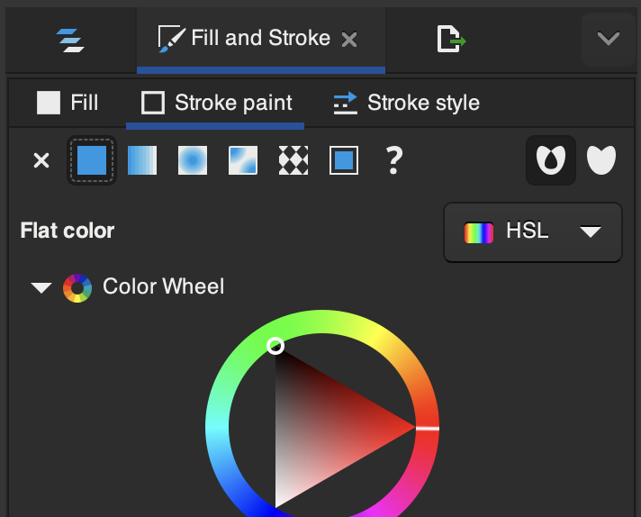
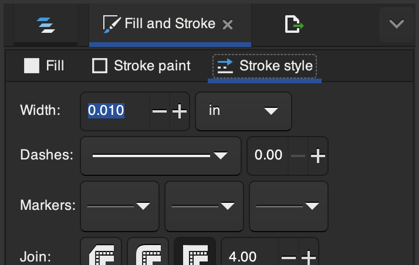
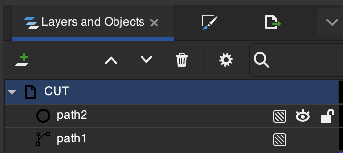
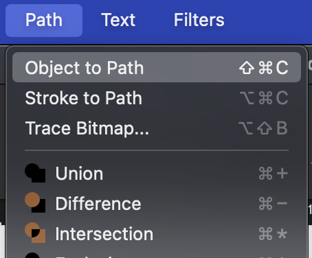
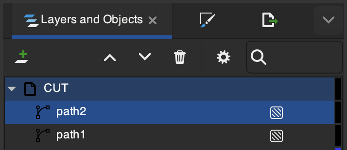

# Vector Drawing
 
**Inkscape** is a free vector graphics editor for GNU/Linux, Windows and macOS. You can download Inkscape [here](https://inkscape.org/release/inkscape-1.2.2/).

## Set Up

1. Download [GlowforgeTemplate.svg](templates/GlowforgeTemplate.svg)
1. Open GlowforgeTemplate.svg using Inkscape
1. Choose `File > Save Template...`, call it "GlowforgeTemplate" and make sure `Set as default template` is checked
1. Close the file
1. Select `File > New` — you should see a light orange grid

## Examples and Templates

1. Box with puzzle sides: [box.svg](templates/box.svg)
1. Speaker: [speaker.svg](templates/speaker.svg)
1. Toggle switch: [toggle.svg](templates/toggle.svg)
1. Mini Breadboard outline: [mini_breadboard.svg](templates/mini_breadboard.svg)

## Guide

### Basic Navigation and Tools

-  **Zoom**: The template is the same size as the draftboard—zoom in to see the small 1/8" grid. The zoom controls are in the lower right corner (just to the left of the "rotate" controls).

-  **Snapping**: Turning on snapping allows you to keep your lines on the grid—very helpful for making sure parts fit together.

-  and   **Pen Tool**: This is the primary tool you will use to make paths—select it from the tool palette on the left. It has several modes, the most useful of which is "straight line segments":  

-  **Selection**: Use the select tool to move your paths around and resize them. Clicking twice on a path will change the handles to enable rotation.

### Layers

The layers panel allows us to organize paths for the different functions of the laser. These are CUT (cut a line all the way through the draftboard), SCORE (go only part way), and ENGRAVE (score a shape other than a line). Primarily, we will be using CUT—note that ENGRAVE takes a very long time!

Though these layers are labeled within our document, the Glowforge interface may or may not assign our layers to the proper functions, so make sure to check!

### Lines and Fills

We want all the CUTS or SCORES that we make to be thin lines, and all the engraves to be fills. We can do this with the "Fill and Stroke" panel.

Under the "Fill" submenu, select "No Paint" for a CUT or SCORE or "Flat Color" for an ENGRAVE.

Under the "Stroke paint" submenu, select "Flat Color" for a CUT or SCORE or "No Paint" for an ENGRAVE.

Under stroke style, set "Width" to 0.010 for a CUT or SCORE.

<!-- ### Deleting Line Segments -->

### Converting Objects to Paths

If you use a shape tool, you'll need to covert those to paths before sending the file to the Glowforge.

Look at the layers tab—everything in the layer should have a "path" icon, not a shape/object:

To convert an object to a path, select the layer, and then choose Path —> "Object to Path".

Now the symbol in the layer should have a "path" icon.

